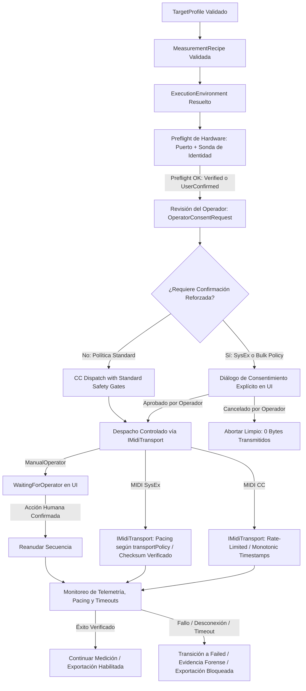

# PLAN OPERATIVO: HITO-10D1 — Hardware Digital (CC/SysEx) y Analógico Manual (Contratos y Resolución Hermética)

**Estado:** 🟢 APROBADO PARA IMPLEMENTACIÓN  
**Fecha:** 2026-09-24  
**Proyecto:** ABDAudioLab  
**Base Certificada:** HITO-10C Caso A (Build #439 — 680 test cases | 672 PASS | 8 SKIPPED históricos | 0 FAIL | 268.280 assertions)  
**Autoridad de Planificación:** Antigravity (Lead Architect & Metrologist) / ajabadia (Tándem Partner)

---

## 1. Frases Rectoras y Axiomas de Seguridad para Hardware

> **«Un TargetProfile puede describir cómo controlar hardware, pero no puede convertir datos no confirmados en órdenes reales ni permitir que un perfil importado envíe CC o SysEx sin validación, preflight y confirmación explícita.»**

> **«HITO-10D1 puede enseñar al sistema a entender un mensaje MIDI, SysEx o una instrucción manual; HITO-10D2 será el único punto donde se demostrará que esos datos pueden llegar de forma segura al hardware real.»**

Para mitigar riesgos sobre equipos analógicos y digitales outboard (desconfiguración de patches en memoria volátil, sobrecargas o bloqueos en hilos de audio), HITO-10D se bifurca en dos fases rigurosamente secuenciales:
1. **HITO-10D1 (Este Plan):** Contratos normativos, enriquecimiento de esquemas, identificadores estructurados con política de seguridad SysEx, validación estricta y resolución puramente hermética en memoria (cero envío físico, cero hardware requerido).
2. **HITO-10D2:** Despacho físico, fixtures de protocolo, preflight interactivo con confirmación del operador y verificación de no-bloqueo en hilo de audio.

---

## 2. Los Tres Modos de Transporte Físico y sus Modelos Normativos

### 2.1. Modo A: Hardware Digital MIDI Continuous Controller (CC)
- **Dispositivo Piloto:** Behringer PRO-800 (`behringer_pro800.target.json`).
- **Naturaleza:** `targetKind = "HardwareDigital"`, `controlTransport = "MidiContinuousController"`.
- **Estructura C++:**
  ```cpp
  struct MidiCcIdentifier
  {
      int channel { 1 };           // Rango estricto [1 .. 16]
      int controllerNumber { 1 };  // Rango estricto [0 .. 127]
  };
  ```
- **Reglas Normativas de Validación y Conversión:**
  - El canal debe estar dentro de $[1, 16]$; de lo contrario se diagnostica `ERR_SEMANTICS_INVALID_RANGE`.
  - El número de controlador debe estar dentro de $[0, 127]$; de lo contrario se diagnostica `ERR_SEMANTICS_INVALID_RANGE`.
  - Mapeo normalizado $[0.0, 1.0] \to [0, 127]$:
    $$\text{rawValue} = \mathrm{clamp}\left(0, 127, \mathrm{round}(\mathrm{normalizedValue} \times 127.0)\right)$$
  - Durante resolución hermética, se asigna `nativeParameterId = "CC_" + std::to_string(controllerNumber)` y `transportAccuracy = TransportAccuracy::Timestamped`.

### 2.2. Modo B: Hardware Digital MIDI System Exclusive (SysEx) con Política de Seguridad
- **Dispositivo Piloto:** Yamaha DX7 (`yamaha_dx7.target.json`).
- **Naturaleza:** `targetKind = "HardwareDigital"`, `controlTransport = "MidiSysEx"`.
- **Estructura C++ Enriquecida:**
  ```cpp
  struct MidiSysExIdentifier
  {
      std::string manufacturerId;       // Ej. "43" (Yamaha)
      std::string deviceIdPolicy { "user-configured" }; // "user-configured", "fixed", "omni"
      std::string commandTemplate;      // Ej. "F0 43 {deviceId} 09 40 {value7bit} F7" o tokens separados
      std::string valueEncoding { "7bit" }; // "7bit", "nibble-msb-first", "nibble-lsb-first"
      std::string checksumPolicy { "none" }; // "none", "yamaha-dx7", "roland"
      bool requiresExplicitConfirmation { false };
  };
  ```
- **Política de Seguridad Estricta de SysEx (Reglas Inquebrantables):**
  1. **Delimitadores F0 y F7 Obligatorios:** El mensaje debe iniciar estrictamente con `F0` y concluir estrictamente con `F7`. Mensajes truncados o sin delimitadores se rechazan con `ERR_SYSEX_INVALID_DELIMITERS`.
  2. **Rango Legal de Carga Útil:** Todos los bytes dentro del mensaje (excluyendo F0 y F7) deben tener el bit más significativo apagado ($0\mathrm{x}00 \le \mathrm{byte} \le 0\mathrm{x}7\mathrm{F}$). La presencia de bytes de estado intermedios se rechaza con `ERR_SYSEX_ILLEGAL_STATUS_BYTE`.
  3. **Tokens Estructurados y Permitidos:** Únicamente se admiten tokens controlados: `{deviceId}`, `{value7bit}`, `{valueNibbleMsb}`, `{valueNibbleLsb}`, `{checksum}` o el placeholder legacy `{XX}`. Tokens desconocidos provocan rechazo con `ERR_SYSEX_UNKNOWN_TOKEN`.
  4. **Protección contra Escritura Masiva Silenciosa:** Prohibido el uso de SysEx para `bulk-dump` o volcados globales de memoria en pasos de modulación de parámetros.
  5. **Aislamiento en Preflight y Resolución:** Resolver un plan o inspeccionar un perfil **JAMÁS** genera tráfico SysEx en puertos MIDI.

### 2.3. Modo C: Hardware Analógico con Control Manual Guiado
- **Dispositivo Piloto:** BOSS DS-1 Distortion (`boss_ds1_distortion.target.json`).
- **Naturaleza:** `targetKind = "HardwareAnalogue"`, `controlTransport = "ManualOperator"`.
- **Clasificación Física:** Circuitería analógica activa alimentada con entrada y salida mono.
- **Estructura C++:**
  ```cpp
  struct ManualOperatorIdentifier
  {
      std::string instructionId;       // Identificador único de paso (ej. "adjust_tone_pot")
      std::string confirmationPrompt;  // Texto para el operador
      std::string controlWidget { "Knob" }; // "Knob", "Slider", "Switch", "Footswitch"
  };
  ```
- **Regla Fundamental de No-Bloqueo del Hilo de Audio:**
  - El ensayo manual **NUNCA** ejecuta `std::this_thread::sleep` ni espera interacción dentro del callback de audio `audioDeviceIOCallbackWithContext()`.
  - La secuencia opera mediante la máquina de estados existente:
    $$\text{Trial Armed} \;\longrightarrow\; \text{WaitingForOperator} \;\longrightarrow\; \text{UI muestra OperatorCards} \;\longrightarrow\; \text{Operador pulsa [Espacio]} \;\longrightarrow\; \text{Resume Trial}$$
  - Tiempo mínimo de asentamiento humano normativo: `defaultSettlingTimeMs >= 500 ms`.

---

## 3. Matriz de Pruebas Normativas para HITO-10D1 (4 Suites Herméticas)

Se desarrollarán 4 suites de pruebas herméticas unitarias sin dependencias externas:

### Suite 1: `test_TargetProfileMidiCc.cpp` (20+ assertions)
1. Carga válida de `behringer_pro800.target.json`.
2. Validación de rangos estrictos: controller number en $[0, 127]$, canal en $[1, 16]$.
3. Rechazo de canal $0$ o $17$ con `ERR_SEMANTICS_INVALID_RANGE`.
4. Rechazo de controller number $< 0$ o $> 127$ con `ERR_SEMANTICS_INVALID_RANGE`.
5. Mapeo normalizado a entero CC $[0, 127]$ con redondeo y comprobación de desbordamiento.
6. Resolución hermética contra receta con `filter_cutoff` y `filter_resonance`: verificación de que los eventos generados contienen `nativeParameterId = "CC_19"` y `transportAccuracy = Timestamped`.
7. Generación de `ParameterStep` de sesión con `controlType = "MidiCC"`.

### Suite 2: `test_TargetProfileMidiSysEx.cpp` (25+ assertions)
1. Carga válida de `yamaha_dx7.target.json`.
2. Rechazo de plantillas sin `F0` inicial o sin `F7` final.
3. Rechazo de bytes ilegales $> 0\mathrm{x}7\mathrm{F}$ dentro de la carga útil SysEx.
4. Sustitución controlada de `{value7bit}` con codificación 7-bit.
5. Sustitución controlada de nibbles (`nibble-msb-first` y `nibble-lsb-first`).
6. Cálculo y verificación de `checksumPolicy = "yamaha-dx7"`.
7. Detección y rechazo de tokens desconocidos en la plantilla.

### Suite 3: `test_TargetProfileManualOperator.cpp` (20+ assertions)
1. Carga válida de `boss_ds1_distortion.target.json` con `targetKind: "HardwareAnalogue"`.
2. Rechazo de `instructionId` vacío con `ERR_SCHEMA_MISSING_REQUIRED_FIELD`.
3. Verificación de política de settling para humanos: `defaultSettlingTimeMs >= 500 ms`.
4. Resolución de receta manual: comprobación de que el plan resultante genera pasos compatibles con `OperatorCardsContainerComponent`.
5. Invarianza: la resolución del plan en memoria no instancia componentes gráficos ni bloquea hilos.

### Suite 4: `test_TargetProfileTransportSafety.cpp` (20+ assertions)
1. Aislamiento total: La carga, inspección o resolución de un perfil hardware no despacha ningún mensaje MIDI real.
2. Inviolabilidad del motor DSP: Cero modificaciones a `ProfilingSequencer`.
3. Preflight seguro: Detección y advertencia si un perfil requiere confirmación de operador para SysEx.
4. Compatibilidad legacy: Los contratos existentes en `contracts/hardware/` se preservan intactos sin regresión.

---

## 4. Criterio de Aceptación de HITO-10D1 (CERTIFICADO — Build #443)

1. Tres perfiles formales creados en `profiles/targets/`:
   - `behringer_pro800.target.json`
   - `yamaha_dx7.target.json`
   - `boss_ds1_distortion.target.json`
2. Esquema [target-profile.schema.json](file:///D:/desarrollos/ABDSynths/ABDAudioLab/docs/contracts/target-profile.schema.json) y servicio [TargetProfileService.cpp](file:///D:/desarrollos/ABDSynths/ABDAudioLab/src/profiling/TargetProfileService.cpp) enriquecidos con las políticas de seguridad de CC, SysEx y Manual.
3. Cuatro nuevas suites registradas y aprobadas al 100% (PASS, 0 FAIL) en Release x64: 11 test cases, 315 assertions PASS.
4. Cero regresiones en la suite global: 684 test cases, 676 PASS, 8 SKIPPED justificados, 0 FAIL, 268.496 assertions PASS.
5. Emisión del acta formal [ACTA_HITO_10D1_HARDWARE_CONTRACTS.md](file:///D:/desarrollos/ABDSynths/ABDAudioLab/ACTA_HITO_10D1_HARDWARE_CONTRACTS.md).

---

## 5. HITO-10D2: Despacho Físico e Integración Real

### Axioma Rector de HITO-10D2
> *«En HITO-10D1 demostramos que sabemos construir una orden válida; en HITO-10D2 debemos demostrar que solo se envía al target correcto, en condiciones verificadas, con consentimiento explícito y sin comprometer el motor de audio ni el estado de sesión.»*

> *«La aplicación puede preparar una orden física declarativa, pero solo el pipeline autorizado puede transmitirla después de comprobar el entorno, verificar o confirmar el target, obtener consentimiento y registrar evidencia de cada resultado.»*

### 5.1 Cadena de Seguridad y Despacho Físico



### 5.2 Ajustes Normativos y Principios de Diseño

1. **Modelo de Estados de Identidad de Hardware (Un puerto MIDI no prueba el target):**
   - La presencia de un puerto `MIDI Out 1` por sí sola no permite afirmar que un sintetizador vintage (ej. Yamaha DX7) esté conectado y listo.
   - Estados normativos de identidad:
     - `PortAvailable`: El puerto físico del sistema operativo existe y puede abrirse.
     - `IdentityVerified`: El target respondió a una sonda de identidad (Device Inquiry, SysEx handshake) con coincidencia estricta de fabricante, modelo o versión.
     - `IdentityUnavailable`: El puerto existe y abre, pero el target no ofrece identidad automática (ej. hardware analógico o DIN clásico pasivo).
     - `IdentityMismatch`: La respuesta del hardware no coincide con el perfil declarado (bloqueo preventivo obligatorio).
     - `UserConfirmedUnverified`: En ausencia de sonda automática, el operador asume y confirma explícitamente que el hardware conectado corresponde al perfil.

2. **Detección Real de Apertura y Escritura (Sustitución de "puerto ocupado"):**
   - En lugar de intentar adivinar qué aplicación externa bloquea un puerto, el preflight evalúa los resultados reales de la API del sistema:
     - `ERR_MIDI_OUTPUT_OPEN_FAILED`: Fallo de apertura a nivel de driver/OS.
     - `PortAvailable`: Apertura exitosa.
     - `ERR_MIDI_TRANSPORT_WRITE_FAILED`: Fallo inmediato en la llamada de escritura de socket/puerto.
     - `ERR_MIDI_TARGET_NO_RESPONSE` o `WARN_MIDI_TARGET_UNVERIFIED`: Evaluación de timeout según la política de respuesta del target.

3. **Pacing y Políticas de Transporte Declarables por Perfil (`transportPolicy`):**
   - El retardo entre tramas SysEx o CC no se codifica como una constante fija global, sino que se declara en el contrato del perfil:
     ```json
     "transportPolicy": {
       "minimumInterMessageDelayMs": 20,
       "maximumMessagesPerSecond": 20,
       "requiresResponseAck": false,
       "responseTimeoutMs": 500,
       "retryPolicy": "none"
     }
     ```
   - El despachador físico consulta `profile.transportPolicy` para modular el ritmo de transmisión según la capacidad del microcontrolador receptor.

4. **Consentimiento Explícito para Perfiles Externos / SysEx:**
   - Todo perfil importado que incluya mensajes SysEx (`requiresExplicitConfirmation = true`) exige consentimiento explícito. **Cero bytes son transmitidos** si el usuario no aprueba o cancela el diálogo.

5. **Aislamiento de Responsabilidades e Interfaces:**
   - La UI nunca construye mensajes MIDI, no calcula checksums ni gestiona puertos: solo presenta `OperatorConsentRequest`.
   - `ProfilingSequencer` se mantiene como la **única autoridad de ejecución**. El transporte físico es un componente subordinado a su control determinista.
   - Cero llamadas a `sleep()` y cero bloqueos dentro de `audioDeviceIOCallbackWithContext()`.

---

### 5.3 Interfaces C++ de HITO-10D2

```cpp
// 1. Interfaz de Transporte Desacoplada (Permite Mocks y Fixtures Herméticos)
class IMidiTransport
{
public:
    virtual ~IMidiTransport() = default;

    virtual MidiTransportOpenResult open(const MidiPortSelection& selection) = 0;
    virtual MidiTransportSendResult sendCc(const MidiCcMessage& message) = 0;
    virtual MidiTransportSendResult sendSysEx(const MidiSysExMessage& message, int minimumDelayMs = 0) = 0;
    virtual void close() = 0;
    virtual bool isOpen() const = 0;
};

// 2. Servicio de Preflight Físico de Hardware
class HardwareTransportPreflightService
{
public:
    HardwarePreflightResult evaluate(
        const TargetProfile& profile,
        const ExecutionEnvironment& environment,
        const ResolvedExecutionPlan& plan,
        IMidiTransport& transport) const;
};

// 3. DTO Inmutable para Consentimiento del Operador
struct OperatorConsentRequest
{
    std::string targetProfileId;
    std::string targetDisplayName;
    std::string selectedMidiPort;
    std::vector<PlannedControlChange> changes;
    bool containsSysEx{ false };
    bool requiresExplicitConfirmation{ false };
    std::string humanReadableSummary;
};
```

---

### 5.4 Batería de Suites de Validación para HITO-10D2

#### Suite 1: `test_TargetProfileHardwarePreflight.cpp` (25+ assertions)
1. Puerto presente y apertura exitosa $\to$ `PortAvailable`.
2. Fallo de apertura de puerto $\to$ `ERR_MIDI_OUTPUT_OPEN_FAILED`.
3. Sonda de identidad exitosa $\to$ `IdentityVerified`.
4. Sonda de identidad con fabricante incorrecto $\to$ `IdentityMismatch` (preflight bloquea).
5. Identidad no disponible cuando el perfil permite `UserConfirmedUnverified` $\to$ pasa con advertencia tras confirmación.
6. Identidad no disponible cuando el perfil exige identidad estricta (`requiresVerifiedIdentity: true`) $\to$ preflight bloquea.

#### Suite 2: `test_TargetProfileOperatorConsent.cpp` (25+ assertions)
1. Perfil importado con SysEx: sin consentimiento explícito del operador $\implies$ **0 bytes transmitidos**.
2. Cancelación por parte del usuario $\implies$ **0 bytes transmitidos**, sesión intacta y retorno seguro a estado inicial.
3. Aprobación explícita del usuario $\implies$ autorización de despacho y paso a ejecución.
4. Generación fiel del resumen legible en `OperatorConsentRequest` (lista de parámetros, valores CC / SysEx).

#### Suite 3: `test_TargetProfilePhysicalDispatch.cpp` (30+ assertions)
1. Despacho de secuencia MIDI CC hacia `MockMidiTransport`: verificación de bytes recibidos, canal y orden secuencial.
2. Despacho de SysEx con pacing: verificación de que los intervalos de emisión respetan `minimumInterMessageDelayMs` de la política.
3. Comprobación de integridad de tramas `F0..F7` y checksums válidos al salir del despachador.
4. Fallo de escritura en transporte $\to$ emisión de `ERR_MIDI_TRANSPORT_WRITE_FAILED` sin corromper el hilo llamador.

#### Suite 4: `test_TargetProfileTransportFailureRecovery.cpp` (20+ assertions)
1. Simulación de desconexión física de cable MIDI durante la sesión de caracterización.
2. Transición determinista del secuenciador a `SessionState::Failed`.
3. Registro de metadatos de error forense en la sesión.
4. Verificación de que `ExportReadiness::evaluate()` dictamina estrictamente `Decision::Blocked`.


