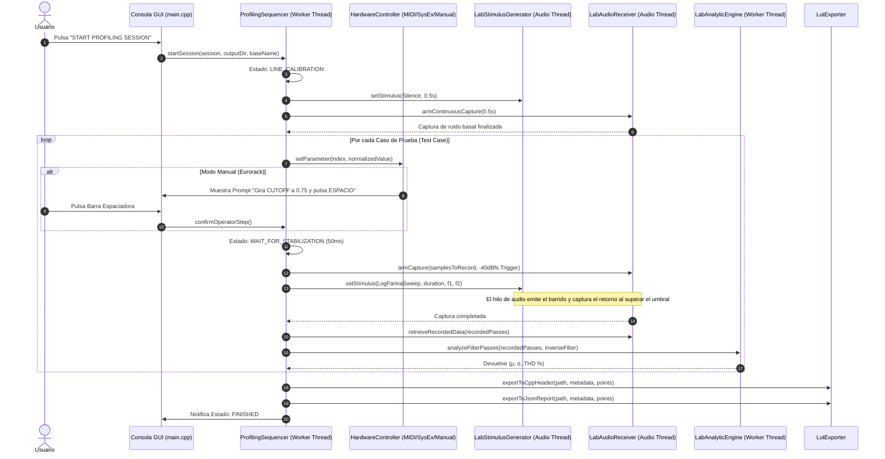

# Arquitectura de Software y Diseño de Sistema — ABDAudioLab

**Proyecto:** ABDAudioLab — Universal Black-Box Musical Hardware Profiler  
**Versión:** 1.0.0  
**Fecha:** 2026-09-01  
**Estándar:** C++20 / JUCE 8.0.4 / CMake  

---

## 1. Visión y Principios Arquitectónicos

ABDAudioLab está estructurado bajo principios estrictos de **Spec-Driven Development (SDD)** y **Zero-Allocation Real-Time Safety**:

1. **Desacoplamiento Absoluto (Contratos Asépticos)**:
   El secuenciador y el motor analítico no tienen conocimiento de marcas o protocolos propietarios; interactúan exclusivamente a través de interfaces C++ abstractas (`IHardwareController`).
2. **Aislamiento del Hilo de Audio**:
   El hilo de procesamiento de audio en tiempo real ejecuta con latencia determinista (< 5 ms). Todas las reservas de memoria dinámica (`new`, `malloc`, `std::vector::resize`) y llamadas a sistema (I/O, logs) están estrictamente prohibidas en el hilo de audio.
3. **Comunicación Sin Bloqueos (Lock-Free FIFO)**:
   El intercambio de bloques de señal entre el hilo de audio y el hilo de análisis en segundo plano se realiza mediante colas circulares SPSC (`juce::AbstractFifo`).
4. **Fuente Única de Verdad**:
   La sesión de perfilado se rige por un esquema de datos plano (`ProfilingSession`), que dicta el orden de los estímulos, parámetros y repeticiones.

---

## 2. Diagrama de Capas del Sistema

```
+-------------------------------------------------------------------------------+
|                       CAPA 1: PRESENTACIÓN & CONSOLA GUI                      |
|                           (src/main.cpp - JUCE GUI)                           |
|  - Selector de Dispositivos Audio & MIDI (WASAPI/DirectSound)                |
|  - Selector de Modo de Hardware (Mock, AIRA, CC, Eurorack Manual)             |
|  - Selector de Suite de Pruebas & Carga de JSON Personalizado                 |
|  - Monitor de Logs en Tiempo Real con Timestamps                              |
|  - Cartel Interactivo de Operador Manual (Confirmación por Barra Espaciadora) |
+---------------------------------------+---------------------------------------+
                                        |
                                        v
+-------------------------------------------------------------------------------+
|                      CAPA 2: NÚCLEO Y SECUENCIADOR (CORE)                     |
|                 (src/core/ProfilingSequencer.h/.cpp)                          |
|  - Máquina de Estados en Hilo Secundario (juce::Thread)                      |
|  - Calibración de Línea (Noise Floor Baseline & Loopback Check)               |
|  - Estabilización Paramétrica & Sincronización de Pasos                       |
|  - Control de Interludios Periódicos de Ruido Térmico                         |
+-------------------+-----------------------------------+-----------------------+
                    |                                   |
                    v                                   v
+---------------------------------------+   +-----------------------------------+
|  CAPA 3: ABSTRACCIÓN DE HARDWARE      |   |  CAPA 4: MOTOR MATEMÁTICO & DSP   |
|         (src/hardware/)               |   |          (src/math/)              |
|  - IHardwareController (Contrato)     |   |  - FarinaDeconvolver              |
|  - MockHardwareController (Simulador) |   |    (Filtro inverso -6dB/oct, FFT, |
|  - AiraSysExController (Roland AIRA)  |   |     separación armónica THD %)    |
|  - MidiCcController (MIDI CC Genérico)|   |  - LabAnalyticEngine              |
|  - ManualAnalogueController (Manual)  |   |    (Cálculo de µ y σ para 5 tipos)|
+-------------------+-------------------+   +-----------------+-----------------+
                    |                                         ^
                    | (Control)                               | (Búferes)
                    v                                         |
+-------------------------------------------------------------+-----------------+
|                  CAPA 5: MOTOR DE AUDIO EN TIEMPO REAL                        |
|                            (src/audio/)                                       |
|  - LabAudioEngine (Callback juce::AudioIODeviceCallback con ScopedNoDenormals)|
|  - LabStimulusGenerator (Farina Sweep, Dirac, Ruido LCG, Rampa, Tono 1kHz)    |
|  - LabAudioReceiver (FIFO Lock-Free Ring Buffer con Disparo por Umbral)       |
|  - Generador de Tono Diagnóstico Atómico (1 kHz)                              |
+---------------------------------------+---------------------------------------+
                                        |
                                        v
+-------------------------------------------------------------------------------+
|                       CAPA 6: EXPORTACIÓN Y GENERACIÓN                        |
|                           (src/export/LutExporter)                            |
|  - Cabecera C++20: alignas(16) static const AbdBatchedPoint (chowdsp_utils)   |
|  - Reporte JSON: Metadatos, puntos de prueba y matrices completas (µ, σ)      |
+-------------------------------------------------------------------------------+
```

---

## 3. Detalle de Componentes y Flujo de Datos

### 3.1 Flujo de Ejecución de una Toma de Medición



---

## 4. Garantías de Seguridad en Tiempo Real (Real-Time Safety)

| Regla | Implementación en ABDAudioLab |
|---|---|
| **Zero Memory Allocation** | Búferes preasignados en `LabAudioReceiver::prepare` y `LabStimulusGenerator::prepare`. Ningún vector se redimensiona dentro de `processBlock`. |
| **Lock-Free Threading** | Uso de `juce::AbstractFifo` y variables atómicas (`std::atomic<bool>`, `std::atomic<int>`). Ningún mutex bloquea el hilo de audio. |
| **Denormal Protection** | Invocación de `juce::ScopedNoDenormals noDenormals;` en el inicio del callback `LabAudioEngine::audioDeviceIOCallbackWithContext`. |
| **Entropy & Random Safety** | Prohibido el constructor por defecto de `juce::Random`. El generador de ruido blanco/rosa utiliza un LCG determinista inline (`randomSeed = randomSeed * 1664525u + 1013904223u`). |
| **Device Fallback Chain** | Cadena jerárquica de 3 pasos en `LabAudioEngine::initializeAudioDevices` para evitar bloqueos por desconexión de dispositivos. |

---

## 5. Reglas "Never Again" y Patrones de la Skill `juce-audio-hybrid-plugin`

Para garantizar la estabilidad y evitar los errores documentados en proyectos previos de sintetizadores y plugins híbridos:

### 5.1 Modo de Diagnóstico Multi-Punto y Aislamiento por Bypass Modular
Cuando se produzca silencio o una medición anómala durante una sesión, el sistema aplica la matriz de aislamiento modular:
* **Inyección de Tono Diagnóstico (440 Hz / 1 kHz)**: Emisión atómica directa en la salida para aislar fallos del DAC/driver frente a problemas en el hardware analógico o enrutamiento.
* **Matriz de Localización de Fallos**:
  - Tono audible en salida pero señal de retorno ausente $\rightarrow$ Fallo de cableado, atenuador o selector de entrada ADC.
  - Retorno saturado / recortado $\rightarrow$ Ganancia excesiva de entrada; requiere atenuación previa (Gain Staging a $-3\text{ dBfs}$).
  - Fluctuación excesiva constante ($\sigma > 20\%$) $\rightarrow$ Inestabilidad térmica o acoplamiento por bucle de masa (*ground loop*).

### 5.2 Patrón de Doble Representación (Dual Representation Pattern)
* **Nivel C++ Nativo / Core**: Utiliza XML para volcado de configuración persistente (`AudioSettings.xml`), inicialización de dispositivos y tablas internas `alignas(16)`.
* **Nivel Transporte / Reportes**: Utiliza JSON Schema estricto (`TestProfile.json`, reportes exportados `.json`) para garantizar la interoperabilidad sin acoplamiento a frameworks de C++.

### 5.3 Contrato de Normalización Estricta `[0.0, 1.0]` y Des-normalización
* Todos los controladores y puentes de parámetros transportan valores normalizados `[0.0, 1.0]`.
* La des-normalización a rangos físicos (MIDI `0..127`, Hz, ms) se realiza explícitamente en C++ mediante `std::lround()` para evitar truncados accidentales a cero que silencien el procesamiento.

### 5.4 Directrices de Portabilidad y Compilación WASM (para Fase 4)
* **Single-File Packaging**: Inclusión de `-s SINGLE_FILE=1` para embeber el binario Base64 sin peticiones de red asíncronas en AudioWorklets.
* **Heap Export**: Inclusión explícita de `HEAPF32` en `EXPORTED_RUNTIME_METHODS` para transferencias de buffers de audio con cero copias.
* **Asignador de Memoria**: Uso de `-s MALLOC=emmalloc` para latencia mínima y huella reducida.
