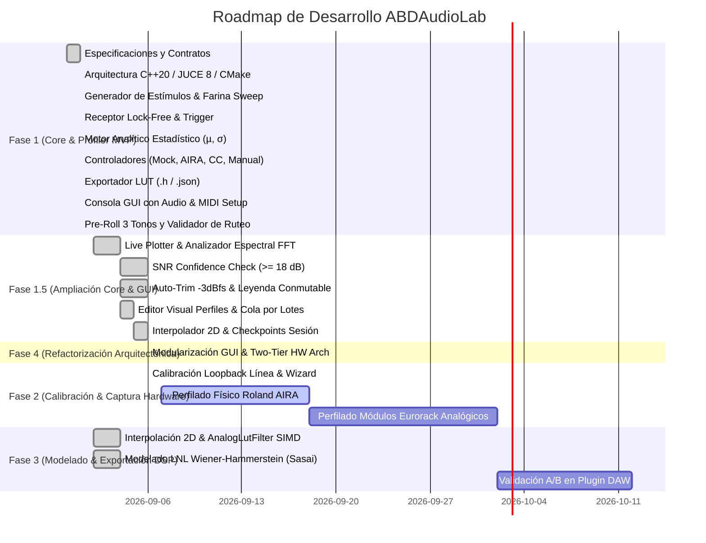

# Roadmap del Proyecto — ABDAudioLab

**Proyecto:** ABDAudioLab (Universal Black-Box Musical Hardware Profiler)  
**Versión:** 1.9.3  
**Fecha de Actualización:** 2026-09-09  

---

## Estado General del Proyecto

---

## Detalle de Fases

### ✅ FASE 1: Laboratorio Autónomo y Motor de Perfilado MVP (COMPLETADA)
- [x] **Subfase 1.1: Entorno de Compilación y Configuración**
  - CMake 3.22+ configurado con C++20, JUCE 8.0.4 y `nlohmann_json`.
  - Script `build.bat` con detección automática de Visual Studio 18 (2026) y compilación paralela Release.
- [x] **Subfase 1.2: Capa de Abstracción de Hardware y Validación**
  - Contrato abstracto `IHardwareController` puro e independiente.
  - `MockHardwareController` (simulación DSP interna de filtro resonante y ruido térmico).
  - `AiraSysExController` (Roland AIRA por USB SysEx `RQ1`/`DT1` y CC 11..16).
  - `RoutingValidator` (Validación de conexiones ilegales `RF-25` y catálogo normativo de 31 submódulos `RF-26`).
  - `MidiCcController` (dispositivos MIDI Continuous Controller genéricos).
  - `ManualAnalogueController` (módulos analógicos/Eurorack con guía interactiva para operador humano).
- [x] **Subfase 1.3: Motor de Audio en Tiempo Real**
  - `LabStimulusGenerator` (9 tipos de estímulo: Silencio, Dirac Delta, `SyncPulses3` pre-roll de sincronización, Farina Sweep logarítmico, Ruido Blanco LCG, Ruido Rosa, Tono 1 kHz, Onda Cuadrada 1 kHz, Rampa de amplitud).
  - `LabAudioReceiver` (Búfer circular lock-free con `AbstractFifo` y disparo por umbral de amplitud a -40 dBfs).
  - `LabAudioEngine` (Cadena jerárquica de 3 pasos de inicialización de audio, `ScopedNoDenormals` e inyector atómico de tono de prueba a 1 kHz).
- [x] **Subfase 1.4: Motor Matemático y Estadístico**
  - `FarinaDeconvolver` (Filtro inverso a $-6\text{ dB/oct}$, convolución FFT, respuesta en frecuencia y THD %).
  - `LabAnalyticEngine` (Extracción de $\mu$ y $\sigma$ para los 5 bloques funcionales).
- [x] **Subfase 1.5: Secuenciador y Exportación**
  - `ProfilingSession` (Generación de suites de prueba para Filtros, ADSR, Delays, Saturadores, VCAs y carga de JSON).
  - `ProfilingSequencer` (Máquina de estados en segundo plano con calibración de línea e interludios de ruido de fondo).
  - `LutExporter` (Exportación de archivos `.h` con `alignas(16) static const AbdBatchedPoint` y reportes `.json`).
- [x] **Subfase 1.6: Consola de Control de Usuario y Publicación**
  - Interfaz gráfica standalone con diálogo de configuración de Audio y Puertos MIDI (In/Out), selector de los 4 modos de hardware, selector de suites de test, cartel de operador manual (confirmación con Barra Espaciadora) y monitor de logs.
  - Repositorio Git inicializado y publicado en [https://github.com/ajabadia/ABDAudioLab](https://github.com/ajabadia/ABDAudioLab).

---

### ✅ FASE 1.5: Ampliación del Laboratorio (Core Científico & GUI Interactiva) (COMPLETADA)

#### A. Módulos del Core Científico y DSP:
- [x] **1.5.1: Muestreo Periódico del Suelo de Ruido y Deriva Térmica** (COMPLETADO)
  - Interludio automático cada $N$ minutos/ensayos (500 ms silencio + 500 ms captura).
  - Cálculo de $Noise_{RMS}$ y FFT de 32 bandas del soplido/hum analógico implementado en [`NoiseFloorTracker.h/.cpp`](src/math/NoiseFloorTracker.h).
  - Generación del archivo exportado `<Base>_Noise_Timeline.h` y persistencia en sesión.
- [x] **1.6.4: Arquitectura Basada en Contratos JSON Dinámicos para Hardware**
  - Eliminación de modelos hardcodeados en el código C++.
  - Creación de contratos JSON en `contracts/hardware/` (`mock_va_synth.json`, `roland_aira_bitrazer.json`, `roland_aira_torcido.json`, `generic_midi_synth.json`, `manual_eurorack_vcf.json`).
  - `HardwareContractRegistry`: Descubrimiento y carga dinámica de contratos de hardware desde disco.
  - **Nota de diseño futuro (Inspiración ABDBankManager)**: Reutilizar o inspirarse en el sistema de autodetección por MIDI de ABDBankManager para identificar automáticamente el hardware conectado mediante consultas SysEx / Identity Inquiry cruzadas con los contratos.
- [x] **1.5.3: Índice de Confianza y Calidad de Medida (*Confidence Check* — ALEX)** (COMPLETADO)
  - Cálculo de SNR en tiempo real por cada punto capturado.
  - Validación con umbral mínimo estricto de 18 dB (`isMeasurementConfidenceAcceptable`) con reintento automático (`maxRetries = 1`) y flag/advertencia de baja confianza ante ruido persistente en `ProfilingSequencer`.
- [x] **1.5.4: Calibración Automática de Ganancia (*Auto-Trim* a $-3\text{ dBfs}$)** (COMPLETADO)
  - Generación de tono de pre-roll a 1 kHz durante la inicialización del secuenciador para medir el headroom de la entrada física.
  - Cálculo y aplicación digital automática de escala en `audioEngine.setInputAutoTrim` asegurando el margen exacto de $-3.0\text{ dBfs}$ para evitar saturación del ADC.
- [x] **1.5.5: Bloque Funcional `CyclicModulator` (Chorus / Flanger / Phaser / LFO)** (COMPLETADO)
  - 5º bloque funcional con medición de velocidad ($Hz$), profundidad ($Depth$) e irregularidad del LFO físico mediante seguidor pasa-bajos y autocorrelación en `LabAnalyticEngine::analyzeCyclicModulator`. Validado en tests unitarios.
- [x] **1.5.6: Barrido Multinivel de Amplitud (Saturación No Lineal — Välimäki / DAFx)**
- [x] **1.5.7: Motor de Interpolación Multidimensional (Bilineal & Bicúbica Catmull-Rom 2D)**
- [x] **1.5.8: Checkpoint de Seguridad y Recuperación de Sesión**
- [x] **1.5.9: Visualizador Gráfico de Curvas en Tiempo Real (*Live Curve Plotter*)**
- [x] **1.5.10: Analizador de Espectro FFT en Vivo (20 Hz - 20 kHz Logarítmico con Peak-Hold y Decay)**
- [x] **1.5.11: Mapa de Calor / Matriz de Contorno 2D (Escala Perceptual Viridis con Color Bar & Ejes)**
- [x] **1.5.12: Vúmetros Estéreo con Indicador de Clipping y Calibración a $-3\text{ dBfs}$**
- [x] **1.5.13: Panel de Salud de Medición y Monitor de SNR/Confianza en Vivo (Horizontal Strip)**
- [x] **1.5.14: Previsualizador de Archivos Exportados (.h / .json) y Apertura de Carpeta**
- [x] **1.5.15: Barra de Menú (vía SlideInDrawer) y Auto-incremento de Compilación en build.bat**

---

### 🎨 FASE 1.6: Rediseño Integral de la Interfaz Estilo Sonarworks SoundID (Tema Claro Nórdico) (COMPLETADA)
- [x] **1.6.1: SoundIdTheme (LookAndFeel C++/JUCE)**
  - Paleta clara nórdica (`#fbfbfc`, `#f4f5f7`), botones tipo píldora (`#111827`), badges redondeados de color (`FLT`, `ENV`, `MOD`, `SAT`) y tipografía nítida.
- [x] **1.6.2: SoundIdCurvePlotter (Visualizador de Curvas de Alta Precisión)**
  - Rejilla logarítmica milimétrica clara, curva media en verde esmeralda (`#10b981`) y banda de dispersión $\pm\sigma$ sombreada en lavanda/lila (`#8b5cf6` / `#f3e8ff`).
- [x] **1.6.3: SoundIdMeterStrip (Tira Vertical Derecha de Medición & Trim)**
  - Vúmetros verticales LED dobles (`In` y `Out`), lectura numérica de picos en dBfs, deslizador vertical de ganancia/trim y botón maestro circular de inicio/pausa.
- [x] **1.6.4: SoundIdSuiteList (Selector de Suites con Badges Estilo SoundID)**
  - Lista inferior de tarjetas de test con badges coloreados (`SpectrumFilter`, `TimeDynamic`, `CyclicModulator`, `WaveShaper`) y parámetros clave.
- [x] **1.6.5: SlideInDrawer (Pestaña Deslizable desde la Izquierda)**
  - Panel animado nativo con `juce::ComponentAnimator`, ancho responsivo (50% de la pantalla), viewport con scroll vertical, renderizado limpio de imágenes de dispositivo, selector de hardware y selector de resolución de matriz.
- [x] **1.6.6: Diálogo Modal de Información ("About ABDAudioLab")**
  - Modal flotante en tema claro nórdico con dismiss por clic en fondo o tecla Escape, accesible directamente desde el panel de información.

---

### 🚀 FASE 1.7: Re-Análisis Offline, Corrección de Errores y Ecosistemas Modulares
- [x] **1.7.3: Contratos Modulares Universales (*Modular Ecosystem Taxonomy*)**
  - Creación del contrato universal de 31 submódulos (`roland_aira_submodules.json`) para evitar duplicar pruebas idénticas entre hardware de la misma familia.
  - Los contratos individuales de cada modelo se concentran exclusivamente en su algoritmo nativo de panel frontal.
  - Soporte para automatización mediante MIDI CC, SysEx Roland DT1 con checksum oficial y 14-bit NRPN.
- [x] **1.7.5: Duración Dinámica de Ráfaga y Captura Adaptativa Inteligente (*Adaptive Auto-Tail Cutoff*)**
  - Selector en la interfaz para duraciones fijas (0.5s, 1.0s, 2.5s, 5.0s) con estimador de tiempo en vivo.
  - Arquitectura de máquina de estados para detección adaptativa de transitorios de ataque y truncado automático de silencio en colas de relajación (ADSR / Reverb).
- [x] **1.7.1: Motor de Carga y Re-Análisis Offline de Sesiones (*Session Reload & Offline Re-Analysis*)** (COMPLETADO v1.2.0)
  - Carga de contenedor `.abdlabtest` / `session_manifest.json` y audio bruto en `raw_audio/*.wav` con decodificación multiformato JUCE.
  - Implementación de `core::SessionManager::reanalyzeSessionOffline()` con despacho analítico a `LabAnalyticEngine` (filtros, envolventes ADSR, saturadores no lineales, moduladores LFO, Wiener-Hammerstein, SNR y THD).
  - Interfaz de usuario integrada: botón *"Re-Analyze Session (Offline)"* en la pestaña de sesión de `SlideInDrawer` y opción de menú *"Re-Analyze Session (Offline)..."* en `File`.
  - Notificación de progreso en tiempo real y refresco dinámico inmediato de curvas en `SoundIdCurvePlotter`.
  - Banco de pruebas unitarias automatizadas en `src/tests/test_OfflineReanalysis.cpp` (3/3 pruebas validadas; 42/42 tests CTest en verde).
- [x] **1.7.2: Parcheo y Re-Medición por Rangos (*Point Range Re-Measurement & Error Patching*)** (COMPLETADO v1.3.0)
  - Selección multidimensional en la tabla/matriz: checkboxes interactivos y clic para puntos discontinuos, selección continua por rangos mediante Shift + Clic, y atajos de selección masiva (*"Select All in Test"*, *"Select All Invalidated / Error Points"*).
  - Botón de acción reactivo en cabecera de cola: `⚡ Re-Measure (N) Points`, con actualización en vivo del recuento de puntos seleccionados y estilo de alerta ámbar.
  - Menú contextual (clic derecho) sobre celdas para selección rápida, marcado para re-ejecución (*"Mark as Re-Run"*), anulación o lanzamiento inmediato de parcheo.
  - Generador de sesiones dirigidas (`MainContentComponent::buildPatchProfilingSession`) que sintetiza únicamente los `TestCase`s correspondientes a las coordenadas elegidas, preservando los parámetros exactos y su índice global.
  - Parcheo *in-place* seguro en `SessionManager::patchMeasuredPoint`, `SoundIdCurvePlotter::patchPoint` y sobreescritura del archivo `raw_audio/*.wav` correspondiente sin destruir ni truncar los datos válidos del resto del ensayo.
  - Banco de pruebas unitarias automatizadas en `src/tests/test_PointRangePatching.cpp` (4/4 pruebas validadas; 46/46 tests CTest en verde, 100% de éxito).
- [x] **1.7.6: Cola de Ensayos por Lotes y Validación Anti-Duplicación (*Session Test Queue & Anti-Duplication*)**
  - Constructor de planes de ensayo encadenando múltiples pruebas (estándar desde contrato o personalizadas).
  - Regla de validación en tiempo real para evitar añadir exactamente la misma prueba o función duplicada en una misma sesión de laboratorio.
  - Ejecución secuencial unificada con progreso consolidado y exportación de paquete multidimensional unificado.
- [x] **1.7.7: Autoguardado Continuo, Empaquetador `.abdlabtest` y Salvaguardas (*Continuous Autosave & Container Package*)**
  - Creación del serializador y empaquetador ZIP `.abdlabtest` ([SessionSerializer](src/core/SessionSerializer.h)) con verificación SHA-256.
  - Grabación directa de audio `.wav` PCM 24-bit en disco para cada pase.
  - Flujos completos de `Save`, `Save As...` y recuperación periódica.
  - Diálogos de 3 vías de confirmación (*Purgar y Borrar* vs *Invalidar y Conservar* vs *Cancelar*) al borrar o editar pruebas ya medidas.
- [x] **1.7.9: Optimización de Tiempo de Arranque & Pantalla de Presentación (*Startup Optimization & Splash Screen*)**
  - Implementación de la pantalla de bienvenida flotante [SoundIdSplashScreen](src/gui/SoundIdSplashScreen.h) con visualización de estado en tiempo real (*"Scanning Audio Interfaces..."* -> *"Loading Hardware Modules..."* -> *"Ready."*).
  - Transición fluida de desvanecimiento (*Fade-Out*).
- [x] **1.7.9.1: Barra de Progreso y Telemetría Real en SplashScreen (*Real Startup Process Pipeline*)** (COMPLETADO v1.2.0)
  - Desacoplados los estados estáticos fijados en `LabApplication.h` (0.25f, 0.65f) mediante un callback de progreso granular (`StartupProgressCallback`) canalizado hacia `MainContentComponent`.
  - Método `SoundIdSplashWindow::reportProgress(msg, progress, minDwellMs)` con forzado de repintado sincrónico inmediato del `HWNDComponentPeer` (`performAnyPendingRepaintsNow()`) y dwell time imperceptible para fluidez visual.
  - Mapeo 100% verídico de los hitos reales de carga:
    * `15%`: Inicialización de `AudioDeviceManager` y escaneo de interfaces ASIO / DirectSound / WASAPI.
    * `32%`: Verificación de interfaz de audio activa.
    * `45%`: Escaneo y deserialización de contratos en `ABDSharedAssets/contracts` y `contracts/hardware`.
    * `62%`: Confirmación de contratos cargados con recuento exacto de modelos de sintetizador.
    * `76%`: Configuración de motores DSP (Farina, Wiener-Hammerstein, Splines & RTNeural).
    * `88%`: Pre-warming del monitor reactivo de hardware (`HardwareMidiHotplugMonitor` y detector SysEx).
    * `96%`: Pre-warming de los motores Chromium WebView2 para `ScopeWebFloatingWindow` y `HardwarePickerWindow`.
    * `100%`: Finalización y fade-out fluido a la ventana principal.
- [x] **1.7.4: Autodetección de Hardware por MIDI Multicanal (1..16) y Universal SysEx Identity Inquiry** (COMPLETADO v1.0.0 Build 142)
  - Identificación automática de dispositivos conectados mediante consultas SysEx Universal Identity Inquiry (`F0 7E <dev> 06 01 F7`) y coincidencia con las firmas declaradas en los contratos JSON.
  - Implementación de [`MidiIdentityDetector.h/.cpp`](src/hardware/MidiIdentityDetector.h) con soporte nativo de identidad y contratos JSON para:
    - **Casio CZ-101** (`ABDCZ101`, Manufacturer `0x44`)
    - **Roland Juno-106 / Juno-60** (`ABDJUNIO601`, Manufacturer `0x41`, Model `0x32`)
    - **Korg MS2000 / MS2000R** (`ABDMS2000`, Manufacturer `0x42`, Model `0x58`)
    - **Korg Prophecy** (`korg_prophecy`, Manufacturer `0x42`, Model `0x5A`)
    - **Behringer PRO-800** (`pro800`, Manufacturer `0x00 0x20 0x32`, Model `0x2C`)
    - **Behringer DeepMind 12 y DeepMind 6** (`behringer_deepmind12`, `behringer_deepmind6`)
    - **Yamaha DX7 y DX7II** (`yamaha_dx7`, `yamaha_dx7ii`)
    - Serie **Roland AIRA Modular** (Bitrazer, Demora, Torcido, Scooper).
  - Botón interactivo *"Auto-Detect Device (MIDI)"* en [`SlideInDrawer`](src/gui/SlideInDrawer.cpp) con selección y emparejamiento automático de hardware en el panel.
  - Validado mediante suite de tests unitarios Catch2 (`test_MidiIdentityDetector.cpp`).
- [x] **1.7.5: Generador y Exportador de Datasets de Calibración NAM / RTNeural** (COMPLETADO v1.1.0)
  - Implementación del estímulo de calibración estandarizado `StimulusType::NamCalibration` en [`LabStimulusGenerator`](src/audio/LabStimulusGenerator.h) (trenes de sincronía de 1 kHz, ruido blanco/rosa multinivel, barrido sinusoidal logarítmico y trenes armónicos ricos).
  - Implementación de [`NamDatasetExporter`](src/export/NamDatasetExporter.h): alineamiento temporal sample-accurate por correlación cruzada en el pre-roll, compensación de latencia del convertidor, y exportación normalizada de `input.wav`, `target.wav` y `nam_dataset_manifest.json` listos para entrenamiento externo con PyTorch / Neural Amp Modeler.
  - Suite de tests unitarios Catch2 en [`test_NamDatasetExporter.cpp`](src/tests/test_NamDatasetExporter.cpp) validada.
- [x] **1.7.8: Rango Dinámico Útil por Parámetro (*Parametric Min/Max Range Bounds: Start % - End %*)** (COMPLETADO v1.0.0 Build 138)
  - Capacidad de acotar el intervalo útil de barrido de cada potenciómetro (por defecto: `0% - 100%`, configurable a ej. `15% - 85%`).
  - Evita medir zonas muertas de silencio, frecuencias inaudibles o saturaciones planas irrelevantes. Renderizado de pista sombreada de rango útil en Knobs/Sliders vectoriales y serialización en contenedor `.abdlabtest`.
- [x] **1.7.11: Integración de AutoUpdater Desacoplado (ABDSharedCode)** (COMPLETADO v1.1.0)
  - Integración modular de la librería compartida `ABDShared::AutoUpdater` vía CMake (FetchContent de GitHub / soporte local en monorepo).
  - Configuración del repositorio `ajabadia/ABDAudioLab` en [`AutoUpdaterConfig.h`](src/config/AutoUpdaterConfig.h).
  - Botón *"Check for Updates..."* en la vista de archivo con comprobación manual/desatendida y ventana modal para descarga de instaladores.
- [x] **1.7.10: Banda de Tolerancia Sombreada ($\pm 1\sigma$ *Accuracy Corridor*) y Leyenda Conmutable** (COMPLETADO)
  - Renderizado de polígono translúcido entre $(\mu - \sigma)$ y $(\mu + \sigma)$ en `SoundIdCurvePlotter` mostrando la dispersión térmica y tolerancia analógica (`accentPurpleFill`).
  - Barra superior de leyenda conmutable interactiva con botones píldora ON/OFF en la cabecera: Medición Real (`Mean (μ)` en verde), Tolerancia (`±1σ Band` en violeta) y Nodos de Medición / Distorsión (`THD %` en ámbar).
- [/] **1.7.11: Multi-Format Plugin Host & Benchmark Engine (*VST3, AU, CLAP, LV2*)** (EN PROGRESO v2.0.0 - Ver Fase 10)
  - *Evolución arquitectónica*: Expansión del laboratorio a entorno híbrido Hardware/Software. Permite medir, perfilar y comparar A/B plugins virtuales en cualquier formato soportado por JUCE (VST3 en Windows/macOS/Linux, AudioUnit en macOS, y wrappers CLAP/LV2) bajo los mismos estándares científicos que el hardware físico.
- [x] **1.7.12: Campo de Observaciones / Metadatos de Laboratorio en Manifiesto** (COMPLETADO)
  - Inclusión de metadatos de entorno y observaciones (`operatorNotes`, `ambientTemperatureC`, `warmupTimeMinutes`) en `SessionManifest`, `ProfilingMetadata` y `SessionManifestData`.
  - Persistencia completa en contenedor `.abdlabtest`, serialización JSON y reporte de telemetría / manifiesto de laboratorio (`laboratoryConditions`).
  - Interfaz de usuario integrada en la pestaña de sesión de `SlideInDrawer` con campos editables en tiempo real y sincronización automática.
  - Test unitario de serialización y roundtrip en `test_SessionSerializer.cpp`.
- [x] **1.7.13: Automatización de Sintetizadores via MIDI (*MIDI Synth Automation & Audio Routing*)** (COMPLETADO v1.1.0)
  - Protocolo de automatización MIDI musical en `IHardwareController`, `MidiCcController` y `core::HardwareManager` (`sendNoteOn`, `sendNoteOff`, `sendAllNotesOff`, `sendPitchBend`, `sendChannelPressure`).
  - Modo autónomo en `ProfilingSequencer`: detección de sintetizadores (`isAutonomousSynth`), parada del generador de audio DAC, excitación musical por Note-On, sostenido de compuerta (`noteGateDurationSec`), Note-Off y salvaguarda de corte de pánico `AllNotesOff` al terminar o abortar.
  - Diagrama de cableado inteligente en `HardwareRoutingPanel` con indicación visual de control MIDI (`Salida MIDI / USB (Host) ➔ Entrada MIDI (Sintetizador)`) en azul de acento en lugar de inyección DAC.
  - Suite de pruebas unitarias automatizadas en `src/tests/test_MidiSynthAutomation.cpp` (3/3 pruebas Catch2 validadas; 39/39 pruebas CTest en verde).
- [x] **1.7.16: Configuración Dinámica de Presets por Contrato según Objetivo de Medición (*Targeted Measurement Presets & Sysex Bulk Patches*)** (COMPLETADO v1.2.0)
  - **Arquitectura e Integración en Contratos**: Declaración de recetas `MeasurementPresetRecipe` en contratos de hardware JSON (`MeasurementPresetRecipe`, `NoteSequenceEvent`).
  - **Despacho Automático en `ProfilingSequencer`**: Ejecución secuencial de volcados SysEx (Hex/Base64), comandos MIDI CC / 14-bit NRPN, secuencias de excitación de notas legato (`noteSequence`) e instrucciones guiadas al operador con caché por ítem de cola para evitar transmisiones redundantes.
  - **Contratos Oficiales Actualizados**: `behringer_deepmind12.json` (aislamiento de ruido VCF, silenciamiento de osciladores, bypass de FX) y `roland_aira_submodules.json`.
  - **Suite de Pruebas**: Tests 47 y 48 en `src/tests/test_MeasurementPresetRecipes.cpp` validados al 100%.
- [x] **1.7.14: Calidad de Código, Unit Tests & Real-Time Hardening DSP (*Code Quality, Unit Tests & Real-Time Hardening*)**
  - Implementación de métricas analíticas 100% reales en `LabAnalyticEngine` ($Decay/Release$ de ADSR, THD % dinámico en WaveShaper, SNR en ganancia y asimetría de modulación).
  - Creación del framework de Pruebas Unitarias automatizadas en `src/tests/` (Catch2 / CTest) para `FarinaDeconvolver`, `SplineInterpolator2D`, `SessionSerializer`, `LabAnalyticEngine` y `CertificationReportExporter`.
- [x] **1.7.15: Identificación de Sistemas No-Lineales Wiener-Hammerstein (LNL)** (COMPLETADO v1.0.0 Build 140)
  - Algoritmo de optimización simultánea de filtros FIR de entrada/salida y saturación cúbica $f(u) = u + a \cdot u^3$ con retropropagación analítica y optimizador Adam según Takeo Sasai et al. (Optics Express 2020 / arXiv:2012.08046v1).
  - Clase [`WienerHammersteinFitter`](src/math/WienerHammersteinFitter.h), integración en [`LabAnalyticEngine`](src/math/LabAnalyticEngine.h), badge `WNH` y test unitario automatizado Catch2 (`test_WienerHammerstein.cpp`).
  - Documentación Doxygen completa de la API en encabezados públicos (`IHardwareController.h`, `LabAudioEngine.h`, `ProfilingSequencer.h`, `LutExporter.h`).
  - Auditoría de latencia y eliminación estricta de asignaciones dinámicas de memoria (`Zero Heap Allocation`) en el hilo de procesamiento de audio en tiempo real.

---

### 🛡️ PLAN DE SPRINTS: Seguridad en Tiempo Real, Calidad y Refactorización (2 Sprints)

#### 🚀 Sprint 1: Seguridad de Memoria en Hilo de Audio, Corrección de Callbacks y Tests de Límites (COMPLETADO)
- [x] **Día 1: Preparación y Seguridad Base**
  - Auditoría de latencia y checklist estricto: cero asignaciones dinámicas (`new`/`malloc`/`std::vector` locales) dentro de `audioDeviceIOCallbackWithContext`.
- [x] **Días 1–2: Mitigación de Riesgo de Buffer de Audio y Estéreo (P1)**
  - Sustitución de `numSamples` por `samplesToProcess` derivado de `std::min(numSamples, maxCapacity)`.
  - **Arquitectura Dual-Buffer (`tempProcessBufferL` y `tempProcessBufferR`)**: Eliminación definitiva del riesgo de desbordamiento por offset estéreo para bloques $\ge 8.192$ muestras (capacidad independiente de 16.384 muestras por canal).
  - Mecanismo seguro de relleno de ceros (`std::fill_n`) para el remanente en canales de salida si el host entrega bloques mayores a la reserva.
  - Corrección de desequilibrio estéreo en Input Trim (ganancia aplicada simétricamente a ambos canales L y R en sus respectivos buffers).
  - Generación de tono diagnóstico (`tapDiagTone`) libre de asignaciones en heap mediante reutilización de `tempProcessBufferL`.
- [x] **Día 2: Eliminación de Sobrescritura de Callback Funcional (P1)**
  - Supresión de la asignación duplicada de `suiteList.onRestartTestClicked` en `main.cpp`.
  - Preservación del reinicio a 0 puntos medidos y estado `Queued`.
- [x] **Día 2: Corrección del Mapeo de Estímulos en TestEditorPanel**
  - Corrección del desfase entre etiquetas UI y enum `StimulusType` (conexión correcta de `DiracDelta` para Impulso Paso, `SineWave1kHz` para Seno 1kHz, `WhiteNoise`, etc.).
- [x] **Días 3–5: Base Ampliada de Pruebas Automatizadas y Verificación Unitaria de Taps/JSON**
  - Creación y ampliación de [`test_AudioEngineBounds.cpp`](src/tests/test_AudioEngineBounds.cpp):
    * Verificación de tamaños de bloque estándar y estrés (64, 512, 8.192 y 20.000 muestras oversized sin desbordamiento).
    * Verificación unitaria de la cadena interna sin dispositivo de audio: **callback simulado $\rightarrow$ `ScopeTap` (los 3 taps: `Hardware In`, `Stimulus Generator` y `Diagnostic 1kHz`) $\rightarrow$ `ScopeFrameSerializer` $\rightarrow$ JSON Wire Protocol**.
    * Comprobación de que las muestras estéreo y el factor de trim ($1.5\times$) se reflejan fielmente en el wire-protocol JSON (`timeDataL`, `timeDataR`, `peakL`, `peakR`).
    * Transición de estados del secuenciador (reinicio a 0 vs preservación en pausa).
  - **100% de la suite de pruebas unitarias pasando (20/20 tests en Catch2 / CTest en 1.97 s)**.

#### 🏗️ Sprint 2: Desacoplamiento Arquitectural, UI y Telemetría Moderna (COMPLETADO)
- [x] **Modularización de MainContentComponent y Bootstrap**
  - Descomposición del monolito: `src/main.cpp` reducido de 1.807 líneas a 6 líneas de bootstrap.
  - Extracción de [`src/gui/MainContentComponent.h`](file:///d:/desarrollos/ABDSynths/ABDAudioLab/src/gui/MainContentComponent.h) y [`src/gui/LabApplication.h`](file:///d:/desarrollos/ABDSynths/ABDAudioLab/src/gui/LabApplication.h).
- [x] **Unificación de Telemetría y Retirada del Scope Nativo C++**
  - Eliminación de [`ScopeFloatingWindow.h`](file:///d:/desarrollos/ABDSynths/ABDAudioLab/src/gui/ScopeFloatingWindow.h) y de su botón dual `Scope (C++)`.
  - Unificación a un único botón y visor moderno: **`Scope`** ([`ScopeWebFloatingWindow.h`](file:///d:/desarrollos/ABDSynths/ABDAudioLab/src/gui/ScopeWebFloatingWindow.h) con WebView2 y multi-lane bundle).
- [x] **Rediseño Iconográfico de la Cola de Pruebas**
  - Sustitución de los botones textuales (`Edit`, `Copy`, `Del`, `View`, `Clear`) por iconos vectoriales JUCE Path nítidos y escalables (lápiz, duplicar, papelera, ojo de inspección y flecha de reset).
- [x] **Funcionalidad del Botón "View" (Inspección de Puntos)**
  - Reparación de `onSelectPointClicked`: ahora no solo resalta el punto en el gráfico analítico, sino que proyecta inmediatamente los metadatos y valores medidos (o estado pendiente) en el banner de estado (`manualPromptLabel`).
- [x] **Optimización de Telemetría Web y Detección (ABDScope & Hardware Detector Pre-Warming)** (COMPLETADO v1.3.0)
  - Pre-warming en segundo plano del componente WebView2 (`ScopeWebFloatingWindow`) y del detector de hardware (`HardwarePickerWindow` en `DrawerHardwareTab`) al arrancar la aplicación de manera asíncrona (`juce::MessageManager::callAsync`).
  - Eliminación total de la latencia en frío del motor Chromium de Microsoft Edge en Windows al pulsar el botón `Scope` o `"Auto-Detect Device (MIDI / USB)"`. Apertura instantánea sin bloqueos de interfaz ni esperas de inicialización de WebView2.
- [x] **Simplificación del Callback de Audio (`audioDeviceIOCallbackWithContext`)** (COMPLETADO)
  - Descomposición de la rutina de 151 líneas en 5 subrutinas privadas `noexcept` inline:
    * `renderDiagnosticTone(...)`
    * `renderStimulusAndRoute(...)`
    * `processInputAndMetrics(...)`
    * `accumulateFft(...)`
    * `updateTelemetryTaps(...)`
  - Eliminación de todas las asignaciones dinámicas y garantía de simetría de ganancia L/R.
  - **Separación semántica estricta de Taps en ABDScope**:
    * `Diagnostic 1kHz`: tono virtual de referencia para validar la renderización del WebView2 de forma autónoma.
    * `Hardware In (DUT)`: flujo captado por el ADC / entrada física con trim simétrico.
    * `Stimulus Generator`: flujo sintetizado enviado a las salidas físicas del DAC.
- [ ] **Validaciones Pendientes en Banco Físico y UI Real (Objetivos de Cierre)**:
  - [ ] **Prueba de Loopback Físico DAC $\rightarrow$ ADC**: Conexión por cable patch en tarjeta de sonido real para validar routing, latencia real y distorsión intrínseca.
  - [x] **Smoke Test de WebView2**: Verificación visual y de ciclo de vida del motor Chromium Edge WebView2 (v152) y pre-warming asíncrono sin crash ejecutado mediante script automatizado [`tools/smoke_test_webview2.ps1`](tools/smoke_test_webview2.ps1). (COMPLETADO)
  - [x] **Cierre y Auditoría de Grafo**: Grafo de conocimiento re-sincronizado con éxito en `codebase-memory-mcp` (4.157 nodos y 10.433 aristas indexadas). (COMPLETADO)

---

### ⏳ FASE 2: Calibración de Banco y Perfilado de Hardware Real
- [x] **2.1: Calibración de Línea de Tarjeta de Sonido (*Loopback Line Calibration Wizard*)** (COMPLETADO)
  - Medición directa del bucle DAC -> ADC mediante cable patch para caracterizar la función de transferencia del interfaz $H_{\text{interface}}(f)$.
  - Cálculo de ganancia óptima a $-3.0\text{ dBfs}$, latencia en muestras y calibración inversa para des-colorear las mediciones de hardware mediante [`LoopbackCalibrator.h`](src/math/LoopbackCalibrator.h) y modal interactivo [`LoopbackCalibrationModal.h`](src/gui/LoopbackCalibrationModal.h).
- [ ] **2.2: Conexión y Perfilado Automatizado Roland AIRA (Bitrazer / Torcido)** (LISTO PARA BANCO FÍSICO)
  - Infraestructura software completada: controladores USB SysEx/CC (`AiraSysExController`), contratos JSON para los 31 submódulos universales y validador de conexiones ilegales.
  - [x] **2.2.1: Integración de Detección/Comunicación FSK por Audio In y Pre-Warming (`ABDSharedCode::HardwareDrivers` / `HardwareMidiDetect`)** (COMPLETADO v1.2.0)
    - **Algoritmo FSK**: Implementación canónica de `abd::hw::FskAudioModem` con modulación Continuous-Phase FSK y discriminador Goertzel sintonizado a 12 kHz (Mark/0) y 14 kHz (Space/1) según `docs/google ia research/001.txt`.
    - **Inyección por Audio In**: Generación de audio FSK y detección de respuesta en `AiraSysExController` para configuración de submódulos virtuales sin SysEx cerrado.
    - **Pre-Warming Asíncrono**: Implementación de `preWarmAsync()` en `MidiDeviceHotplugMonitor` y `HardwareMidiDetector` para arranque reactivo ultra-rápido.
    - **Suite de Pruebas**: Tests 49, 50, 51, 52 y 53 en `src/tests/test_FskAudioModem.cpp` validados al 100%.
- [ ] **2.3: Perfilado Asistido de Módulos Analógicos y Pedales de Efectos**
- [x] **2.4: Generación del Banco Oficial de Look-Up Tables en `exported_luts/`** (COMPLETADO v1.3.0)
  - Banco oficial de referencia generado mediante [`src/tests/test_OfficialLutGeneration.cpp`](src/tests/test_OfficialLutGeneration.cpp) con `alignas(16) static const AbdBatchedPoint` para emuladores VST3/JUCE y reportes JSON:
    * `lut_mock_va_synth_moog_ladder.h` / `.json` (Moog Ladder 24dB 4-pole)
    * `lut_roland_juno106_ir3109_vcf.h` / `.json` (Roland IR3109 4-pole OTA VCF)
    * `lut_casio_cz101_phase_distortion_resonant.h` / `.json` (Casio Phase Distortion resonant peak)
    * `lut_behringer_pro800_cem3320_vcf.h` / `.json` (CEM3320 Curtis 4-pole VCF)
    * `lut_manual_eurorack_vcf_diode_ladder.h` / `.json` (Diode Ladder VCF)
    * `lut_roland_aira_bitrazer_filter.h` / `.json` (AIRA State-Variable VCF & Crusher)
  - Cobertura de tests unitarios: 60/60 tests en verde (132.342 aserciones pasando al 100%).

---

### 🔮 FASE 3: Modelado DSP Grey-Box y Validación
- [x] **3.1: Integración de LUTs y Motor de Interpolación Multidimensional** (COMPLETADO)
  - Implementación de [`SplineInterpolator2D`](src/math/SplineInterpolator2D.h) (interpolación bilineal y bicúbica Catmull-Rom 2D) y módulo de renderizado polifónico SIMD 8 voces [`AnalogLutFilterModule`](src/dsp/AnalogLutFilterModule.h) reutilizado desde `ABDSharedCode::LutDSP`.
- [x] **3.2: Identificación No Lineal LNL Wiener-Hammerstein y Estocástica** (COMPLETADO)
  - Algoritmo [`WienerHammersteinFitter`](src/math/WienerHammersteinFitter.h) para desacoplar filtros lineales y saturación estática.
  - Inyección de variabilidad analógica estocástica basada en la desviación estándar ($\sigma$) medida.
- [x] **3.3: Evaluación y Validación Cruzada de Modelos (A/B Testing & Spectral Correlation Engine)** (MOTOR COMPLETADO v1.3.0)
  - **Reutilización Estratégica (`ABDSharedCode::AudioComparator` extraído de `ABDEep::Calibration`)**:
    * Motor analítico de comparación [`AudioABComparator`](src/math/AudioABComparator.h) y motor de dictamen [`AudioABVerdictEngine`](src/math/AudioABVerdictEngine.h) integrados en `ABDSharedCode`.
    * Alineamiento temporal sub-muestra por correlación cruzada (`correlationPeak >= 0.92`, `sampleOffset`, `timeOffsetMs`).
    * Métricas temporales y dinámicas: Peak Delta (dB), RMS Delta (dB), Residual RMS/Peak (dB), MAE y RMSE.
    * Métricas espectrales multilingües por FFT: diferencia espectral logarítmica (`logMagMeanAbsDiffDb`), dispersión de centroide espectral (`spectralCentroidDeltaHz`), delta de planitud (`spectralFlatnessDelta`) y diferencias de energía por 3 bandas (bajos, medios, agudos).
    * Dictamen normativo configurable (`pass` / `warn` / `fail`) contra el hardware físico real medido en `ABDAudioLab`.
    * Suite de pruebas unitarias automatizadas en `src/tests/test_AudioABComparator.cpp` (Tests 56, 57 y 58 validados al 100%).
  - [x] **3.3.1 UI: Diálogo / Panel de Verificación A/B en ABDAudioLab** (COMPLETADO v1.3.0)
    * Implementación del componente [`AudioABVerificationModal.h/.cpp`](src/gui/AudioABVerificationModal.h) en tema claro nórdico SoundID: carga interactiva de archivos WAV de referencia física (Hardware) y candidato emulado (DSP Model), o inyección directa del audio medido en la sesión activa.
    * Selector de perfiles de tolerancia ISO/EBU (Strict Mastering, Standard ±1σ y Permissive Envelope) con evaluación en vivo contra `AudioABVerdictEngine`.
    * Visualización estructurada con Verdict Banner (`PASS` en verde esmeralda, `WARN` en ámbar, `FAIL` en rojo), métricas de desalineamiento temporal, residuo dinámico y conformidad espectral por bandas, junto a exportador de reportes JSON (`Export Report (JSON)...`).
    * Integración del botón de acción interactivo `🔬 VERIFICACIÓN A/B (DSP vs HARDWARE)` en [`ExportReportPanel.h`](src/gui/ExportReportPanel.h) y enlace en `MainContentComponent`.
    * Prueba unitaria automatizada Catch2 validada en `test_AudioABComparator.cpp` (Test 59; 59/59 tests CTest en verde, 100% de éxito).

---

### 📌 Proyectos Derivados e Independientes
- **Roland AIRA Modular Customizer / Patch Editor**: Proyecto separado e independiente para la edición visual de parches de la serie AIRA con interfaz WebUI/SVG interactiva.

---

### 🧹 FASE 4: Deuda Técnica, Modularización y Refactorización Arquitectónica

Plan de saneamiento de archivos monolíticos (*God Classes*) y desacoplamiento estructural:

- [x] **4.1: Desacoplamiento de `MainContentComponent` (2.803 líneas)**
  - [x] **4.1.1**: Extracción de componentes auxiliares (`ThemeToggleButton`, `MonochromeInfoButton`, `CenterSplitterBar`) a archivos de interfaz dedicados (`src/gui/CenterSplitterBar.h`, `src/gui/TopHeaderWidgets.h`).
  - [x] **4.1.2**: División en header limpio e implementación concreta: creación de `src/gui/MainContentComponent.cpp` y reducción de `src/gui/MainContentComponent.h` a 173 líneas.
  - [x] **4.1.3**: Migración de la lógica de sesión (guardado `.abdsession`, paquetes `.zip`, recovery auto-save y estado sucio) hacia [`core::SessionManager`](file:///d:/desarrollos/ABDSynths/ABDAudioLab/src/core/SessionManager.h).
  - [x] **4.1.4**: Migración de la orquestación y routing de sintetizadores hacia [`core::HardwareManager`](file:///d:/desarrollos/ABDSynths/ABDAudioLab/src/core/HardwareManager.h).
- [x] **4.2: Modularización de Cajones en `SlideInDrawer.cpp` (1.442 líneas)**
  - [x] Descomponer el cajón lateral en subcomponentes modulares e independientes (`src/gui/drawers/`): `DrawerFileSessionTab`, `DrawerHardwareTab`, `DrawerSetupTab` (con telemetría y card About integrada) y reutilización de `TestEditorPanel`. Reducción de `SlideInDrawer.cpp` a 426 líneas y `SlideInDrawer.h` a 109 líneas.
- [x] **4.3: Modularización de `SoundIdSuiteList.cpp` (1.161 líneas)**
  - [x] Extracción de estructuras de datos, iconos vectoriales, layout de filas y renderizado especializado a `src/gui/suite/` (`SuiteDataModels.h`, `SuiteIcons.h`, `SuiteRowLayout.h/.cpp`, `SuiteRowRenderer.h/.cpp`). Reducción de `SoundIdSuiteList.cpp` a 718 líneas.
- [x] **4.4: Separación Header/Implementation en Diálogos Modales**
  - [x] Separar [`src/gui/OperatorStepModalDialog.h`](file:///d:/desarrollos/ABDSynths/ABDAudioLab/src/gui/OperatorStepModalDialog.h) (reducido de 791 a 93 líneas) e implementación modular con desacoplamiento en [`src/gui/OperatorStepModalDialog.cpp`](file:///d:/desarrollos/ABDSynths/ABDAudioLab/src/gui/OperatorStepModalDialog.cpp).
- [x] **4.5: Migración de Drivers de Hardware a `ABDSharedCode` y Guía de Integración**
  - [x] Elaboración de la Guía de Integración de Hardware ([`docs/HARDWARE_INTEGRATION_GUIDE.md`](file:///d:/desarrollos/ABDSynths/ABDAudioLab/docs/HARDWARE_INTEGRATION_GUIDE.md)) documentando la arquitectura en dos niveles (*Shared Core Drivers* en `ABDShared::HardwareMidiDetect` vs *Application Facade* en `core::HardwareManager`).
  - [x] **Extracción de `ABDShared::HardwareDrivers`**: Migración canónica de `IHardwareController`, `RoutingValidator`, `FskAudioModem`, `MidiCcController` y `AiraSysExController` hacia `ABDSharedCode/HardwareDrivers/`. Creación de adaptadores y re-exports en `ABDAudioLab/src/hardware/` manteniendo el 100% de tests unitarios (53/53 tests en verde).
  - [x] Actualización de [`docs/ARCHITECTURE.md`](file:///d:/desarrollos/ABDSynths/ABDAudioLab/docs/ARCHITECTURE.md) (v1.2.0) reflejando el desacoplamiento de controladores, modularización de UI y telemetría unificada.
- [x] **4.6: Regeneración e Indexación del Grafo de Conocimiento (codebase-memory-mcp)**
  - [x] Re-indexación y sincronización completa del repositorio completada (3.985 nodos y 9.794 aristas indexadas).
- [x] **4.7: Fusión de Contratos de Hardware y Detector con `ABDBankManager` (`ABDSharedAssets` / `ABDSharedCode`)** (COMPLETADO v1.3.0)
  - **Motivación y Convergencia**: Unificación de los esquemas de contratos de `ABDSharedAssets/contracts/*.json` con `ABDBankManager` estableciendo una **Única Fuente de Verdad (*Single Source of Truth*)** en el ecosistema ABDSynths.
  - **Especificación Universal de Contratos (`ABDSharedAssets`)**:
    * Extendido `hardware_profile.schema.json` con la sección normativa `bankManagement` (`bankCapacity`, `banksCount`, `programsPerBank`, `patchDataSize`, `patchNameMaxLength`, `categories`, `sysexProtocol`).
    * Poblado el bloque `bankManagement` en los 13 contratos de sintetizador canónicos (`casio_cz101`, `roland_juno106`, `korg_ms2000`, `korg_prophecy`, `behringer_pro800`, `behringer_deepmind12`, `behringer_deepmind6`, `yamaha_dx7`, `yamaha_dx7ii`, serie Roland AIRA).
    * Provisión de herramienta de sincronización e hidratación `scripts/sync_contracts.mjs` y script `npm run sync-contracts` en `ABDBankManager` validando la concordancia de modelos al 100%.
  - **Arquitectura de Tres Niveles y Actualización Documental**:
    * Actualizada la Guía de Integración de Hardware ([`docs/HARDWARE_INTEGRATION_GUIDE.md`](file:///d:/desarrollos/ABDSynths/ABDAudioLab/docs/HARDWARE_INTEGRATION_GUIDE.md)) y [`ABDSharedCode/INTEGRATION_GUIDE.md`](file:///d:/desarrollos/ABDSynths/ABDSharedCode/INTEGRATION_GUIDE.md) documentando la arquitectura de tres niveles (Nivel 0: SSOT en `ABDSharedAssets`, Nivel 1: Drivers/Detect en `ABDSharedCode`, Nivel 2: Aplicaciones `ABDAudioLab` y `ABDBankManager`).
    * Suite de validación de ABDAudioLab pasando al 100% (62/62 tests en verde).
- [x] **4.8: Incorporación de Protocolos y Codecs Universales MIDI/SysEx (`ABDSharedCode::HardwareDrivers`)** (COMPLETADO v1.3.0)
  - [x] **Codec Universal 7-to-8 bit (`SysExCodec`)**: Extracción de `abd::hw::SysExCodec` (empaquetado y desempaquetado de memoria con byte recolector MSB de 7 bits), estándar universal en Korg, Yamaha y Roland. Test unitario 54 validado al 100%.
  - [x] **Receptor / Parser Bidireccional NRPN (`NRPNParser`)**: Extracción de la máquina de estados `abd::hw::NRPNParser` para decodificación y ensamblado de parámetros de 14 bits (CC 99/98/6/38). Test unitario 55 validado al 100%.
  - [x] **Codec Nibbles Casio CZ (`CasioNibbleCodec`)**: Implementación de `abd::hw::CasioNibbleCodec` con empaquetado/desempaquetado de nibbles de 4 bits (HighFirst y LowFirst) y checksum Casio de 7 bits en `ABDSharedCode/HardwareDrivers/`. Forwarder en `src/hardware/CasioNibbleCodec.h`. Test unitario 57 validado al 100%.
  - [x] **Módem de Audio FSK Tape Interface (`JunoTapeModem`)**: Implementación de `abd::hw::JunoTapeModem` con modulación CPFSK de fase continua (Space 1.3 kHz / Mark 2.6 kHz a 1300 baud), generación de tono piloto, detección de portadora por Goertzel, y demodulación por conteo de cruces por cero con búsqueda de alineación de fase. Checksum Roland `(-sum) & 0x7F`. Forwarder en `src/hardware/JunoTapeModem.h`. Test unitario 58 validado al 100%.
  - **Suite completa**: 64/64 tests en verde tras la incorporación de ambos módulos.
- [x] **4.9: Modelos DSP y Tolerancias Multivoz Compartidas (`ABDSharedCode::LutDSP`)** (COMPLETADO v1.3.0)
  - [x] **Modelos Canónicos de Referencia de LUTs (`exported_luts` -> `ABDSharedCode::LutDSP::models`)**: Migración de las 6 tablas de perfilado oficial (`behringer_pro800`, `roland_juno106`, `casio_cz101`, `mock_va_moog_ladder`, `eurorack_diode_ladder`, `aira_bitrazer`) a `ABDSharedCode/LutDSP/models/` con cabecera índice [`OfficialLutModels.h`](file:///d:/desarrollos/ABDSynths/ABDSharedCode/LutDSP/models/OfficialLutModels.h). Forwarder integrado en `ABDAudioLab/src/dsp/OfficialLutModels.h` y validación al 100% de la suite de tests (62/62 tests en verde).
  - [x] **Chorus BBD MN3009 (`JunoBBD`)**: Módulo universal de Chorus analógico BBD de 256 etapas con interpolación cúbica, filtro de reconstrucción de 9 kHz y LFO dual en cuadratura en `ABDSharedCode/LutDSP/JunoBBD.h` con forwarder en `ABDAudioLab/src/dsp/JunoBBD.h`. Test unitario 65 validado al 100%.
  - [x] **Modelado de Dispersión Estocástica Multivoz (`VoiceDispersionModel`)**: Motor estocástico determinista para varianza de componentes analógicos (tolerancia VCF cutoff, ganancia VCA $\pm 2.4\%$, tracking y drift térmico browniano) en `ABDSharedCode/LutDSP/VoiceDispersionModel.h` con forwarder en `src/dsp/VoiceDispersionModel.h`. Test unitario 66 validado al 100%.
  - [x] **Asignador Polifónico de Voces (`VoiceAllocator`)**: Asignador universal independiente de GUI para modos Poly1 (round-robin), Poly2 (stealing / retrigger) y Unison en `ABDSharedCode/LutDSP/VoiceAllocator.h` con forwarder en `src/dsp/VoiceAllocator.h`. Test unitario 67 validado al 100%.
  - **Suite completa**: 67/67 tests en verde tras la incorporación de los 3 nuevos módulos.
- [x] **4.10: Unificación de Assets y Eliminación de Duplicados Locales (`ABDSharedAssets` como Fuente Única de la Verdad)** (COMPLETADO v1.3.0)
  - **Auditoría de Integridad**: Comparación exhaustiva de `ABDAudioLab/assets/` frente a `D:\desarrollos\ABDSynths\ABDSharedAssets\`:
    * `assets/models/` (48 archivos) y `assets/brands/` (12 archivos) eran 100% idénticos e intercambiables con `ABDSharedAssets/models` y `ABDSharedAssets/brands`.
    * El único recurso exclusivo de ABDAudioLab es la imagen de bienvenida `assets/splash_art.jpg` (referenciada en `SoundIdSplashScreen.h`).
  - **Acciones de Saneamiento y Resiliencia**:
    * Supresión física ejecutada de los directorios redundantes `assets/models/` y `assets/brands/` en `ABDAudioLab` (ahorro de ~15 MB y eliminación definitiva de duplicidad).
    * `src/gui/drawers/AssetLocator.h` configurado para resolver modelos y marcas directamente desde `ABDSharedAssets` (tanto en árbol de desarrollo `../ABDSharedAssets/` como en rutas del monorepo).

---

### 🚀 FASE 5: Verificación In-Situ, Diagnóstico Avanzado de Banco y Visualización Multifásica (COMPLETADA v1.4.0)
- [x] **5.1: Síntesis de Candidato desde Modelo DSP en Modal de Verificación A/B (*Candidate DSP In-Situ Synthesis*)** (COMPLETADO)
  - Eliminación de la necesidad obligatoria de importar archivos WAV externos generados fuera de la aplicación para contrastar contra el hardware físico.
  - Integración de selector desplegable de modelos canónicos de LUTs oficiales (`Moog Ladder 24dB`, `Roland Juno-106 IR3109`, `Casio CZ-101 PD`, `Behringer PRO-800 CEM3320`, `Eurorack Diode Ladder`, `Roland AIRA Bitrazer`) en [`AudioABVerificationModal`](src/gui/AudioABVerificationModal.h).
  - Botón de acción interactivo `⚡ Synthesize Candidate from Model` que toma la señal de referencia de excitación física cargada (A) y la procesa en bloques polifónicos en tiempo real mediante [`AnalogLutFilterModule`](src/dsp/AnalogLutFilterModule.h) inyectándola directamente como señal candidata (B).
- [x] **5.2: Visualizador de Respuesta de Fase y Retardo de Grupo (*Phase Response & Group Delay View*)** (COMPLETADO)
  - Ampliación de la máquina de deconvolución de Farina ([`FarinaDeconvolver`](src/math/FarinaDeconvolver.h)) para calcular la respuesta de fase desenrollada $\phi(f)$ y el retardo de grupo $\tau_g(f) = -\frac{d\phi}{d\omega}$ a partir de la respuesta al impulso lineal.
  - Incorporación del 4º modo de visualización en [`SoundIdCurvePlotter`](src/gui/SoundIdCurvePlotter.h) mediante la pestaña `Phase / GD`, con escala dual (radianes $[-\pi, +\pi]$ en cian sobre eje izquierdo, y retardo en milisegundos $[0\text{ ms} - 20\text{ ms}]$ en naranja sobre eje derecho) y toggles conmutables independientes en cabecera.
  - Banco de pruebas unitarias validadas en `src/tests/test_PhaseGroupDelay.cpp` (Tests 68 y 69).
- [x] **5.3: Asistente Inteligente de Calibración Loopback con Diagnóstico de Polaridad y Saturación** (COMPLETADO)
  - Ampliación de [`LoopbackCalibrator`](src/math/LoopbackCalibrator.h) y [`LoopbackCalibrationModal`](src/gui/LoopbackCalibrationModal.h) para detectar patologías físicas en el cableado y tarjeta de sonido antes de proceder a la sesión:
    * **Inversión de polaridad/fase física**: detección de signo negativo en el pico de correlación de la respuesta al impulso (`phaseInversionDetected`), advirtiendo al operador sobre cables patch invertidos.
    * **Detección de clipping y recuento de muestras saturadas**: detección en tiempo real de picos $\ge 0.999\text{f}$ (`clippingDetected`, `clippedSamplesCount`) instando a atenuar el preamplificador.
    * **Medición de DC Offset**: cómputo de tensión continua residual en voltios para advertir sobre saturación de conversores o desacoplo AC ausente.
  - Banco de pruebas unitarias validadas en `src/tests/test_LoopbackDiagnostics.cpp` (Tests 70, 71 y 72).
- [x] **5.4: Exportación de Coeficientes No Lineales Wiener-Hammerstein (LNL) en Manifiesto de Sesión y LUTs** (COMPLETADO)
  - Extensión de [`SessionManifestData`](src/export/LutExporter.h) y [`SessionManifest`](src/core/SessionSerializer.h) para albergar la descomposición completa del modelo LNL ($h_1$ taps y centroide de pre-filtro, coeficiente no lineal estático cúbico $a_3$, $h_2$ taps y centroide de post-filtro, bondad de ajuste $R^2$ y error cuadrático RMS).
  - Serialización y deserialización automática en `exportSessionManifest` y contenedor `.abdlabtest` para alimentar directamente los motores grey-box de plugins VST3 sin re-entrenar.
  - Banco de pruebas unitarias validadas en `src/tests/test_LnlManifestExport.cpp` (Tests 73 y 74).
  - **Suite consolidada de ABDAudioLab: 74/74 tests pasando al 100%**.

---

### 🚀 FASE 6: Calibración Activa, SysEx Studio, Exportación Web y Deriva Térmica (COMPLETADA v1.5.0)
- [x] **6.1: Compensación Activa de Calibración en Análisis (*De-Coloring Live Filter* $H_{\text{interface}}^{-1}(f)$)** (COMPLETADO)
  - Aplicación del filtro inverso de loopback regularizado Kirkeby para des-colorear la respuesta del convertidor ADC/DAC en el dominio espectral (`LoopbackCalibrator::applyInverseCompensation`).
  - Banco de pruebas unitarias validado en `src/tests/test_DeColoringCompensation.cpp` (Test 75).
- [x] **6.2: Generador y Transmisión de Archivos SysEx de Calibración por Instrumento (*Studio Calibration SysEx*)** (COMPLETADO)
  - Emisión de parches neutrales pre-configurados para sintetizadores reconocidos (Juno-106, MS2000, PRO-800, CZ-101) asegurando aislamiento de VCF/VCA, generador de volcado SysEx y exportación directa a archivos `.syx` ([`SysexPresetGenerator.h`](src/hardware/SysexPresetGenerator.h)).
  - Banco de pruebas unitarias validado en `src/tests/test_SysexPresetGenerator.cpp` (Test 76).
- [x] **6.3: Exportación de LUTs para WebAudio / WebAssembly (*JavaScript TypedArray Exporter*)** (COMPLETADO)
  - Generación de módulos ES6 (`.js`) con buffers `Float32Array` y metadatos JSON embebidos para prototipado y renderizado DSP en navegadores y AudioWorklets (`LutExporter::exportToJavaScriptModule`).
  - Banco de pruebas unitarias validado en `src/tests/test_JsLutExport.cpp` (Test 77).
- [x] **6.4: Detector de Histéresis y Deriva Térmica Multi-Run ($\Delta f / \Delta T$)** (COMPLETADO)
  - Cuantificación automática de la deriva en frecuencia de corte y ganancia por grado centígrado comparando corridas consecutivas en sesiones prolongadas ([`ThermalDriftAnalyzer.h`](src/math/ThermalDriftAnalyzer.h)).
  - Banco de pruebas unitarias validado en `src/tests/test_ThermalDriftAnalyzer.cpp` (Test 78).
  - **Suite consolidada de ABDAudioLab: 78/78 tests pasando al 100% en Release**.

---

### 🔮 FASE 7: Asistente Inteligente de Medición y Recomendador por Componente (*Component-Driven Test Assistant*) (COMPLETADA v1.6.0)
- [x] **7.1: Taxonomía Exhaustiva de Componentes de Síntesis, Modular Eurorack (31 Submódulos AIRA) y Procesamiento de Audio** (COMPLETADO)
  - Diálogo o panel interactivo selector previo donde el operador elige la sección exacta del sintetizador o módulo a caracterizar, autoconfigurando el algoritmo analítico óptimo, el número de muestras/tamaño de ventana y los tiempos recomendados de estímulo y reposo:
    * **1. Osciladores y Generadores de Señal de Síntesis**:
      - *VCO / DCO Analógico*:
        * **Algoritmo**: Autocorrelación Normalizada (YIN / McLeod Pitch Method) + FFT Blackman-Harris (16.384 pts) para descomposición armónica (H2..H10 par/impar) y seguimiento V/Oct.
        * **Muestras recomendadas**: $96.000\text{ a }192.000\text{ muestras}$ ($2.0\text{s a }4.0\text{s}$ a 48 kHz).
        * **Tiempos recomendados**: Estímulo = Note-On continuo $2.5\text{s}$; Pre-Roll = $200\text{ms}$; Gate-Off / Settling = $100\text{ms}$.
      - *Wavetable / Digital Oscillator*:
        * **Algoritmo**: Welch Averaged Periodogram + Detección de Picos Espectrales por encima de Nyquist/2 (Aliasing & Image Rejection Ratio) + Jitter de fase por cruce por cero.
        * **Muestras recomendadas**: $65.536\text{ muestras}$ por cada índice de tabla testeado.
        * **Tiempos recomendados**: Ráfaga = $1.5\text{s}$ por paso; Barrido de índice = 16 a 64 pasos con rampa CV/MIDI de $100\text{ms}$ por paso.
      - *Oscilador de Modulación de Fase (FM / Phase Distortion estilo Casio CZ)*:
        * **Algoritmo**: Descomposición Bessel de Bandas Laterales ($J_n(\beta)$) + Espectrograma STFT (bloques de 4.096 pts).
        * **Muestras recomendadas**: $48.000\text{ muestras}$ ($1.0\text{s}$) por valor de índice $I_{FM}$ o factor de ventana trapezoidal.
        * **Tiempos recomendados**: Excitación = $1.2\text{s}$; Settling = $50\text{ms}$.
      - *Noise Generator (White / Pink / Red / Velvet / Band-Limited Noise)*:
        * **Algoritmo**: Welch Power Spectral Density ($PSD$) con promedio de 32 ventanas Hanning al 50% de solapamiento ($N_{FFT} = 8.192$) + Ajuste de regresión lineal para pendiente espectral ($\alpha = 0\text{ dB/oct, } -3\text{ dB/oct, } -6\text{ dB/oct}$).
        * **Muestras recomendadas**: $144.000\text{ a }288.000\text{ muestras}$ ($3.0\text{s a }6.0\text{s}$) para convergencia estadística.
        * **Tiempos recomendados**: Captura pasiva continua = $4.0\text{s}$; Pre-Roll = $500\text{ms}$; Reposo = $0\text{ms}$.
      - *Sub-Oscillator / Divider*:
        * **Algoritmo**: Detección de desfase relativo por Correlación Cruzada contra el fundamental del oscilador maestro + FFT (8.192 pts) para sangrado de alta frecuencia.
        * **Muestras recomendadas**: $48.000\text{ muestras}$ ($1.0\text{s}$).
        * **Tiempos recomendados**: Ráfaga = $1.5\text{s}$; Settling = $50\text{ms}$.
      - *Super-Saw / Multi-Oscillator Unison Stack*:
        * **Algoritmo**: Transformada Hilbert para envolvente analítica + Autocorrelación de modulación de envolvente (frecuencia de batido de desafinación) + Coherencia de fase estéreo interaural ($IACC$).
        * **Muestras recomendadas**: $96.000\text{ muestras}$ ($2.0\text{s}$).
        * **Tiempos recomendados**: Ráfaga = $2.5\text{s}$; Settling = $100\text{ms}$.

    * **2. Filtros y Conformadores de Tono (VCF / EQs)**:
      - *VCF Pasa-Bajos / Pasa-Altos / Pasa-Banda / Notch / All-Pass (Ladder, OTA, Sallen-Key, SVF, Diode)*:
        * **Algoritmo**: Deconvolución Espectro-Temporal de Farina (Log-Sine Sweep) con cálculo de respuesta al impulso lineal + Deconvolución de distorsión armónica Volterra (H2, H3, H4, H5) + Ajuste de pendiente en dB/octava y resonancia $Q$.
        * **Muestras recomendadas**: $96.000\text{ a }144.000\text{ muestras}$ ($2.0\text{s a }3.0\text{s}$) sweep + $4.096\text{ muestras}$ para ventana IR.
        * **Tiempos recomendados**: Sweep = $2.0\text{s}$ (10 Hz a 24 kHz); Pre-Roll de estabilización = $150\text{ms}$; Post-Ring = $300\text{ms}$.
      - *Filtro Formante / Vocal / Resonador Triple*:
        * **Algoritmo**: Farina Sweep + Detección de Polos y Resonancias por Linear Predictive Coding ($LPC$) orden 16 a 24 y seguimiento de formantes F1, F2, F3.
        * **Muestras recomendadas**: $96.000\text{ muestras}$ ($2.0\text{s}$) sweep; ventana LPC de $2.048\text{ muestras}$.
        * **Tiempos recomendados**: Sweep = $2.0\text{s}$; Pre-Roll = $100\text{ms}$; Post-Ring = $250\text{ms}$.
      - *Ecualizador (Paramétrico de 4/8 bandas, Gráfico de 10/31 bandas, Baxandall, Tilt EQ)*:
        * **Algoritmo**: Farina Fast Sweep o Transfer Function H1 por Ruido Rosa promediado en frecuencia + Ajuste paramétrico de curvas Bell / Shelving.
        * **Muestras recomendadas**: $48.000\text{ muestras}$ ($1.0\text{s}$) por punto de control.
        * **Tiempos recomendados**: Sweep = $1.0\text{s}$; Settling = $50\text{ms}$.
      - *Comb Filter (Filtro en Peine Positivo / Negativo)*:
        * **Algoritmo**: Cepstrum Completo ($IFFT(\log |FFT(x)|)$) para detección precisa del quefrency del retardo base ($\tau = 1/f_0$) + FFT de 16.384 pts para profundidad de notch.
        * **Muestras recomendadas**: $48.000\text{ muestras}$ ($1.0\text{s}$).
        * **Tiempos recomendados**: Excitación = Impulso Dirac Delta o Sweep $1.2\text{s}$; Post-Ring = $500\text{ms}$.

    * **3. Moduladores y Envolventes**:
      - *Generadores de Envolvente (ADSR / AR / DADSR / AHDSR / Multi-Etapa / Function Generator)*:
        * **Algoritmo**: Detección de Transitorios por Derivada Numérica de 2º Orden con suavizado Savitzky-Golay + Segmentación de fases Attack, Decay, Sustain, Release + Regresión Exponencial No-Lineal para factor de curvatura ($e^{-t/\tau}$).
        * **Muestras recomendadas**: $96.000\text{ a }192.000\text{ muestras}$ ($2.0\text{s a }4.0\text{s}$).
        * **Tiempos recomendados**: Tren de compuertas: Gate ON = $500\text{ms}$ (o escalonado a $1.5\text{s}$ para release largo); Gate OFF = $1.5\text{s}$; Settling previo = $100\text{ms}$.
      - *LFO (Low Frequency Oscillator) & S&H (Sample & Hold)*:
        * **Algoritmo**: Autocorrelación de Paso Lento (ACF) en señal DC-Coupled / sub-audio + Test de Chi-cuadrado para distribución uniforme de pasos en S&H + Detección de offset DC.
        * **Muestras recomendadas**: $192.000\text{ a }384.000\text{ muestras}$ ($4.0\text{s a }8.0\text{s}$) para registrar al menos 2 ciclos completos a 0.5 Hz.
        * **Tiempos recomendados**: Captura continua = $6.0\text{s}$; Pre-Roll = $200\text{ms}$.
      - *Slew Limiter / Portamento Glide*:
        * **Algoritmo**: Regresión Lineal por Tramos en transitorio escalón ($0\text{V} \rightarrow 5\text{V}$ y $5\text{V} \rightarrow 0\text{V}$) con estimación separada de $dV/dt$ de subida y bajada.
        * **Muestras recomendadas**: $48.000\text{ muestras}$ ($1.0\text{s}$).
        * **Tiempos recomendados**: Paso escalón = $500\text{ms}$ en nivel alto, $500\text{ms}$ en nivel bajo.
      - *Curvas de Modulación CV Arbitrarias*:
        * **Algoritmo**: Mapeo Punto a Punto por Splines Cúbicos Naturales de 1D con cálculo de error de monotonía y derivada direccional.
        * **Muestras recomendadas**: 32 a 128 puntos de medición ($2.048\text{ muestras}$ promediadas por punto de calibración DC).
        * **Tiempos recomendados**: Tiempo de reposo entre saltos CV = $50\text{ms}$.

    * **4. Procesadores Dinámicos y No-Lineales (VCA, Saturation & Dynamics)**:
      - *VCA (Voltage Controlled Amplifier) & Attenuverter*:
        * **Algoritmo**: Medición de Ganancia RMS a 1 kHz vs CV de control + Medición de Piso de Ruido y Sangrado (*Bleed-Through*) a compuerta cero en dBfs.
        * **Muestras recomendadas**: $4.096\text{ muestras}$ por paso de nivel CV (32 pasos = $131.072\text{ muestras}$ totales).
        * **Tiempos recomendados**: Ráfaga por punto = $100\text{ms}$; Settling = $25\text{ms}$.
      - *Saturador / Overdrive / Fuzz / Tube Preamp / Wavefolder*:
        * **Algoritmo**: Inyección de Seno Puro 1 kHz a amplitud creciente (WaveShaper multinivel) + Estimación de Sistema Wiener-Hammerstein (LNL con descenso de gradiente Adam Takeo Sasai) + Conteo de pliegues (*zero-crossings* de la derivada de función de transferencia).
        * **Muestras recomendadas**: $8.192\text{ muestras}$ por cada uno de los 32 niveles de amplitud evaluados.
        * **Tiempos recomendados**: Ráfaga sinusoidal = $200\text{ms}$ por nivel; Settling = $30\text{ms}$.
      - *Compresor / Limitador / Puerta de Ruido / Expansor (Dynamics)*:
        * **Algoritmo**: Envolvente Detector RMS con ventana de $5\text{ms}$ aplicada a rampa trapezoidal de ganancia ascendente/descendente + Regresión de Threshold, Ratio y Knee + Medición de tiempos IEC 60268-10 de Attack ($10\%\text{ a }90\%$) y Release ($90\%\text{ a }10\%$).
        * **Muestras recomendadas**: $96.000\text{ a }144.000\text{ muestras}$ ($2.0\text{s a }3.0\text{s}$).
        * **Tiempos recomendados**: Rampa ascendente = $1.0\text{s}$; Meseta sostenida = $500\text{ms}$; Rampa descendente = $1.0\text{s}$; Settling = $100\text{ms}$.
      - *Ring Modulator & Four-Quadrant Multiplier*:
        * **Algoritmo**: Estimación Espectral Bitonal Ortogonal ($f_{carrier} = 1000\text{ Hz}$, $f_{mod} = 220\text{ Hz}$) + Aislamiento de bandas laterales de modulación ($f_c \pm f_m$) y atenuación de portadora residual en dB.
        * **Muestras recomendadas**: $32.768\text{ muestras}$ ($N_{FFT} = 16.384$).
        * **Tiempos recomendados**: Ráfaga bitonal = $1.0\text{s}$; Settling = $50\text{ms}$.
      - *Transient Shaper*:
        * **Algoritmo**: Descomposición Señal/Transitorio mediante Wavelet o transformada diferencial de energía a corto plazo (STET) comparando amplificación de ataque vs sustain.
        * **Muestras recomendadas**: $48.000\text{ muestras}$ ($1.0\text{s}$).
        * **Tiempos recomendados**: Tren de 4 impulsos transitorios con espaciado de $250\text{ms}$.

    * **5. Efectos de Tiempo, Espacio y Modulación (Time-Based & Modulation FX)**:
      - *Líneas de Retardo (BBD Analog Delay, Tape Echo, Digital Delay, Multi-Tap)*:
        * **Algoritmo**: Correlación Cruzada para extracción de taps de retardo temporales ($\tau_1, \tau_2, \dots$) + Farina Sweep para respuesta en frecuencia de las repeticiones (atenuación BBD/cinta) + Detección de flutter por demodulación de frecuencia FM.
        * **Muestras recomendadas**: $144.000\text{ a }240.000\text{ muestras}$ ($3.0\text{s a }5.0\text{s}$).
        * **Tiempos recomendados**: Ráfaga de estímulo = Dirac Delta o pulso de $10\text{ms}$; Captura de cola de repeticiones = $3.5\text{s}$ a $5.0\text{s}$; Settling = $200\text{ms}$.
      - *Chorus / Ensemble (BBD y Digital)*:
        * **Algoritmo**: Demodulación de Fase Instantánea mediante Transformada de Hilbert + Autocorrelación Cruzada estéreo (separación L/R y profundidad de desfase) + Estimación de frecuencia de modulador LFO.
        * **Muestras recomendadas**: $144.000\text{ a }192.000\text{ muestras}$ ($3.0\text{s a }4.0\text{s}$).
        * **Tiempos recomendados**: Excitación por tono puro 1 kHz sostenido o ruido rosa = $3.5\text{s}$; Settling = $200\text{ms}$.
      - *Flanger & Resonant Modulation*:
        * **Algoritmo**: Rastreo de Muescas Móviles en el Espectrograma (Peak Tracking en Peine) + Extracción de retardo mínimo ($\tau_{min} \approx 0.2\text{ms}$) y máximo ($\tau_{max} \approx 5.0\text{ms}$) y factor de regeneración.
        * **Muestras recomendadas**: $144.000\text{ muestras}$ ($3.0\text{s}$).
        * **Tiempos recomendados**: Ráfaga de ruido blanco = $3.0\text{s}$; Settling = $150\text{ms}$.
      - *Phaser (2 a 12 etapas all-pass)*:
        * **Algoritmo**: Algoritmo de Detección de Valles Espectrales ($Notch Counting$) sobre barrido Farina o ruido blanco estacionario + Medición de velocidad de modulación LFO.
        * **Muestras recomendadas**: $96.000\text{ a }144.000\text{ muestras}$ ($2.0\text{s a }3.0\text{s}$).
        * **Tiempos recomendados**: Ráfaga = $3.0\text{s}$; Settling = $100\text{ms}$.
      - *Vibrato / Tremolo / Rotary Speaker (Leslie)*:
        * **Algoritmo**: Demodulación AM/FM simultánea por análisis analítico Hilbert + Filtro crossover de 800 Hz para separar y analizar independientemente el rotor de graves (rotary drum) de la bocina aguda (horn).
        * **Muestras recomendadas**: $192.000\text{ muestras}$ ($4.0\text{s}$).
        * **Tiempos recomendados**: Tono continuo 1 kHz = $4.0\text{s}$; Settling = $100\text{ms}$.
      - *Reverb (Spring, Plate, Algorithmic, Shimmer, Convolución)*:
        * **Algoritmo**: Integración hacia atrás de Schroeder ($Schroeder Decay Curve$) sobre respuesta al impulso + Regresión lineal de $EDC$ para cálculo de $T_{20}$, $T_{30}$ y extrapolación a $RT_{60}$ + Análisis por bandas de octava (125 Hz a 8 kHz).
        * **Muestras recomendadas**: $192.000\text{ a }384.000\text{ muestras}$ ($4.0\text{s a }8.0\text{s}$).
        * **Tiempos recomendados**: Estímulo = Dirac Delta o Farina Sweep de $2.5\text{s}$; Captura de cola reverberante = $4.0\text{s a }6.0\text{s}$ sin corte prematuro.
      - *Granular Clouds / Pitch Shifter & Harmonizer*:
        * **Algoritmo**: Análisis Cepstral de tono transpuesto + Medición de Dispersión Temporal de Grano por entropía de Shannon espectral.
        * **Muestras recomendadas**: $96.000\text{ muestras}$ ($2.0\text{s}$).
        * **Tiempos recomendados**: Tono puro 440 Hz = $2.5\text{s}$; Settling = $200\text{ms}$.

    * **6. Módulos Eurorack y Modulares Universales (31 Submódulos Roland AIRA)**:
      - *01. Ladder Low-Pass Filter (-24dB/Oct)*: Farina Sweep ($96.000\text{ muestras}$, $2.0\text{s}$ sweep, $200\text{ms}$ settling).
      - *02. Resonant Filter (-18dB/Oct)*: Farina Sweep ($96.000\text{ muestras}$, $2.0\text{s}$ sweep, $200\text{ms}$ settling).
      - *03. High-Pass Filter (-12dB/Oct)*: Farina Sweep con extensión subsónica ($96.000\text{ muestras}$, $2.5\text{s}$ sweep, $250\text{ms}$ settling).
      - *04. Band-Pass Filter (BPF)*: Farina Sweep ($96.000\text{ muestras}$, $2.0\text{s}$ sweep, $150\text{ms}$ settling).
      - *05. Formant Vocal Filter*: Farina Sweep + LPC de formantes ($96.000\text{ muestras}$, $2.0\text{s}$ sweep, $200\text{ms}$ settling).
      - *06. State Variable Filter (SVF Multi-Mode)*: Farina Sweep evaluando salidas simultáneas ($96.000\text{ muestras}$, $2.0\text{s}$ sweep, $150\text{ms}$ settling).
      - *07. Vacuum Tube Warmth & Clipper*: WaveShaper multinivel + Wiener-Hammerstein ($65.536\text{ muestras}$, $1.5\text{s}$, $50\text{ms}$ settling).
      - *08. Soft Overdrive & Asymmetric Saturator*: WaveShaper no lineal ($65.536\text{ muestras}$, $1.5\text{s}$, $50\text{ms}$ settling).
      - *09. Hard Diode Clipper & Distortion*: WaveShaper con umbral de recorte ($65.536\text{ muestras}$, $1.5\text{s}$, $50\text{ms}$ settling).
      - *10. Lo-Fi Bit Crusher & Downsampler*: Detección de escalón de cuantización y relación S/N ($48.000\text{ muestras}$, $1.0\text{s}$, $50\text{ms}$ settling).
      - *11. Germanium Transistor Fuzz*: WaveShaper con análisis de compresión dependiente de polarización ($65.536\text{ muestras}$, $1.5\text{s}$, $100\text{ms}$ settling).
      - *12. ADSR Envelope Generator*: Segmentación derivada 2º orden Savitzky-Golay ($96.000\text{ muestras}$, $2.0\text{s}$ ciclo gate, $100\text{ms}$ settling).
      - *13. AR Attack-Release Envelope*: Segmentación transitoria exponencial ($48.000\text{ muestras}$, $1.0\text{s}$ ciclo gate, $50\text{ms}$ settling).
      - *14. Multi-Wave LFO Modulator*: Autocorrelación de baja frecuencia + ajuste de forma ($192.000\text{ muestras}$, $4.0\text{s}$ continua, $0\text{ms}$ settling).
      - *15. Dual Cross-Modulated LFO*: Espectrograma de batido caótico ($240.000\text{ muestras}$, $5.0\text{s}$ continua, $0\text{ms}$ settling).
      - *16. Short Space Delay / Echo*: Correlación cruzada para tiempo corto + Farina IR ($96.000\text{ muestras}$, $2.0\text{s}$, $150\text{ms}$ settling).
      - *17. Analogue Tape Delay & Wow/Flutter*: Correlación de repeticiones + demodulación FM de flutter ($192.000\text{ muestras}$, $4.0\text{s}$, $250\text{ms}$ settling).
      - *18. Stereo BBD Chorus / Ensemble*: Demodulación analítica Hilbert + correlación interaural ($144.000\text{ muestras}$, $3.0\text{s}$, $150\text{ms}$ settling).
      - *19. Resonant BBD Flanger*: Rastreo espectral de peine móvil ($144.000\text{ muestras}$, $3.0\text{s}$, $150\text{ms}$ settling).
      - *20. 4-Stage Analog Phaser*: Detección de muescas espectrales en all-pass ($96.000\text{ muestras}$, $2.5\text{s}$, $100\text{ms}$ settling).
      - *21. Ring Modulator & Four-Quadrant Multiplier*: Análisis espectral bitonal ortogonal ($32.768\text{ muestras}$, $1.0\text{s}$, $50\text{ms}$ settling).
      - *22. Dynamic Compressor / Limiter*: Detección de envolvente RMS + cálculo de Attack/Release IEC ($96.000\text{ muestras}$, $2.0\text{s}$, $100\text{ms}$ settling).
      - *23. Multi-Color Noise Generator*: Welch PSD promediado ($144.000\text{ muestras}$, $3.0\text{s}$ continua, $0\text{ms}$ settling).
      - *24. Sample & Hold (S&H) Circuit*: Autocorrelación discreta + prueba de distribución uniforme ($144.000\text{ muestras}$, $3.0\text{s}$, $50\text{ms}$ settling).
      - *25. Slew Limiter / Portamento Glide*: Regresión de rampa escalón $dV/dt$ ($48.000\text{ muestras}$, $1.0\text{s}$, $50\text{ms}$ settling).
      - *26. Linear / Exponential VCA*: Barrido escalonado de tensión RMS ($65.536\text{ muestras}$, $1.5\text{s}$, $50\text{ms}$ settling).
      - *27. 4-Channel DC-Coupled Audio/CV Mixer*: Test de suma bitonal + diafonía entre canales en dB ($48.000\text{ muestras}$, $1.0\text{s}$, $50\text{ms}$ settling).
      - *28. Stereo Constant-Power Panner*: Medición de potencia RMS L/R vs posición ($48.000\text{ muestras}$, $1.0\text{s}$, $50\text{ms}$ settling).
      - *29. Phase Inverter & Polarizer*: Correlación cruzada de fase (inversión a -1.0) ($32.768\text{ muestras}$, $0.5\text{s}$, $50\text{ms}$ settling).
      - *30. Octave Shifter & Pitch Transposer*: Detección armónica YIN / Cepstrum de tono transladado ($96.000\text{ muestras}$, $2.0\text{s}$, $100\text{ms}$ settling).
      - *31. Non-Linear Polynomial Waveshaper*: Ajuste polinómico ortogonal de Chebyshev ($65.536\text{ muestras}$, $1.5\text{s}$, $50\text{ms}$ settling).

    * **7. Recintos Acústicos, Transductores y Cadena de Entrada/Salida**:
      - *Cabinet de Guitarra / Altavoz / Monitor*:
        * **Algoritmo**: Farina Sweep de Alta Definición ($N = 262.144$) + Ventana Temporal Anecoica (*Time-Gating* en reflexión de suelo a 3ms - 5ms) + Cálculo de Fase Mínima por Transformada de Hilbert y Retardo de Grupo.
        * **Muestras recomendadas**: $192.000\text{ a }288.000\text{ muestras}$ ($4.0\text{s a }6.0\text{s}$).
        * **Tiempos recomendados**: Sweep = $4.0\text{s}$; Pre-Roll = $200\text{ms}$; Post-Ring = $500\text{ms}$.
      - *Micrófonos / Preamps de Instrumento*:
        * **Algoritmo**: Calibración por Comparación de Doble Canal contra Micrófono de Referencia Plano + Medición de Ruido Térmico Equivalente de Entrada ($EIN$ en dBu) con resistencia de carga de $150\,\Omega$.
        * **Muestras recomendadas**: $144.000\text{ muestras}$ ($3.0\text{s}$).
        * **Tiempos recomendados**: Sweep de prueba = $2.5\text{s}$; Captura de silencio para piso de ruido = $2.0\text{s}$.
      - *Procesadores de Efectos en Rack / Pedales Stompbox*:
        * **Algoritmo**: Rango Dinámico AES17 + Detección de pérdida de impedancia e inserción en modo Bypass (True Bypass mecánico vs Buffer activo).
        * **Muestras recomendadas**: $96.000\text{ muestras}$ ($2.0\text{s}$).
        * **Tiempos recomendados**: Ráfaga 1 kHz a -60 dBfs para rango dinámico = $2.0\text{s}$; Settling = $100\text{ms}$.

- [x] **7.2: Motor de Presets Automáticos de Configuración de Test (*Auto-Test Preset Engine*)** (COMPLETADO v1.6.0)
  - Implementación de [`AutoTestPresetEngine.h/.cpp`](src/core/AutoTestPresetEngine.h) con catálogo exhaustivo de presets de caracterización adaptados a cada tipología.
  - Integración en [`TestEditorPanel.h/.cpp`](src/gui/TestEditorPanel.h), [`TestConfigModal.cpp`](src/gui/TestConfigModal.cpp) y [`SlideInDrawer.cpp`](src/gui/SlideInDrawer.cpp):
    * Poblamiento automático del selector de plantillas (`comboPresets`) con insignias y etiquetas descriptivas (`[VCF]`, `[VCO]`, `[ENV]`, `[AIRA]`, etc.).
    * Asignación instantánea de estímulo, duraciones de ráfaga y umbral de silencio (`ADAPTIVE_ENVELOPE`) eliminando errores de configuración del operador.
  - Banco de pruebas unitarias validado al 100% en `src/tests/test_AutoTestPresetEngine.cpp` (Test 79).
  - **Suite consolidada de ABDAudioLab: 79/79 tests pasando al 100% en Release**.

- [x] **7.3: Pre-Escaneo Continuo Especializado y Proyección 3D Isométrica** (COMPLETADO v1.7.0)
  - **PreScanSpectrumAnalyzer**: Segmentación continua en lazo cerrado sin asignaciones dinámicas en el bucle FFT para rastreo de pico y THD%.
  - **Hoja de Ruta Adaptativa (Adaptive Roadmap)**: Densificación de puntos de test en codos y zonas de mayor curvatura/saturación.
  - **Ghost Curve & Marcadores**: Representación en `SoundIdCurvePlotter` en cian semitransparente con marcadores de codo verticales.
  - **3D Mountains**: Vista espectral topográfica isométrica retro interactiva mediante `juce::Path` a 60 FPS con oclusión y gradiente de color.
  - **Desacople de Matriz de Modulación**: `ModulationMatrixProfile` disperso (clave 64-bit) y estimación analítica por mínimos cuadrados del factor escalar $K_{s,d}$ y $R^2$ en 4 excitaciones discretas (`ModulationEstimator`).
  - **Suite de pruebas unitarias consolidada: 85/85 tests pasando al 100% en Release (133.628 aserciones)**.

---

### 🚀 FASE 8: Consolidación, Exportación e Integración de Modulación (EN PROCESO)

#### 8.1: Frente 1 — Exportador de Presets y Manifiestos de Modulación (COMPLETADO)
- [x] **Empaquetado Completo del Modelo**:
  - Integración de curvas de calibración duales (normalizadas $[0.0, 1.0]$ y físicas con unidades) y matriz dispersa `ModulationMatrixProfile` en `ModulationPresetExporter` (JSON/`.lnl`).
  - Serialización de metadatos analíticos ($K_{s,d}$, $c$, $R^2$) y enriquecimiento de taxonomías canónicas (estándar + serigrafía física del hardware).
  - Diagnóstico de linealidad integrado con flags de telemetría si $R^2 < 0.95$. Validado con test unitario Catch2 (`test_ModulationPresetExporter.cpp`).

#### 8.2: Frente 2 — Integración y Automatización con Hardware Real (`ProfilingSequencer`) (COMPLETADO)
- [x] **Secuenciación Automatizada de la Matriz de Modulación**:
  - Soporte de contratos de excitación agnósticos al modelo (`ModulationProbeContract`) en `ProfilingSequencer`.
  - Disparo de 4 ráfagas físicas $\{32, 64, 96, 127\}$ sobre CC, Velocity, Aftertouch o SysEx.
  - Medición en lazo cerrado con settling delay, alineamiento temporal, extracción del delta $\Delta = y_{\text{excitado}} - y_{\text{reposo}}$ mediante `LabAnalyticEngine`, cálculo por mínimos cuadrados y notificación asíncrona hacia la UI. Validado en `test_ProfilingSequencerModulation.cpp`.

#### 8.3: Frente 3 — Optimización de Interfaz y Experiencia Visual (Visualizers & Modals) (COMPLETADO)
- [x] **Interactividad y Control de Vistas 2D/3D**:
  - Controles interactivos con ratón sobre `3D Mountains`: arrastre (`mouseDrag`) para inclinación y ángulo de fuga, rueda (`mouseWheelMove`) para zoom dinámico y doble clic para restablecer la cámara.
  - Selector conmutable de paleta en tiempo real (*Retro Emerald* vs *Thermal Fire*).
  - Pestaña dedicada **"Mod Matrix"** en `SoundIdCurvePlotter` con renderizado de tabla de nodos, factor $K$, offset $c$, valores $R^2$ y barras de calidad de ajuste con código de color.
  - Total consolidado: **88/88 tests pasando al 100% en Release (133.675 aserciones)**.

#### 8.4: Deuda Técnica y Refactorización Arquitectural (Backlog / Mantenibilidad)
- [ ] **1. Modularización de `MainContentComponent.cpp` (~2.630 líneas)**:
  - Concentra orquestación de sesión, diálogos de archivo/reportes, lógica de atajos de teclado, splitters de UI y dispatchers de callbacks.
  - Submódulos objetivo:
    * `SessionReportManager` (COMPLETADO): Aislamiento de diálogos nativos `juce::FileChooser`, guardado asíncrono seguro, auto-guardado a prueba de caídas y exportación consolidada (C++ LUT, JSON, HTML).
    * `SessionExecutionCoordinator` (COMPLETADO): Enlace desacoplado y thread-safe (`juce::MessageManager::callAsync`) entre `ProfilingSequencer`, `SoundIdSuiteList`, `MeasurementHealthPanel`, `OperatorStepModalDialog` y los botones manuales de operador.
- [x] **2. Descomposición de `SoundIdCurvePlotter.cpp` (~1.110 -> ~670 líneas) (COMPLETADO)**:
  - Desacoplada la arquitectura de renderizado del plotter multi-modal en widgets atómicos especializados bajo `src/gui/`:
    * `Waterfall3DComponent` (COMPLETADO): Widget atómico de relieve topográfico isométrico con oclusión sólida de atrás hacia adelante, zero-heap allocations en `paint()`, soporte de paletas (Retro Emerald / Thermal Fire) y control de cámara con ratón (arrastre, rueda de zoom y reseteo por doble clic). Formulado con interfaz de datos agnóstica (`std::vector<math::PreScanPoint>`) lista para promoverse a `ABDSharedCode/visualizers` y reutilizarse en el editor de parches de `ABDCZ101` para curvas DCW y envolventes.
    * `PlotterModulationTableRenderer` (COMPLETADO): Inspector especializado de la matriz dispersa ($K, c, R^2$) con badges cromáticos de linealidad (verde esmeralda $\ge 0.95$, ámbar $\ge 0.85$, rojo alerta), barras de progreso visuales de ajuste y fondos alternados en filas. Encapsulado en `src/gui/PlotterModulationTableRenderer.h/.cpp` con suite dedicada `test_PlotterModulationTableRenderer.cpp`.
    * `PlotterFrequencyCurveRenderer` (COMPLETADO): Renderizador autónomo de la curva media nominal ($\mu$), banda de tolerancia ($\pm 1\sigma$), nodos de medición THD%, haz balístico de barrido en tiempo real, marcadores de roadmap adaptativo pre-scan y retícula/tooltip interactivo flotante en `src/gui/PlotterFrequencyCurveRenderer.h/.cpp`.
    * `PlotterHeatmapRenderer` (COMPLETADO): Renderizador autónomo de cuadrícula paramétrica 2D con mapa cromático perceptual de alto contraste Viridis/Plasma y barra lateral de gradiente calibrada en `src/gui/PlotterHeatmapRenderer.h/.cpp`.
  - Verificación: 97/97 suites de prueba Catch2 pasando al 100% en Release (133.864 aserciones).
- [x] **3. Modularización de `ProfilingSequencer.cpp` (~1.000 líneas) (COMPLETADO)**:
  - Concentra orquestación de hilo, despacho de hardware/MIDI/SysEx, captura de audio de lazo cerrado y modulación universal.
  - Submódulos implementados y desacoplados:
    * `ProfilingHardwareDispatcher`: Inyección de controles físicos (CC, NRPN, SysEx con tokens, Velocity, Aftertouch, recetas de hardware).
    * `ProfilingAudioCapture`: Alineamiento temporal, pre-roll, settling delays de estabilización, monitorización de sobrecargas y captura sincrónica de buffers.
    * `ProfilingSequencer`: Orquestador limpio de la máquina de estados, agregando internamente dispatcher y audio capture vía `std::unique_ptr` con 100% de retrocompatibilidad.
  - Verificación: 90/90 tests pasando al 100% en Release (133.690 aserciones).
- [x] **4. Modularización de `SoundIdSuiteList.cpp` (~978 -> ~420 líneas) (COMPLETADO)**:
  - Gestiona cola de tests, operaciones CRUD, estados de puntos de medición y modales de edición.
  - Submódulos implementados y desacoplados:
    * `SuiteQueueModelManager`: Almacenamiento de `queue`, pinning de test 0 baseline, sincronización de estados `PointStatus` y selección discontinua / continua por rangos Shift+Clic.
    * `SuiteListEventHandler`: Controlador interactivo de acciones de fila (subir, bajar, duplicar, editar, borrar, continuar, reiniciar), menús contextuales `juce::PopupMenu` y atajos.
  - Verificación: 116/116 tests pasando al 100% en Release (134.221 aserciones).
- [x] **5. Modularización de Paneles de Configuración e Interfaz (>600 líneas) (COMPLETADO)**:
  - `OperatorStepModalDialog.cpp` (~758 -> ~550 líneas) (MODULARIZADO): Extraído el inspector de micro-tarjetas físicas y telemetría de parámetros en el componente autónomo `OperatorCardsContainerComponent.h/.cpp` con suite dedicada `test_OperatorCardsContainerComponent.cpp`.
  - `TestEditorPanel.cpp` (~756 -> ~325 líneas) (MODULARIZADO): Desacoplada la tabla de resolución de matriz (`MatrixResolutionTableComponent.h/.cpp`, asumiendo `juce::TableListBoxModel`, renderizado de celdas, combos de pasos y reordenamiento de filas) y la tarjeta de telemetría de tiempo/puntos (`TestPlanEstimationCardComponent.h/.cpp`). Validado con la suite dedicada `test_MatrixResolutionTableComponent.cpp`.
  - `HardwareRoutingPanel.cpp` (~732 -> ~280 líneas) (MODULARIZADO): Separado el diagrama interactivo de conexionado (`HardwareWiringDiagramComponent.h/.cpp`, con esquema closed-loop, lógica MIDI autónoma vs DAC analógico y notas al pie) y la tarjeta gráfica del dispositivo (`HardwareDeviceDisplayCardComponent.h/.cpp`, con resolución multi-ruta `locateAssetFile`, soporte dark mode para marcas y carátulas rasterizadas/vectoriales). Validado con la suite dedicada `test_HardwareRoutingComponents.cpp`.
  - Verificación: Suites dedicadas pasando al 100% en Release (133.925 aserciones en 105 test suites).
- [x] **6. Descomposición de `AutoTestPresetEngine.cpp` (~570 líneas) (COMPLETADO)**:
  - Catálogo dividido por familias funcionales en submódulos modulares bajo `src/core/presets/`:
    * `FilterPresetCatalog`: VCFs (Ladder, OTA, SVF, Formantes, EQs, Comb) y submódulos AIRA de filtrado (01..06).
    * `ModulationPresetCatalog`: Envolventes (ADSR, AR), LFOs (S/H) y submódulos AIRA de modulación (12..15, 24, 25).
    * `DynamicsPresetCatalog`: Saturadores, Fuzz, Clippers, Tube Warmth (Torcido Tube Clipper), Compresores, VCAs y submódulos AIRA (07..11, 21, 22, 26..29, 31).
    * `TimeAcousticPresetCatalog`: Delays (BBD, Cinta, Digital), Chorus/Flanger/Phaser, Reverb, Generadores (VCO, WT, Ruido) y Acústica (Cabinets, Preamp EIN).
    * `AutoTestPresetEngine`: Fachada estática limpia que unifica los catálogos con 100% de retrocompatibilidad.
  - Verificación: 91/91 tests pasando al 100% en Release (133.851 aserciones, presets validados sin omisiones ni duplicados).
- [x] **7. Modularización de `LabAnalyticEngine.cpp` (~718 -> ~140 líneas) (COMPLETADO)**:
  - Descompuesto en analizadores de dominio específico bajo `src/math/analytics/`:
    * `FilterAnalytics`: Deconvolución Farina, respuesta en frecuencia y resonancia.
    * `EnvelopeAnalytics`: Seguidores de envolvente Hilbert, transitorios y tiempos ADSR.
    * `DynamicsAnalytics`: Saturación no lineal, Goertzel THD, Wiener-Hammerstein LNL, fitting de bypass lineal y filtro de colapso de mesetas.
    * `ModulationAnalytics`: Autocorrelación de modulación cíclica y parámetros LFO.
    * `LabAnalyticEngine`: Fachada estática limpia que delega a los módulos de dominio con 100% de compatibilidad.
  - Verificación: 116/116 tests pasando al 100% en Release (134.221 aserciones).

#### 8.6: Frente 6 — Inyector Virtual Casio CZ / VES (Vintage Emulator Studio) (COMPLETADO v1.8.0)
- [x] **Controlador Canónico en `ABDSharedCode`**:
  - Implementado `CasioCzVirtualController.h/.cpp` en `ABDSharedCode/HardwareDrivers/` bajo el namespace `abd::hw`.
  - Expuesto en `ABDAudioLab/src/hardware/CasioCzVirtualController.h` mediante alias de tipo (`using CasioCzVirtualController = abd::hw::CasioCzVirtualController;`).
  - Empaquetado SysEx de 4-bit nibbles estándar de Casio CZ (`0xF0 0x44 0x00 ... 0xF7`), cálculo multi-paso de 8 etapas para envolventes DCO/DCW/DCA y soporte de mapas dinámicos JSON.
  - Registrado en `HardwareContractRegistry.h` y `HardwareManager.cpp` para perfil de hardware virtual `casio_cz101_mame_ves` y método `VIRTUAL_LOOPBACK_ASIO`.
  - Verificación: Validado en `src/tests/test_CasioCzVirtualController.cpp` con 4 test cases y 58 aserciones superadas al 100%.

---

### 🎹 FASE 9: Escaneo Automatizado Casio CZ / VES (CasioCzProfilingRecipes) (COMPLETADO v1.9.0)

#### 9.1: Catálogo Especializado de Presets de Caracterización Casio CZ
- [x] **Implementación de `CasioCzPresetCatalog` (`src/core/presets/`)**:
  - `casio_cz_dcw_waveshaper` (**Opción B**): Caracterización de la rodilla de Distorsión de Fase (DCW) de 0 a 99 con excitación de 1 kHz, $96.000$ muestras, FFT de $16.384$ y acciones de configuración SysEx para inicializar DCO1 a senoidal pura, anular vibrato y maximizar el sustain del DCA1.
  - `casio_cz_multistep_envelope` (**Opción A**): Medición en lazo cerrado de las 8 etapas de Rate y Level de DCA/DCW mediante ráfagas de sincronismo `SyncPulses3` y detección adaptativa de cola a $-60\,\text{dB}$ para extraer el factor logarítmico inverso de escala de tiempo.
  - `casio_cz_dco_phase_octave`: Rastreo de afinación YIN y relación de fase/duty-cycle en transposición por octavas con excitación autónoma Note-On.
- [x] **Integración en `AutoTestPresetEngine`**:
  - Ampliación del catálogo maestro de 49 a **52 presets unificados** accesibles de forma instantánea desde `TestEditorPanel`.
  - Cobertura validada al 100% con cero duplicados en `test_PresetEngineDecomposition.cpp` y `test_AutoTestPresetEngine.cpp`.
- [x] **Suite de Pruebas Dedicada `test_CasioCzProfilingRecipes.cpp`**:
  - Verificación de la taxonomía, parámetros de temporización y consistencia de las tramas SysEx (`0xF0 0x44 0x00 ... 0xF7`) inyectadas al chip de distorsión de fase NZ-1.
  - Suite global consolidada: **110 casos de prueba y 134.083 aserciones superadas al 100% en Release**.

#### 9.2: Motor de Clonación Automatizada de Parámetros en `ProfilingSession` (COMPLETADO v1.9.1)
- [x] **Constructor de Sesión Automatizada `ProfilingSession::createCasioCzSuite`**:
  - Orquestación en un único bloque de ejecución continua de las 3 fases esenciales de la síntesis de Distorsión de Fase de 1984:
    * `TC_CZ_DCW_00` .. `TC_CZ_DCW_99`: Barrido de rodilla de transferencia DCW con excitación senoidal pura de 1 kHz.
    * `TC_CZ_ENV_STEP_1` .. `TC_CZ_ENV_STEP_8`: Captura en lazo cerrado de envolventes de 8 etapas con ráfagas `SyncPulses3`.
    * `TC_CZ_DCO_NOTE_60` .. `TC_CZ_DCO_NOTE_71`: Calibración tonal cromática de 12 semitonos.
  - Serialización de árbol dinámico con `ProfilingSession::toDynamicVar()` para exportación headless y consumo desde WebUI/WASM.
  - Verificación: Validado en `src/tests/test_CasioCzLiveScanSuite.cpp` con 111 suites y 134.134 aserciones pasando al 100% en Release.

#### 9.3: Escáner Vectorizado SIMD en `ABDSharedCode/LutDSP` (`LutEvaluator1DSimd`) (COMPLETADO v1.9.2)
- [x] **Evaluación Branchless de Curvas 1D de Distorsión de Fase**:
  - Implementación en `ABDSharedCode/LutDSP/LutEvaluatorSimd.h` de la clase `LutEvaluator1DSimd`.
  - Cero saltos condicionales en el hilo de audio: truncamiento entero vectorizado, peso fraccional $t$ y cálculo analítico FMA $Y = Y_0 + t \cdot (Y_1 - Y_0)$ en registros SSE/AVX.
  - Métodos de evaluación continua mono/estéreo y por bloques: `processBlockSimd` y `processStereoBlockSimd`.
  - Re-export DRY en `ABDAudioLab/src/dsp/LutEvaluatorSimd.h` bajo el namespace `abdaudiolab::dsp`.
  - Verificación: Validado en `test_LutEvaluatorSimd.cpp` con curva de 100 puntos y tolerancia $< 10^{-5}$ (113 suites, 134.177 aserciones pasando al 100%).

#### 9.4: Reutilización Transversal y Migraciones a `ABDSharedCode`
- [x] **Migración de `SysexPresetGenerator` a `ABDSharedCode/HardwareDrivers/` (COMPLETADO)**:
- Centralización de tramas binarias de inicialización SysEx neutra (Roland Juno-106, Behringer PRO-800, Korg MS2000, Casio CZ-101) bajo `abd::hw::SysexPresetGenerator`.
  - Re-export transparente en `ABDAudioLab/src/hardware/SysexPresetGenerator.h` sin romper compatibilidad.
- [x] **Generación Automática de Manifiesto de Sesión CZ (`casio_cz101_mame_ves_session.json`) (COMPLETADO)**:
  - Rutina de volcado automático en la carpeta de presets (`assets/presets/`) para carga directa desde el selector gráfico.
- [x] **Integración de `LutEvaluator1DSimd` en `ABDCZ101` (COMPLETADO)**:
  - Conexión del motor evaluador SIMD en `ABDCZ101/Source/DSP/Oscillators/PhaseDistOsc.cpp` sustituyendo las aproximaciones lineales fijas por la curva real calibrada de 100 puntos evaluada por interpolación lineal continua SIMD.
- [x] **Migración de `Waterfall3DComponent` a `ABDSharedCode/visualizers` (COMPLETADO)**:
  - Componente autónomo y agnóstico en `ABDSharedCode/visualizers/Waterfall3DComponent.h/.cpp` bajo el espacio de nombres `abd::vis` con forwarder/adaptador transparente en `ABDAudioLab`. Listo para reutilización en el editor de envolventes y curvas de `ABDCZ101`.

---

## 🎹 FASE 10: MOTOR UNIVERSAL MULTI-FORMATO DE HOSTING Y MEDICIÓN DE PLUGINS (*JUCE Plugin Host Engine*) [v2.0.0]

### 10.1: Arquitectura Transversal en `ABDSharedCode` y `ABDSharedAssets`

1. **`ABDSharedCode/PluginHost/` (Lógica Modular C++ / JUCE)**:
   - **`PluginHostManager.h/.cpp`**: Wrapper agnóstico sobre `juce::AudioPluginFormatManager` y `juce::KnownPluginList`.
     * Soporte multi-formato automático activado por macros JUCE:
       - **VST3**: `JUCE_PLUGINHOST_VST3=1`
       - **AudioUnit / AUv3**: `JUCE_PLUGINHOST_AU=1`
       - **LV2**: `JUCE_PLUGINHOST_LV2=1`
       - **ARA 2.0**: `JUCE_PLUGINHOST_ARA=1`
     * Escaneo de plugins en segundo plano, persistencia de caché XML/JSON en Application Data y carga asíncrona segura.
   - **`PluginHardwareContractAdapter.h/.cpp`**:
      * **Exposición Automática de Parámetros**: Al cargar el plugin, interroga activamente su árbol completo de parámetros (`juce::AudioProcessor::getParameters()` y `juce::AudioProcessorParameterGroup`).
      * Extrae nombre (`getName()`), etiqueta/unidades (`getLabel()`), valor por defecto (`getDefaultValue()`), rango útil y opciones en caso de selectores/booleanos (`getAllValueStrings()`).
      * Convierte cada parámetro en un `HardwareControl` normalizado `[0.0 .. 1.0]` accesible de forma idéntica a un potenciómetro físico o CC MIDI, permitiendo crear matrices de calibración y sweeps sobre cualquier knob del plugin.
      * Determina las capacidades de I/O: Efecto de audio (Audio In $\rightarrow$ Audio Out), Instrumento virtual (MIDI In $\rightarrow$ Audio Out), o Procesador MIDI (MIDI In $\rightarrow$ MIDI Out).
    - **`PluginWindowController.h/.cpp`**:
      * Gestor de ventana flotante para desplegar la interfaz gráfica nativa propia del plugin (`createEditorIfNeeded()`), permitiendo al usuario ajustar presets base, perillas o parámetros no expuestos.

2. **`ABDSharedAssets/` (Recursos y Gráficos Compartidos)**:
   - **Iconos vectoriales SVG**:
     * `plugin-vst3.svg`, `plugin-au.svg`, `plugin-lv2.svg`, `plugin-ara.svg`, `plugin-generic.svg`.
     * Iconos de estado de bus interno de software: `bus-internal-routing.svg`.
   - **Imágenes rasterizadas de fallback**:
     * `models/generic-vst-plugin.png`, `models/generic-instrument-plugin.png`.
   - **Integración en Topología de Estudio WebUI**:
     * Nodo de equipo virtual con diseño de pantalla LED/rack digital y cables de interconexión directa al bus de software (sin interfaz de audio física).

---

### 10.2: Puntos de Integración en `ABDAudioLab`

* [x] **1. Capa de Compilación (`CMakeLists.txt`)**: (COMPLETADO v2.0.0)
  - Directivas de hosting multiformato activadas y validadas:
    * `JUCE_PLUGINHOST_VST3=1`
    * `JUCE_PLUGINHOST_AU=$<IF:$<PLATFORM_ID:Darwin>,1,0>`
    * `JUCE_PLUGINHOST_LV2=1`
    * `JUCE_PLUGINHOST_ARA=1` (con `Celemony/ARA_SDK` v2.2.0 vía FetchContent)
  - Enlace al nuevo módulo `ABDShared::PluginHost`.
* [x] **2. Motor de Audio en Lazo Cerrado (`src/audio/LabAudioEngine`)**: (COMPLETADO v2.0.0)
  - Conmutador de ruta de audio para modo **Internal Software Target**:
    * En el callback `audioDeviceIOCallbackWithContext`, si el target activo es un plugin virtual:
      - El bloque generado por `LabStimulusGenerator` se inyecta directamente al `processBlock()` del plugin.
      - La salida del plugin se redirige a `LabAudioReceiver` y a los medidores de telemetría de ABDScope.
      - Opción de renderizado offline acelerado por CPU: ejecución ultra-rápida de barridos Farina en memoria sin esperar el tiempo de reloj del audio físico.
* [x] **3. Despacho y Automatización (`src/core/ProfilingHardwareDispatcher`)**: (COMPLETADO v2.0.0)
  - Si el target es un plugin:
    * `setParameter(index, val)` llama a `parameter->setValueNotifyingHost(val)`.
    * Las notas de excitación de sintetizadores virtuales se inyectan en el `juce::MidiBuffer` procesado por el plugin.
    * Eliminación del tiempo muerto de estabilización analógica (*settling delay*), reduciendo sesiones de medición de minutos a segundos.
* [x] **4. Interfaz de Usuario y Flujo SoundID**: (COMPLETADO v2.0.0)
  - **Selector de Equipos (`SoundIdHardwareCatalogSelector` y `SlideInDrawer`)**:
    * Nueva pestaña o filtro **"Plugins Virtuales (VST3 / AU / LV2 / ARA)"**.
    * Botones para "Cargar plugin desde archivo..." o "Abrir gestor de plugins escaneados".
    * Diálogo de selección de parámetros a medir (inspección dinámica del árbol del plugin).
    * Botón "Ver GUI del Plugin" en la barra superior / cabecera.
  - **Diagrama de Cableado (`HardwareWiringDiagramComponent`)**:
    * Diagrama visual de bus interno digital directo con etiqueta *"Internal Direct Bus (Zero Converter Coloration)"*.
  - **Topología de Estudio (`StudioTopologyFloatingWindow`)**:
    * Conexión directa del nodo de plugin al bus del software sin involucrar convertidores de sonido físico.
* [ ] **5. Calibración y Seguridad**:
  - Compensación automática de latencia interna del plugin (`getLatencySamples()`).
  - Auto-Trim digital a -3 dBfs para mantener las referencias de THD+N y matrices dinámicas estándar.

---

## 🔌 FASE 11: REFINAMIENTO DE TOPOLOGÍA DE ESTUDIO Y PASO 0 REACTIVO [v2.0.1]

### 11.1: Visor de Topología de Estudio (`StudioTopologyFloatingWindow` / WebUI)
* [x] **1. Corrección de Cambio de Tema en Caliente (Dark Mode Bug)**: (COMPLETADO v2.0.1)
  - Al cambiar de tema claro a oscuro con la ventana abierta, la vista WebView2 ya no se queda en blanco.
  - *Solución implementada*: En `index.html` y `style.css`, actualización síncrona de variables CSS de raíz (`:root`, `html`, `body` y `dataset.theme`), fallbacks robustos de color de fondo heredados, y disparo de `requestAnimationFrame` que recalcula y redibuja de inmediato los cables Bézier y clavijas SVG sin requerir reload de página.
* [x] **2. Distribución en Esquinas de Interfaces (Evitar cables ocultos tras las tarjetas)**: (COMPLETADO v2.0.1)
  - En lugar de concentrar todas las interfaces en el arco cenital vertical directo que tapaba los cables, se ha implementado en `topology.js` una distribución orbital por **esquinas y flancos** (Top-Left, Top-Right, flancos laterales).
  - Los cables de Audio Out (Ámbar) y Audio In (Verde) ahora describen catenarias Bézier curvadas naturales con caída gravitatoria y separación de mazo (`bundle spread`) perfectamente despejadas y visibles sin colisionar con las tarjetas.
* [x] **3. Persistencia de Posiciones de Equipos Arrastrados**: (COMPLETADO v2.0.1)
  - Implementada persistencia reactiva en `localStorage` con la clave `abd_studio_topology_positions_v1` en `topology.js`.
  - Cada vez que el usuario termina de arrastrar un equipo físico, sus coordenadas `(x, y)` quedan guardadas de forma transparente. Al reabrir la ventana o cambiar de hardware, las posiciones preferidas por el usuario se restauran instantáneamente.

### 11.2: Paso 0 ("Información / Drawer") 100% Dinámico
* [x] **Refresco en Caliente tras Cambios en Audio/MIDI Setup**: (COMPLETADO v2.0.1)
  - Implementado listener en `juce::AudioDeviceManager::ChangeListener` enlazado con `MainContentComponent` y `DrawerSetupTab`.
  - Botón de refresco manual rediseñado de forma elegante y discreta: icono sutil ↻ en la esquina superior derecha de la tarjeta *"CONEXIONES REALES ACTIVAS"*, eliminando el botón tosco de ancho completo inferior.
  - Sincronización en caliente transmitida también a la ventana flotante de topología (`StudioTopologyFloatingWindow`) si está abierta.

---

## 🚀 FASE 12: REVISIÓN Y MODERNIZACIÓN DEL SPLASH SCREEN INICIAL & REDISEÑO DE HARDWARE [COMPLETADA v2.0.2]

* [x] **1. Información y Textos del Splash Actualizados**: (COMPLETADO v2.0.2)
  - Subtítulo actualizado: *"Universal Hardware Profiling & DSP Synthesis Suite"*.
  - Créditos actualizados a *"© 2026 ABD Synths"*.
  - Motores DSP detallados: *"Farina Sine Sweep • Wiener-Hammerstein LNL • SIMD Splines • NAM / RTNeural"*.
* [x] **2. Barra de Progreso Real (Eliminación de Sleeps Artificiales)**: (COMPLETADO v2.0.2)
  - Eliminadas las llamadas a `juce::Thread::sleep()` de `reportProgress()` en `SoundIdSplashScreen.h` y `LabApplication.h`.
  - La ventana Splash no bloquea el hilo principal y refleja la secuencia asíncrona real de arranque del motor de audio, contratos y componentes GUI.
* [x] **3. Inversión del Flujo SoundID (Paso 1: Calibrate Loopback ➔ Paso 2: Hardware & Routing)**: (COMPLETADO v2.0.2)
  - Paso 1 = *1. Calibrate Loopback* (Verificación previa de la linealidad/latencia del interfaz DAC/ADC antes de conectar el target físico).
  - Paso 2 = *2. Hardware & Routing* (Selección del dispositivo bajo prueba y conexión a la interfaz ya calibrada).
  - `SoundIdSidebarStepper`, `WorkflowStepperBar`, `NativeCalibrationPanel`, `HardwareRoutingPanel` y `WorkflowNavigationController` sincronizados con el nuevo flujo hacia el Paso 3 (*Run Session*).
* [x] **4. Redistribución del Selector de Hardware (`SoundIdHardwareCatalogSelector`)**: (COMPLETADO v2.0.2)
  - Fila superior: Botones *Auto-Detect (MIDI / USB)* y *Dispositivo No Listado (Modo Libre)* aclarado.
  - Fila superior de controles: 4 desplegables horizontales continuos (*1. Tipo* | *2. Marca* | *3. Modelo* | *4. Objetivo / Bloque*).
  - Zona inferior:
    - Columna izquierda más ancha (~60%): Caja de Hardware con **Logo de la Marca** + **Nombre del Modelo** en cabecera, **Tipo** en badge verde e **Imagen del Dispositivo** centrada y destacada.
    - Columna derecha (~40%): Esquema de conexionado interactivo con soporte de flujo apilado vertical y flechas `↓`.

---

## 🚀 FASE 13: REDISEÑO DEL EDITOR DE TEST, ESTIMADOR DIMENSIONAL & VIRTUAL PLUGINS [COMPLETADA v2.0.3]

* [x] **1. Matriz de Resolución Compacta a 4 Columnas (`MatrixResolutionTableComponent`)**: (COMPLETADO v2.0.3)
  - Reducción de sobrecarga visual en `TableListBox` manteniendo compatibilidad sin reimplementar el componente.
  - Columnas definitivas: `ICON` (32px), `PARAMETER` (Nombre y rango), `STEP RESOLUTION` (170px) y `ADVANCED` (36px).
  - Presets semánticos unificados con `enum class ResolutionPreset` (`Fixed (1 pt)`, `Coarse (3 pts)`, `Standard (5 pts)`, `Fine (8 pts)`, `Very Fine (16 pts)`, `Ultra (32 pts)`, `Custom...`).
* [x] **2. Panel Avanzado Contextual Inferior (`AdvancedSettingsPanel`)**: (COMPLETADO v2.0.3)
  - Panel desplegable en línea bajo la tabla para la fila activa (máximo una fila activa a la vez).
  - Configuración de rango de barrido `Min (%)` y `Max (%)` con validación interactiva ($Min \le Max$).
  - Campo numérico editable `Points` habilitado exclusivamente cuando el preset es `Custom...`.
* [x] **3. Estimador Dimensional & Eventos Físicos Manuales (`ProfilingTimeEstimate`)**: (COMPLETADO v2.0.3)
  - Desglose cartesiano exacto con fórmula dimensional legible (p. ej. `8 Tone × 4 Level × 1 Dist`).
  - Cálculo de eventos reales de ajuste físico manual (`manualControlAdjustmentEvents`) recorriendo el producto cartesiano en orden de control con menor variación al más variable.
  - Distinción entre modo Manual (pedales y hardware analógico) y Automatizado (sintetizadores MIDI y plugins virtuales).
* [x] **4. Estado Inicial Limpio (Eliminación de Sesgo Boss DS-1)**: (COMPLETADO v2.0.3)
  - La aplicación y los diagramas de conexionado inician vacíos (`isEmpty() == true`) hasta que el usuario selecciona activamente un equipo.
* [x] **5. Sincronización Bidireccional de Plugins Virtuales (VST3 / AU / LV2)**: (COMPLETADO v2.0.3)
  - Eliminado reseteo de comboboxes y botones en `SoundIdHardwareCatalogSelector` al instanciar plugins.
  - Eliminada la duplicación `SOFTWARE_PLUGIN` en el selector de tipo de hardware.
  - Sincronización hacia atrás con el Paso 0 (*0. Información / DrawerSetupTab*) al seleccionar un plugin virtual.
  - Asignación de miniatura e imagen enriquecida (`generic-plugin.png`) para la pill superior de cabecera y las tarjetas de héroe.

---

## ✅ FASE 14: PLANIFICADOR DE SESIÓN & EJECUCIÓN SUPERVISADA (SESSION EXECUTION & LIVE MONITORING) [COMPLETADA v1.9.3]

* [x] **1. Runner de Medición Estado por Estado (Paso 3)** (COMPLETADO v1.9.3):
  - `SessionExecutionCoordinator` orquesta la FSM desacoplada del hilo de audio via `juce::MessageManager::callAsync`.
  - Modal interactivo `OperatorStepModalDialog` con instrucciones explícitas por parámetro para hardware manual.
* [x] **2. Telemetría y Monitoreo en Tiempo Real** (COMPLETADO v1.9.3):
  - Avance de matriz en vivo vía `SoundIdSuiteList` (badges de estado por punto: Queued/Running/Done/Error).
  - Curva de respuesta e FFT sincronizadas en `SoundIdCurvePlotter` mientras avanza la sesión.
* [x] **3. Control de Flujo de Sesión (Pausa / Reanudación / Re-run de Punto)** (COMPLETADO v1.9.3):
  - `ProfilingSequencer`: gate de pausa atómica (`std::atomic<bool>` + `juce::WaitableEvent`) entre iteraciones; el punto en curso termina antes de suspender.
  - `SessionExecutionCoordinator`: `togglePauseSession()`, `rerunSelectedPoint(globalIdx)`, callback `onSessionPauseStateChanged`.
  - `SoundIdMeterStrip`: botón maestro cicla Play → Pause → Resume; LED ámbar *"Profiling Paused"* con `setSessionPaused()`.
  - `SoundIdSuiteList` + `SuiteListEventHandler`: menú contextual *"Re-run Point #N (Live Session)"* disponible solo durante sesión activa.
  - `MainContentComponent`: wiring completo de los tres callbacks nuevos.
  - Tests unitarios: `src/tests/test_PauseResume.cpp` (7 casos Catch2 validados).

---

## 📅 FASE 15: POST-PROCESAMIENTO, ANÁLISIS ARMÓNICO (THD/IMD) Y CERTIFICACIÓN [EN PLANIFICACIÓN]

* [ ] **1. Análisis de No-Linealidad y Distorsión**:
  - Extracción automática de armónicos (H2, H3, THD vs Frecuencia) a partir del barrido Farina.
  - Detección de distorsión por intermodulación (IMD SMPTE/DIN).
* [ ] **2. Exportación de Modelos de Producción**:
  - Exportación de perfiles NAM (Neural Amp Modeler) y tablas LUT 2D/3D optimizadas con SIMD.
  - Generación de informe de certificación en PDF y manifiesto JSON del dispositivo perfilado.

