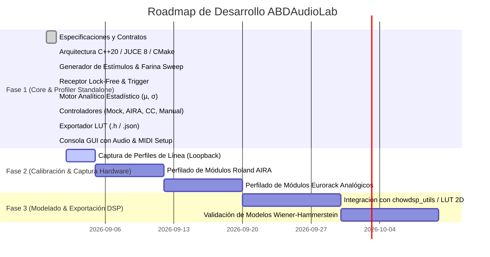

# Roadmap del Proyecto — ABDAudioLab

**Proyecto:** ABDAudioLab (Universal Black-Box Musical Hardware Profiler)  
**Versión:** 1.0.0  
**Fecha de Actualización:** 2026-09-01  

---

## Estado General del Proyecto

---

## Detalle de Fases

### ✅ FASE 1: Laboratorio Autónomo y Motor de Perfilado (COMPLETADA)
- [x] **Subfase 1.1: Entorno de Compilación y Configuración**
  - CMake 3.22+ configurado con C++20, JUCE 8.0.4 y `nlohmann_json`.
  - Script `build.bat` con detección automática de Visual Studio 18 (2026) y compilación paralela Release.
- [x] **Subfase 1.2: Capa de Abstracción de Hardware**
  - Contrato abstracto `IHardwareController` puro e independiente.
  - `MockHardwareController` (simulación DSP interna de filtro resonante y ruido térmico).
  - `AiraSysExController` (Roland AIRA por USB SysEx `RQ1`/`DT1` y CC 11..16).
  - `MidiCcController` (dispositivos MIDI Continuous Controller genéricos).
  - `ManualAnalogueController` (módulos analógicos/Eurorack con guía interactiva para operador humano).
- [x] **Subfase 1.3: Motor de Audio en Tiempo Real**
  - `LabStimulusGenerator` (7 tipos de estímulo: Silencio, Dirac Delta, Farina Sweep logarítmico, Ruido Blanco LCG, Ruido Rosa, Tono 1 kHz, Rampa).
  - `LabAudioReceiver` (Búfer circular lock-free con `AbstractFifo` y disparo por umbral de amplitud a -40 dBfs).
  - `LabAudioEngine` (Cadena jerárquica de 3 pasos de inicialización de audio, `ScopedNoDenormals` e inyector atómico de tono de prueba a 1 kHz).
- [x] **Subfase 1.4: Motor Matemático y Estadístico**
  - `FarinaDeconvolver` (Filtro inverso a $-6\text{ dB/oct}$, convolución FFT, respuesta en frecuencia y THD %).
  - `LabAnalyticEngine` (Extracción de $\mu$ y $\sigma$ para los 5 bloques funcionales).
- [x] **Subfase 1.5: Secuenciador y Exportación**
  - `ProfilingSession` (Generación de suites de prueba para Filtros, ADSR, Delays, Saturadores, VCAs y carga de JSON).
  - `ProfilingSequencer` (Máquina de estados en segundo plano con calibración de línea e interludios de ruido de fondo).
  - `LutExporter` (Exportación de archivos `.h` con `alignas(16) static const AbdBatchedPoint` y reportes `.json`).
- [x] **Subfase 1.6: Consola de Control de Usuario**
  - Interfaz gráfica standalone con diálogo de configuración de Audio y Puertos MIDI (In/Out), selector de los 4 modos de hardware, selector de suites de test, cartel de operador manual (confirmación con Barra Espaciadora) y monitor de logs.

---

### ⏳ FASE 2: Calibración de Banco y Perfilado de Hardware Real (EN CURSO)
- [ ] **2.1**: Calibración de línea y medición de curva de respuesta de la tarjeta de sonido local (*Loopback Calibration*).
- [ ] **2.2**: Conexión y perfilado automatizado del primer hardware digital (Roland AIRA Bitrazer / Torcido) para los 31 submódulos.
- [ ] **2.3**: Perfilado asistido de módulos analógicos y pedales de distorsión/filtros externos.
- [ ] **2.4**: Generación del banco inicial de Look-Up Tables en `exported_luts/`.

---

### 🔮 FASE 3: Modelado DSP Grey-Box y Validación
- [ ] **3.1**: Integración de las LUTs generadas en emuladores C++ basados en `chowdsp_utils` (interpolación bicúbica/bilineal).
- [ ] **3.2**: Inyección de variabilidad analógica estocástica mediante moduladores *Random Walk* basados en la desviación estándar ($\sigma$) medida.
- [ ] **3.3**: Evaluación de la fidelidad del modelo frente a la respuesta del hardware real (comparación de espectros FFT y THD).

---

### 📌 Proyectos Derivados e Independientes
- **Roland AIRA Modular Customizer / Patch Editor**: Proyecto separado e independiente para la edición visual de parches de la serie AIRA con interfaz WebUI/SVG interactiva.
