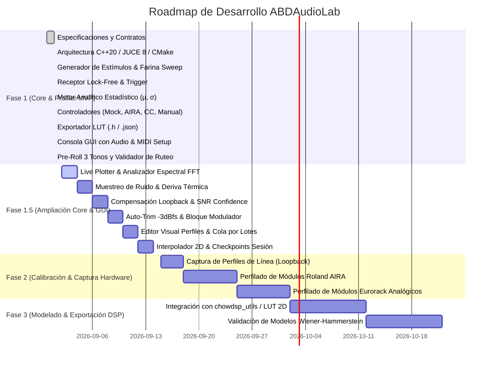

# Roadmap del Proyecto — ABDAudioLab

**Proyecto:** ABDAudioLab (Universal Black-Box Musical Hardware Profiler)  
**Versión:** 1.1.0  
**Fecha de Actualización:** 2026-09-01  

---

## Estado General del Proyecto

---

## Detalle de Fases

### ✅ FASE 1: Laboratorio Autónomo y Motor de Perfilado MVP (COMPLETADA)
- [x] **Subfase 1.1: Entorno de Compilación y Configuración**
  - CMake 3.22+ configurado con C++20, JUCE 8.0.4 y `nlohmann_json`.
  - Script `build.bat` con detección automática de Visual Studio 18 (2026) y compilación paralela Release.
- [x] **Subfase 1.2: Capa de Abstracción de Hardware y Validación**
  - Contrato abstracto `IHardwareController` puro e independiente.
  - `MockHardwareController` (simulación DSP interna de filtro resonante y ruido térmico).
  - `AiraSysExController` (Roland AIRA por USB SysEx `RQ1`/`DT1` y CC 11..16).
  - `RoutingValidator` (Validación de conexiones ilegales `RF-25` y catálogo normativo de 31 submódulos `RF-26`).
  - `MidiCcController` (dispositivos MIDI Continuous Controller genéricos).
  - `ManualAnalogueController` (módulos analógicos/Eurorack con guía interactiva para operador humano).
- [x] **Subfase 1.3: Motor de Audio en Tiempo Real**
  - `LabStimulusGenerator` (9 tipos de estímulo: Silencio, Dirac Delta, `SyncPulses3` pre-roll de sincronización, Farina Sweep logarítmico, Ruido Blanco LCG, Ruido Rosa, Tono 1 kHz, Onda Cuadrada 1 kHz, Rampa de amplitud).
  - `LabAudioReceiver` (Búfer circular lock-free con `AbstractFifo` y disparo por umbral de amplitud a -40 dBfs).
  - `LabAudioEngine` (Cadena jerárquica de 3 pasos de inicialización de audio, `ScopedNoDenormals` e inyector atómico de tono de prueba a 1 kHz).
- [x] **Subfase 1.4: Motor Matemático y Estadístico**
  - `FarinaDeconvolver` (Filtro inverso a $-6\text{ dB/oct}$, convolución FFT, respuesta en frecuencia y THD %).
  - `LabAnalyticEngine` (Extracción de $\mu$ y $\sigma$ para los 5 bloques funcionales).
- [x] **Subfase 1.5: Secuenciador y Exportación**
  - `ProfilingSession` (Generación de suites de prueba para Filtros, ADSR, Delays, Saturadores, VCAs y carga de JSON).
  - `ProfilingSequencer` (Máquina de estados en segundo plano con calibración de línea e interludios de ruido de fondo).
  - `LutExporter` (Exportación de archivos `.h` con `alignas(16) static const AbdBatchedPoint` y reportes `.json`).
- [x] **Subfase 1.6: Consola de Control de Usuario y Publicación**
  - Interfaz gráfica standalone con diálogo de configuración de Audio y Puertos MIDI (In/Out), selector de los 4 modos de hardware, selector de suites de test, cartel de operador manual (confirmación con Barra Espaciadora) y monitor de logs.
  - Repositorio Git inicializado y publicado en [https://github.com/ajabadia/ABDAudioLab](https://github.com/ajabadia/ABDAudioLab).

---

### 🚀 FASE 1.5: Ampliación del Laboratorio (Core Científico & GUI Interactiva) (EN PLANIFICACIÓN)

#### A. Módulos del Core Científico y DSP:
- [ ] **1.5.1: Muestreo Periódico del Suelo de Ruido y Deriva Térmica**
  - Interludio automático cada $N$ minutos (500 ms silencio + 500 ms captura).
  - Cálculo de $Noise_{RMS}$ y FFT de 32 bandas del soplido/hum analógico.
  - Generación del archivo exportado `Analogue_Noise_Timeline.h`.
- [ ] **1.5.2: Compensación de Error de Tarjeta de Sonido (*Loopback Calibration Reference*)**
  - Medición previa de salida $\rightarrow$ entrada directa.
  - Sustracción matemática de la latencia nativa del conversor y caída en 20 Hz.
- [ ] **1.5.3: Índice de Confianza y Calidad de Medida (*Confidence Check* — ALEX)**
  - Cálculo de SNR en tiempo real por cada punto capturado.
  - Validación con umbral mínimo de 18 dB con reintento automático o alerta de fallo.
- [ ] **1.5.4: Calibración Automática de Ganancia (*Auto-Trim* a $-3\text{ dBfs}$)**
  - Ajuste digital automático de escala para evitar saturación del ADC.
- [ ] **1.5.5: Bloque Funcional `CyclicModulator` (Chorus / Flanger / Phaser / LFO)**
  - 5º bloque funcional con medición de velocidad ($Hz$), profundidad ($Depth$) e irregularidad del LFO físico.
- [ ] **1.5.6: Barrido Multinivel de Amplitud (Saturación No Lineal — Välimäki / DAFx)**
  - Inyección escalonada a $-18, -12, -6, 0\text{ dBfs}$ para registrar curvas dependientes del nivel de excitación.
- [ ] **1.5.7: Motor de Interpolación Multidimensional (Spline Bilineal / Bicúbica 2D)**
  - Expansión de matrices 16x16 a resolución completa 128x128 para exportaciones de alta fidelidad.
- [ ] **1.5.8: Checkpoint de Seguridad y Recuperación de Sesión**
  - Guardado periódico en `session_checkpoint.json` ante desconexiones accidentales de hardware.

#### B. Módulos de la Interfaz Gráfica y Consola Interactiva (GUI):
- [ ] **1.5.9: Visualizador Gráfico de Curvas en Tiempo Real (*Live Curve Plotter*)**
  - Renderizado dinámico de la curva de transferencia conforme avanza el robot (Eje X: Control, Eje Y: $\mu$, Franja sombreada: $\pm\sigma$).
- [ ] **1.5.10: Analizador de Espectro FFT en Vivo**
  - Visualización del espectro de retorno superpuesto a la curva teórica del estímulo, marcando armónicos y resonancia.
- [ ] **1.5.11: Mapa de Calor / Matriz de Contorno 2D**
  - Cuadrícula interactiva en tiempo real para escaneos bidimensionales (ej. Cutoff vs Resonancia).
- [ ] **1.5.12: Vúmetros Estéreo con Indicador de Clipping y Calibración a $-3\text{ dBfs}$**
  - Medidores RMS y de pico con marcas de seguridad para calibrar el previo de la tarjeta.
- [ ] **1.5.13: Panel de Salud de Medición y Monitor de SNR/Confianza en Vivo**
  - Indicador numérico de SNR y semáforo visual de estado de medición (*Excelente / Aceptable / Ruido Excesivo*).
- [ ] **1.5.14: Editor Visual de Perfiles de Prueba (*Profile Builder GUI*) y Cola por Lotes (*Batch Queue*)**
  - Diseñador visual de perfiles de prueba y lista de tareas secuenciales desatendidas.
- [ ] **1.5.15: Previsualizador de Archivos Exportados (.h / .json)**
  - Visor de código con botón de copiado rápido y apertura directa en el Explorador de Windows.

---

### ⏳ FASE 2: Calibración de Banco y Perfilado de Hardware Real
- [ ] **2.1**: Calibración de línea y medición de curva de respuesta de la tarjeta de sonido local (*Loopback Calibration*).
- [ ] **2.2**: Conexión y perfilado automatizado del primer hardware digital (Roland AIRA Bitrazer / Torcido) para los 31 submódulos.
- [ ] **2.3**: Perfilado asistido de módulos analógicos y pedales de distorsión/filtros externos.
- [ ] **2.4**: Generación del banco inicial de Look-Up Tables en `exported_luts/`.

---

### 🔮 FASE 3: Modelado DSP Grey-Box y Validación
- [ ] **3.1**: Integración de las LUTs generadas en emuladores C++ basados en `chowdsp_utils` (interpolación bicúbica/bilineal).
- [ ] **3.2**: Inyección de variabilidad analógica estocástica mediante moduladores *Random Walk* basados en la desviación estándar ($\sigma$) medida.
- [ ] **3.3**: Evaluación de la fidelidad del modelo frente a la respuesta del hardware real (comparación de espectros FFT y THD).

---

### 📌 Proyectos Derivados e Independientes
- **Roland AIRA Modular Customizer / Patch Editor**: Proyecto separado e independiente para la edición visual de parches de la serie AIRA con interfaz WebUI/SVG interactiva.

