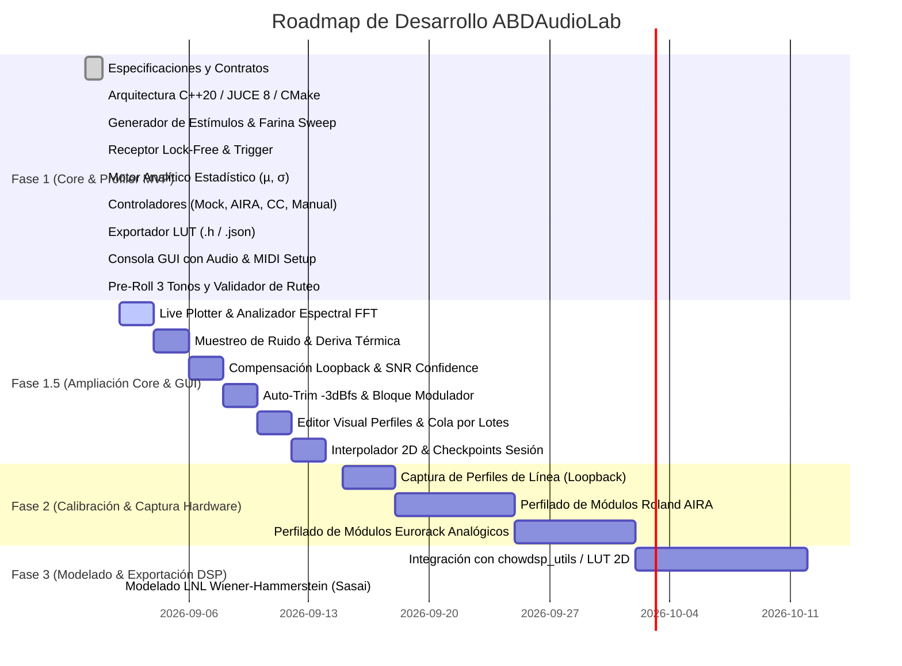

# Roadmap del Proyecto — ABDAudioLab

**Proyecto:** ABDAudioLab (Universal Black-Box Musical Hardware Profiler)  
**Versión:** 1.1.0  
**Fecha de Actualización:** 2026-09-01  

---

## Estado General del Proyecto

---

## Detalle de Fases

### ✅ FASE 1: Laboratorio Autónomo y Motor de Perfilado MVP (COMPLETADA)
- [x] **Subfase 1.1: Entorno de Compilación y Configuración**
  - CMake 3.22+ configurado con C++20, JUCE 8.0.4 y `nlohmann_json`.
  - Script `build.bat` con detección automática de Visual Studio 18 (2026) y compilación paralela Release.
- [x] **Subfase 1.2: Capa de Abstracción de Hardware y Validación**
  - Contrato abstracto `IHardwareController` puro e independiente.
  - `MockHardwareController` (simulación DSP interna de filtro resonante y ruido térmico).
  - `AiraSysExController` (Roland AIRA por USB SysEx `RQ1`/`DT1` y CC 11..16).
  - `RoutingValidator` (Validación de conexiones ilegales `RF-25` y catálogo normativo de 31 submódulos `RF-26`).
  - `MidiCcController` (dispositivos MIDI Continuous Controller genéricos).
  - `ManualAnalogueController` (módulos analógicos/Eurorack con guía interactiva para operador humano).
- [x] **Subfase 1.3: Motor de Audio en Tiempo Real**
  - `LabStimulusGenerator` (9 tipos de estímulo: Silencio, Dirac Delta, `SyncPulses3` pre-roll de sincronización, Farina Sweep logarítmico, Ruido Blanco LCG, Ruido Rosa, Tono 1 kHz, Onda Cuadrada 1 kHz, Rampa de amplitud).
  - `LabAudioReceiver` (Búfer circular lock-free con `AbstractFifo` y disparo por umbral de amplitud a -40 dBfs).
  - `LabAudioEngine` (Cadena jerárquica de 3 pasos de inicialización de audio, `ScopedNoDenormals` e inyector atómico de tono de prueba a 1 kHz).
- [x] **Subfase 1.4: Motor Matemático y Estadístico**
  - `FarinaDeconvolver` (Filtro inverso a $-6\text{ dB/oct}$, convolución FFT, respuesta en frecuencia y THD %).
  - `LabAnalyticEngine` (Extracción de $\mu$ y $\sigma$ para los 5 bloques funcionales).
- [x] **Subfase 1.5: Secuenciador y Exportación**
  - `ProfilingSession` (Generación de suites de prueba para Filtros, ADSR, Delays, Saturadores, VCAs y carga de JSON).
  - `ProfilingSequencer` (Máquina de estados en segundo plano con calibración de línea e interludios de ruido de fondo).
  - `LutExporter` (Exportación de archivos `.h` con `alignas(16) static const AbdBatchedPoint` y reportes `.json`).
- [x] **Subfase 1.6: Consola de Control de Usuario y Publicación**
  - Interfaz gráfica standalone con diálogo de configuración de Audio y Puertos MIDI (In/Out), selector de los 4 modos de hardware, selector de suites de test, cartel de operador manual (confirmación con Barra Espaciadora) y monitor de logs.
  - Repositorio Git inicializado y publicado en [https://github.com/ajabadia/ABDAudioLab](https://github.com/ajabadia/ABDAudioLab).

---

### 🚀 FASE 1.5: Ampliación del Laboratorio (Core Científico & GUI Interactiva) (EN PLANIFICACIÓN)

#### A. Módulos del Core Científico y DSP:
- [ ] **1.5.1: Muestreo Periódico del Suelo de Ruido y Deriva Térmica**
  - Interludio automático cada $N$ minutos (500 ms silencio + 500 ms captura).
  - Cálculo de $Noise_{RMS}$ y FFT de 32 bandas del soplido/hum analógico.
  - Generación del archivo exportado `Analogue_Noise_Timeline.h`.
- [x] **1.6.4: Arquitectura Basada en Contratos JSON Dinámicos para Hardware**
  - Eliminación de modelos hardcodeados en el código C++.
  - Creación de contratos JSON en `contracts/hardware/` (`mock_va_synth.json`, `roland_aira_bitrazer.json`, `roland_aira_torcido.json`, `generic_midi_synth.json`, `manual_eurorack_vcf.json`).
  - `HardwareContractRegistry`: Descubrimiento y carga dinámica de contratos de hardware desde disco.
  - **Nota de diseño futuro (Inspiración ABDBankManager)**: Reutilizar o inspirarse en el sistema de autodetección por MIDI de ABDBankManager para identificar automáticamente el hardware conectado mediante consultas SysEx / Identity Inquiry cruzadas con los contratos.
- [ ] **1.5.3: Índice de Confianza y Calidad de Medida (*Confidence Check* — ALEX)**
  - Cálculo de SNR en tiempo real por cada punto capturado.
  - Validación con umbral mínimo de 18 dB con reintento automático o alerta de fallo.
- [ ] **1.5.4: Calibración Automática de Ganancia (*Auto-Trim* a $-3\text{ dBfs}$)**
  - Ajuste digital automático de escala para evitar saturación del ADC.
- [ ] **1.5.5: Bloque Funcional `CyclicModulator` (Chorus / Flanger / Phaser / LFO)**
  - 5º bloque funcional con medición de velocidad ($Hz$), profundidad ($Depth$) e irregularidad del LFO físico.
- [x] **1.5.6: Barrido Multinivel de Amplitud (Saturación No Lineal — Välimäki / DAFx)**
- [x] **1.5.7: Motor de Interpolación Multidimensional (Bilineal & Bicúbica Catmull-Rom 2D)**
- [x] **1.5.8: Checkpoint de Seguridad y Recuperación de Sesión**
- [x] **1.5.9: Visualizador Gráfico de Curvas en Tiempo Real (*Live Curve Plotter*)**
- [x] **1.5.10: Analizador de Espectro FFT en Vivo (20 Hz - 20 kHz Logarítmico con Peak-Hold y Decay)**
- [x] **1.5.11: Mapa de Calor / Matriz de Contorno 2D (Escala Perceptual Viridis con Color Bar & Ejes)**
- [x] **1.5.12: Vúmetros Estéreo con Indicador de Clipping y Calibración a $-3\text{ dBfs}$**
- [x] **1.5.13: Panel de Salud de Medición y Monitor de SNR/Confianza en Vivo (Horizontal Strip)**
- [x] **1.5.14: Previsualizador de Archivos Exportados (.h / .json) y Apertura de Carpeta**
- [x] **1.5.15: Barra de Menú (vía SlideInDrawer) y Auto-incremento de Compilación en build.bat**

---

### 🎨 FASE 1.6: Rediseño Integral de la Interfaz Estilo Sonarworks SoundID (Tema Claro Nórdico) (COMPLETADA)
- [x] **1.6.1: SoundIdTheme (LookAndFeel C++/JUCE)**
  - Paleta clara nórdica (`#fbfbfc`, `#f4f5f7`), botones tipo píldora (`#111827`), badges redondeados de color (`FLT`, `ENV`, `MOD`, `SAT`) y tipografía nítida.
- [x] **1.6.2: SoundIdCurvePlotter (Visualizador de Curvas de Alta Precisión)**
  - Rejilla logarítmica milimétrica clara, curva media en verde esmeralda (`#10b981`) y banda de dispersión $\pm\sigma$ sombreada en lavanda/lila (`#8b5cf6` / `#f3e8ff`).
- [x] **1.6.3: SoundIdMeterStrip (Tira Vertical Derecha de Medición & Trim)**
  - Vúmetros verticales LED dobles (`In` y `Out`), lectura numérica de picos en dBfs, deslizador vertical de ganancia/trim y botón maestro circular de inicio/pausa.
- [x] **1.6.4: SoundIdSuiteList (Selector de Suites con Badges Estilo SoundID)**
  - Lista inferior de tarjetas de test con badges coloreados (`SpectrumFilter`, `TimeDynamic`, `CyclicModulator`, `WaveShaper`) y parámetros clave.
- [x] **1.6.5: SlideInDrawer (Pestaña Deslizable desde la Izquierda)**
  - Panel animado nativo con `juce::ComponentAnimator`, ancho responsivo (50% de la pantalla), viewport con scroll vertical, renderizado limpio de imágenes de dispositivo, selector de hardware y selector de resolución de matriz.
- [x] **1.6.6: Diálogo Modal de Información ("About ABDAudioLab")**
  - Modal flotante en tema claro nórdico con dismiss por clic en fondo o tecla Escape, accesible directamente desde el panel de información.

---

### 🚀 FASE 1.7: Re-Análisis Offline, Corrección de Errores y Ecosistemas Modulares
- [x] **1.7.3: Contratos Modulares Universales (*Modular Ecosystem Taxonomy*)**
  - Creación del contrato universal de 31 submódulos (`roland_aira_submodules.json`) para evitar duplicar pruebas idénticas entre hardware de la misma familia.
  - Los contratos individuales de cada modelo se concentran exclusivamente en su algoritmo nativo de panel frontal.
  - Soporte para automatización mediante MIDI CC, SysEx Roland DT1 con checksum oficial y 14-bit NRPN.
- [x] **1.7.5: Duración Dinámica de Ráfaga y Captura Adaptativa Inteligente (*Adaptive Auto-Tail Cutoff*)**
  - Selector en la interfaz para duraciones fijas (0.5s, 1.0s, 2.5s, 5.0s) con estimador de tiempo en vivo.
  - Arquitectura de máquina de estados para detección adaptativa de transitorios de ataque y truncado automático de silencio en colas de relajación (ADSR / Reverb).
- [ ] **1.7.1: Motor de Carga y Re-Análisis Offline de Sesiones (*Session Reload & Offline Re-Analysis*)**
  - Carga de `session_manifest.json` y archivos brutos de audio capturados para re-evaluar $\mu, \sigma$, THD %, armónicos $H_2-H_5$, splines o filtrado de ruido con nuevos parámetros matemáticos sin tener que conectar el hardware ni repetir las ráfagas físicas de audio.
  - Visor histórico de sesiones y comparador A/B de curvas.
- [ ] **1.7.2: Corrección Parcial de Errores y Parcheo por Rangos (*Point Range Re-Measurement & Error Patching*)**
  - Capacidad de re-medir un subconjunto específico de puntos defectuosos (ej. puntos 12 al 15 con baja relación señal/ruido o error de posición de perilla) y fusionar/parchear los resultados directamente sobre el manifiesto y tablas existentes.
- [x] **1.7.6: Cola de Ensayos por Lotes y Validación Anti-Duplicación (*Session Test Queue & Anti-Duplication*)**
  - Constructor de planes de ensayo encadenando múltiples pruebas (estándar desde contrato o personalizadas).
  - Regla de validación en tiempo real para evitar añadir exactamente la misma prueba o función duplicada en una misma sesión de laboratorio.
  - Ejecución secuencial unificada con progreso consolidado y exportación de paquete multidimensional unificado.
- [x] **1.7.7: Autoguardado Continuo, Empaquetador `.abdlabtest` y Salvaguardas (*Continuous Autosave & Container Package*)**
  - Creación del serializador y empaquetador ZIP `.abdlabtest` ([SessionSerializer](src/core/SessionSerializer.h)) con verificación SHA-256.
  - Grabación directa de audio `.wav` PCM 24-bit en disco para cada pase.
  - Flujos completos de `Save`, `Save As...` y recuperación periódica.
  - Diálogos de 3 vías de confirmación (*Purgar y Borrar* vs *Invalidar y Conservar* vs *Cancelar*) al borrar o editar pruebas ya medidas.
- [x] **1.7.9: Optimización de Tiempo de Arranque & Pantalla de Presentación (*Startup Optimization & Splash Screen*)**
  - Implementación de la pantalla de bienvenida flotante [SoundIdSplashScreen](src/gui/SoundIdSplashScreen.h) con visualización de estado en tiempo real (*"Scanning Audio Interfaces..."* -> *"Loading Hardware Modules..."* -> *"Ready."*).
  - Transición fluida de desvanecimiento (*Fade-Out*).
- [x] **1.7.4: Autodetección de Hardware por MIDI Multicanal (1..16) y Universal SysEx Identity Inquiry** (COMPLETADO v1.0.0 Build 142)
  - Identificación automática de dispositivos conectados mediante consultas SysEx Universal Identity Inquiry (`F0 7E <dev> 06 01 F7`) y coincidencia con las firmas declaradas en los contratos JSON.
  - Implementación de [`MidiIdentityDetector.h/.cpp`](src/hardware/MidiIdentityDetector.h) con soporte nativo de identidad y contratos JSON para:
    - **Casio CZ-101** (`ABDCZ101`, Manufacturer `0x44`)
    - **Roland Juno-106 / Juno-60** (`ABDJUNIO601`, Manufacturer `0x41`, Model `0x32`)
    - **Korg MS2000 / MS2000R** (`ABDMS2000`, Manufacturer `0x42`, Model `0x58`)
    - **Korg Prophecy** (`korg_prophecy`, Manufacturer `0x42`, Model `0x5A`)
    - **Behringer PRO-800** (`pro800`, Manufacturer `0x00 0x20 0x32`, Model `0x2C`)
    - **Behringer DeepMind 12 y DeepMind 6** (`behringer_deepmind12`, `behringer_deepmind6`)
    - **Yamaha DX7 y DX7II** (`yamaha_dx7`, `yamaha_dx7ii`)
    - Serie **Roland AIRA Modular** (Bitrazer, Demora, Torcido, Scooper).
  - Botón interactivo *"Auto-Detect Device (MIDI)"* en [`SlideInDrawer`](src/gui/SlideInDrawer.cpp) con selección y emparejamiento automático de hardware en el panel.
  - Validado mediante suite de tests unitarios Catch2 (`test_MidiIdentityDetector.cpp`).
- [x] **1.7.5: Generador y Exportador de Datasets de Calibración NAM / RTNeural** (COMPLETADO v1.1.0)
  - Implementación del estímulo de calibración estandarizado `StimulusType::NamCalibration` en [`LabStimulusGenerator`](src/audio/LabStimulusGenerator.h) (trenes de sincronía de 1 kHz, ruido blanco/rosa multinivel, barrido sinusoidal logarítmico y trenes armónicos ricos).
  - Implementación de [`NamDatasetExporter`](src/export/NamDatasetExporter.h): alineamiento temporal sample-accurate por correlación cruzada en el pre-roll, compensación de latencia del convertidor, y exportación normalizada de `input.wav`, `target.wav` y `nam_dataset_manifest.json` listos para entrenamiento externo con PyTorch / Neural Amp Modeler.
  - Suite de tests unitarios Catch2 en [`test_NamDatasetExporter.cpp`](src/tests/test_NamDatasetExporter.cpp) validada.
- [x] **1.7.8: Rango Dinámico Útil por Parámetro (*Parametric Min/Max Range Bounds: Start % - End %*)** (COMPLETADO v1.0.0 Build 138)
  - Capacidad de acotar el intervalo útil de barrido de cada potenciómetro (por defecto: `0% - 100%`, configurable a ej. `15% - 85%`).
  - Evita medir zonas muertas de silencio, frecuencias inaudibles o saturaciones planas irrelevantes. Renderizado de pista sombreada de rango útil en Knobs/Sliders vectoriales y serialización en contenedor `.abdlabtest`.
- [x] **1.7.11: Integración de AutoUpdater Desacoplado (ABDSharedCode)** (COMPLETADO v1.1.0)
  - Integración modular de la librería compartida `ABDShared::AutoUpdater` vía CMake (FetchContent de GitHub / soporte local en monorepo).
  - Configuración del repositorio `ajabadia/ABDAudioLab` en [`AutoUpdaterConfig.h`](src/config/AutoUpdaterConfig.h).
  - Botón *"Check for Updates..."* en la vista de archivo con comprobación manual/desatendida y ventana modal para descarga de instaladores.
- [ ] **1.7.10: Banda de Tolerancia Sombreada ($\pm 1\sigma$ *Accuracy Corridor*) y Leyenda Conmutable**
  - Renderizado de polígono translúcido entre $(\mu - \sigma)$ y $(\mu + \sigma)$ en `SoundIdCurvePlotter` mostrando la dispersión térmica y tolerancia analógica.
  - Barra superior de leyenda para conmutar visibilidad de capas: Medición Real ($\mu$), Tolerancia ($\pm 1\sigma$), THD % y Modelo Teórico Objetivo.
- [ ] **1.7.11: Modo Benchmark VST / Plugin (Inspirado en Audio Latency Examiner)**
  - Capacidad de alojar un plugin VST3 como referencia y ejecutar la misma batería de pruebas para comparar directamente el modelo virtual contra el hardware real superpuesto.
- [ ] **1.7.12: Campo de Observaciones / Metadatos de Laboratorio en Manifiesto**
  - Notas de sesión libres (temperatura ambiente, tiempo de precalentamiento, voltaje) registradas en el contenedor `.abdlabtest`.
- [ ] **1.7.13: Automatización de Sintetizadores via MIDI (*MIDI Synth Automation & Audio Routing*)**
  - Estudio y desarrollo de automatización MIDI multicanal para sintetizadores físicos y virtuales (notas MIDI, Pitch Bend, CCs, Sysex).
  - Soporte para dos modos operativos: (A) Estímulo de audio inyectado internamente desde la aplicación (`LabStimulusGenerator`), o (B) Audio producido externamente por el propio sintetizador de hardware disparado vía MIDI.
- [x] **1.7.14: Calidad de Código, Unit Tests & Real-Time Hardening DSP (*Code Quality, Unit Tests & Real-Time Hardening*)**
  - Implementación de métricas analíticas 100% reales en `LabAnalyticEngine` ($Decay/Release$ de ADSR, THD % dinámico en WaveShaper, SNR en ganancia y asimetría de modulación).
  - Creación del framework de Pruebas Unitarias automatizadas en `src/tests/` (Catch2 / CTest) para `FarinaDeconvolver`, `SplineInterpolator2D`, `SessionSerializer`, `LabAnalyticEngine` y `CertificationReportExporter`.
- [x] **1.7.15: Identificación de Sistemas No-Lineales Wiener-Hammerstein (LNL)** (COMPLETADO v1.0.0 Build 140)
  - Algoritmo de optimización simultánea de filtros FIR de entrada/salida y saturación cúbica $f(u) = u + a \cdot u^3$ con retropropagación analítica y optimizador Adam según Takeo Sasai et al. (Optics Express 2020 / arXiv:2012.08046v1).
  - Clase [`WienerHammersteinFitter`](src/math/WienerHammersteinFitter.h), integración en [`LabAnalyticEngine`](src/math/LabAnalyticEngine.h), badge `WNH` y test unitario automatizado Catch2 (`test_WienerHammerstein.cpp`).
  - Documentación Doxygen completa de la API en encabezados públicos (`IHardwareController.h`, `LabAudioEngine.h`, `ProfilingSequencer.h`, `LutExporter.h`).
  - Auditoría de latencia y eliminación estricta de asignaciones dinámicas de memoria (`Zero Heap Allocation`) en el hilo de procesamiento de audio en tiempo real.

---

### 🛡️ PLAN DE SPRINTS: Seguridad en Tiempo Real, Calidad y Refactorización (2 Sprints)

#### 🚀 Sprint 1: Seguridad de Memoria en Hilo de Audio, Corrección de Callbacks y Tests de Límites (COMPLETADO)
- [x] **Día 1: Preparación y Seguridad Base**
  - Auditoría de latencia y checklist estricto: cero asignaciones dinámicas (`new`/`malloc`/`std::vector` locales) dentro de `audioDeviceIOCallbackWithContext`.
- [x] **Días 1–2: Mitigación de Riesgo de Buffer de Audio y Estéreo (P1)**
  - Sustitución de `numSamples` por `samplesToProcess` derivado de `std::min(numSamples, maxCapacity)`.
  - **Arquitectura Dual-Buffer (`tempProcessBufferL` y `tempProcessBufferR`)**: Eliminación definitiva del riesgo de desbordamiento por offset estéreo para bloques $\ge 8.192$ muestras (capacidad independiente de 16.384 muestras por canal).
  - Mecanismo seguro de relleno de ceros (`std::fill_n`) para el remanente en canales de salida si el host entrega bloques mayores a la reserva.
  - Corrección de desequilibrio estéreo en Input Trim (ganancia aplicada simétricamente a ambos canales L y R en sus respectivos buffers).
  - Generación de tono diagnóstico (`tapDiagTone`) libre de asignaciones en heap mediante reutilización de `tempProcessBufferL`.
- [x] **Día 2: Eliminación de Sobrescritura de Callback Funcional (P1)**
  - Supresión de la asignación duplicada de `suiteList.onRestartTestClicked` en `main.cpp`.
  - Preservación del reinicio a 0 puntos medidos y estado `Queued`.
- [x] **Día 2: Corrección del Mapeo de Estímulos en TestEditorPanel**
  - Corrección del desfase entre etiquetas UI y enum `StimulusType` (conexión correcta de `DiracDelta` para Impulso Paso, `SineWave1kHz` para Seno 1kHz, `WhiteNoise`, etc.).
- [x] **Días 3–5: Base Ampliada de Pruebas Automatizadas y Verificación Unitaria de Taps/JSON**
  - Creación y ampliación de [`test_AudioEngineBounds.cpp`](src/tests/test_AudioEngineBounds.cpp):
    * Verificación de tamaños de bloque estándar y estrés (64, 512, 8.192 y 20.000 muestras oversized sin desbordamiento).
    * Verificación unitaria de la cadena interna sin dispositivo de audio: **callback simulado $\rightarrow$ `ScopeTap` (los 3 taps: `Hardware In`, `Stimulus Generator` y `Diagnostic 1kHz`) $\rightarrow$ `ScopeFrameSerializer` $\rightarrow$ JSON Wire Protocol**.
    * Comprobación de que las muestras estéreo y el factor de trim ($1.5\times$) se reflejan fielmente en el wire-protocol JSON (`timeDataL`, `timeDataR`, `peakL`, `peakR`).
    * Transición de estados del secuenciador (reinicio a 0 vs preservación en pausa).
  - **100% de la suite de pruebas unitarias pasando (20/20 tests en Catch2 / CTest en 1.97 s)**.

#### 🏗️ Sprint 2: Desacoplamiento Arquitectural y Modularización (Deuda P2) (EN CURSO)
- [ ] **Modularización de MainContentComponent ("God Class")**
  - Extracción de `HardwareSelectionController` (gestión de contratos hardware, escaneo y handshake MIDI/SysEx).
  - Extracción de `SessionWorkflowController` (coordinación de colas de ejecución, inicio/pausa/reanudación y persistencia).
  - Extracción de `MainViewInitializer` (composición y montaje de paneles UI).
- [x] **Simplificación del Callback de Audio (`audioDeviceIOCallbackWithContext`)** (COMPLETADO)
  - Descomposición de la rutina de 151 líneas en 5 subrutinas privadas `noexcept` inline:
    * `renderDiagnosticTone(...)`
    * `renderStimulusAndRoute(...)`
    * `processInputAndMetrics(...)`
    * `accumulateFft(...)`
    * `updateTelemetryTaps(...)`
  - Eliminación de todas las asignaciones dinámicas y garantía de simetría de ganancia L/R.
  - **Separación semántica estricta de Taps en ABDScope**:
    * `Diagnostic 1kHz`: tono virtual de referencia para validar la renderización del WebView2 de forma autónoma.
    * `Hardware In (DUT)`: flujo captado por el ADC / entrada física con trim simétrico.
    * `Stimulus Generator`: flujo sintetizado enviado a las salidas físicas del DAC.
- [ ] **Validaciones Pendientes en Banco Físico y UI Real (Objetivos de Cierre)**:
  - [ ] **Prueba de Loopback Físico DAC $\rightarrow$ ADC**: Conexión por cable patch en tarjeta de sonido real para validar routing, latencia real y distorsión intrínseca.
  - [ ] **Smoke Test de WebView2**: Verificación visual de renderizado en ventana real con temporizador a 30 fps e IPC.
  - [ ] **Cierre y Auditoría**: Actualización de grafos de dependencias en `codebase-memory-mcp`.

---

### ⏳ FASE 2: Calibración de Banco y Perfilado de Hardware Real
- [ ] **2.1: Calibración de Línea de Tarjeta de Sonido (*Loopback Line Calibration Wizard*)** (EN CURSO)
  - Medición directa del bucle DAC -> ADC mediante cable patch para caracterizar la función de transferencia del interfaz $H_{\text{interface}}(f)$.
  - Cálculo de ganancia óptima a $-3.0\text{ dBfs}$, latencia en muestras y calibración inversa para des-colorear las mediciones de hardware.
- [ ] **2.2**: Conexión y perfilado automatizado del primer hardware digital (Roland AIRA Bitrazer / Torcido) para los 31 submódulos universales.
- [ ] **2.3**: Perfilado asistido de módulos analógicos y pedales de distorsión/filtros externos.
- [ ] **2.4**: Generación del banco inicial de Look-Up Tables en `exported_luts/`.

---

### 🔮 FASE 3: Modelado DSP Grey-Box y Validación
- [ ] **3.1**: Integración de las LUTs generadas en emuladores C++ basados en `chowdsp_utils` (interpolación bicúbica/bilineal).
- [ ] **3.2**: Inyección de variabilidad analógica estocástica mediante moduladores *Random Walk* basados en la desviación estándar ($\sigma$) medida.
- [ ] **3.3**: Evaluación de la fidelidad del modelo frente a la respuesta del hardware real (comparación de espectros FFT y THD).

---

### 📌 Proyectos Derivados e Independientes
- **Roland AIRA Modular Customizer / Patch Editor**: Proyecto separado e independiente para la edición visual de parches de la serie AIRA con interfaz WebUI/SVG interactiva.

