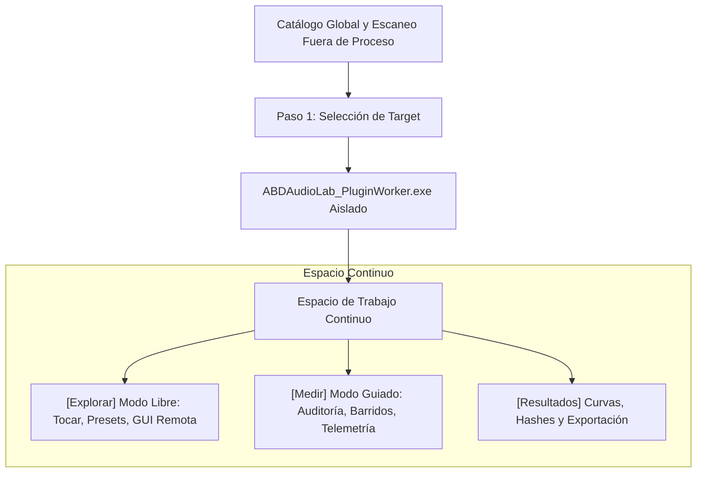

# Informe Técnico: Diferencias Reales entre el Modo Guiado y el Modo No Guiado en ABDAudioLab

**Fecha:** 15 de Septiembre de 2026  
**Documento:** Informe de Arquitectura de Producto y Motor de Ejecución  
**Estado:** Diagnóstico y Base para la Convergencia Arquitectónica  

---

## 1. Resumen Ejecutivo

En el estado actual de la base de código de ABDAudioLab existen dos modos de interacción: el **Modo Guiado** (diseñado para la medición metrológica formal y certificación de modelos black-box) y el **Modo No Guiado o Laboratorio Libre** (diseñado para la exploración interactiva, prueba de presets y audición en tiempo real).

Aunque conceptualmente pertenecen a la misma herramienta, históricamente se han desarrollado sobre rutas de ejecución, componentes de interfaz y políticas de seguridad marcadamente diferenciadas. Este informe detalla **dónde divergen hoy en la realidad del código**, **qué riesgos conlleva esa divergencia** y **cómo deben unificarse bajo la arquitectura de proceso aislado (Fase 20.8)**.

---

## 2. Matriz Comparativa Integral

| Dimensión | Modo Guiado (Medición / Perfilado) | Modo No Guiado (Laboratorio Libre) |
| :--- | :--- | :--- |
| **Objetivo Principal** | Caracterización científica reproducible de un target acústico. | Exploración musical, prueba de sonidos y diseño sonoro interactivo. |
| **Flujo de Usuario** | Secuencial estricto de 3 pasos: `Target` $\to$ `Auditoría` $\to$ `Medición/Resultados`. | Libre y no lineal: abrir catálogo, elegir plugin, tocar y modificar en vivo. |
| **Componente Orquestador** | `ProfilingSessionCoordinator` (con máquina de estados formal). | `MainContentComponent` + `audioEngine` + `HardwareDispatcher`. |
| **Gestión de Instancias** | `ISynthTargetLifecycleAdapter` (`Synthetic` o `ExternalPluginFixture`). | `PluginHostManager` (contenedor de `juce::AudioPluginFormatManager`). |
| **Naturaleza del Audio** | **Por Bloques de Test (Render Determinista)**:<br>Bloques fijos (256 muestras), sin streaming de entrada en vivo. | **Streaming Continuo en Tiempo Real**:<br>Procesamiento continuo a la frecuencia y buffer de la tarjeta de sonido. |
| **Generación de Señal** | `ParameterExcitationEngine` (recetas científicas: APRBS, barridos, Jacobiano). | Teclado virtual MIDI, secuenciador interno o controlador MIDI USB externo. |
| **Requisito de Auditoría** | **Estricto y Obligatorio**:<br>Exige aprobación (`Approved` o `ApprovedWithWarnings`) antes de medir. | **Opcional / Inexistente**:<br>Se puede cargar y tocar cualquier binario sin pasar auditoría. |
| **Procedencia y Hashes** | **Obligatorios e Inmutables**:<br>Exige SHA-256 de binario, hash de contrato y hash canónico RFC 8785. | Dinámico y efímero (`PluginHardwareContractAdapter` inferido al vuelo). |
| **Política de Exportación** | **Condicionada**:<br>Permite exportar informes y tablas JSON/LUT si los tests son válidos. | **Bloqueada por Diseño**:<br>No se permite exportar modelos sin certificación previa. |
| **Interfaz Gráfica del Plugin** | **Headless**:<br>No abre ni requiere la ventana GUI del plugin. | **Ventana Flotante Nativa**:<br>`pluginWindowController` aloja el editor gráfico del plugin (`HWND`). |
| **Riesgo Actual de Crash** | Aislado en proceso worker (`ABDAudioLab_PluginWorker.exe`) en 20.8.3. | **In-Process Crítico**:<br>Corre en el proceso principal; un fallo en audio o GPU derriba la app. |

---

## 3. Desglose en Detalle por Capas

### 3.1. Capa de Dominio y Control (Orquestación)
* **Modo Guiado:**
  - El orquestador (`ProfilingSessionCoordinator`) asume el control total de la línea temporal.
  - La sesión avanza mediante estados discretos: `SelectingTarget`, `AuditingTarget`, `ProfilingRunning`, `Paused`, `Completed`, `Cancelled`.
  - Si ocurre una anomalía acústica o una divergencia en el reset de fase, la medición se detiene y se exige confirmación explícita.
* **Modo No Guiado:**
  - No hay máquina de estados centralizada; los eventos ocurren de forma reactiva asíncrona ante la interacción humana (mover un slider, pulsar una tecla, cargar un archivo FXP/preset).
  - Los datos fluyen constantemente a través de osciloscopios (`ABDScope`) y analizadores de espectro en tiempo real sin una ventana temporal de observación cerrada.

### 3.2. Capa de Audio y Transporte
* **Modo Guiado:**
  - El audio se sintetiza bajo demanda en bloques controlados (`processBlock`), calculando métricas instantáneas (RMS, THD%, respuesta en frecuencia transitoria, retardo acústico).
  - No existe latencia de monitorización directa del usuario: lo prioritario es la exactitud sub-bloque y la reproducibilidad matemática.
* **Modo No Guiado:**
  - El motor de audio (`audioEngine`) procesa el búfer en bucle continuo cerrado dependiente del driver ASIO/WASAPI de Windows.
  - La latencia auditiva es crítica para que el usuario experimente respuesta inmediata al tocar el teclado virtual.

### 3.3. Capa de Seguridad y Estabilidad ante Fallos
* **Modo Guiado:**
  - Está protegido por el adaptador out-of-process (`OutOfProcessVst3LifecycleAdapter`).
  - Si un plugin colapsa durante un barrido, el watchdog detecta la desconexión del Named Pipe, marca el fallo en la sesión y el host principal permanece intacto.
* **Modo No Guiado (Hoy):**
  - Utiliza `PluginHostManager::loadPluginFromFileAsync` e instanciación directa en memoria.
  - Si el usuario abre la GUI nativa de un sintetizador de terceros y este falla (p. ej. conflicto de contexto OpenGL en monitores secundarios o error de puntero nulo en el procesamiento interno), **ABDAudioLab.exe se cierra abruptamente perdiendo todo el trabajo**.

---

## 4. Los Tres Puntos de Fricción / Divergencia Detectados

1. **Doble Catálogo y Escaneo Divergente:**
   - En el modo no guiado, el usuario escanea carpetas con `pluginScanModal` y guarda un archivo `PluginCache.xml`.
   - En el modo guiado, el selector de targets lee definiciones estructuradas y exige procedencia estricta.
   - *Riesgo:* Que un plugin visible en la lista libre no pueda seleccionarse para medir o viceversa.
2. **Inconsistencia Visual y Mental:**
   - El Modo Guiado utiliza la cabecera estilizada `SoundIdTopHeaderStrip` y un asistente visual limpio por etapas.
   - El Modo No Guiado recurre a desplegables clásicos, modales genéricos de exploración y controles de asignación de hardware antiguos.
   - *Efecto:* Da la sensación de estar utilizando dos programas distintos empaquetados en un mismo `.exe`.
3. **Falsa Sensación de Aislamiento:**
   - La ventana de escaneo del modo libre dice *"Scanning in background thread"*, pero corre dentro del mismo espacio de memoria virtual del ejecutable principal.

---

## 5. El Modelo Objetivo Unificado ("Un Solo Producto, Dos Espacios")

Para subsanar definitivamente estas diferencias sin sacrificar la agilidad de la exploración libre ni el rigor de la metrología, la arquitectura converge en:



### Reglas Clave de la Convergencia:
1. **Mismo Proceso Worker:** Tanto para tocar en vivo como para medir, el plugin se ejecuta dentro de `ABDAudioLab_PluginWorker.exe`.
2. **Transición sin Recarga:** El usuario puede cargar un plugin en `[Explorar]`, ajustar el preset deseado, y simplemente pulsar *"Preparar para Medición"* para auditar y perfilar exactamente esa instancia sin reiniciar el target.
3. **Exportación Blindada:** La exportación formal a archivos `.json` / `.h` solo se desbloquea en `[Resultados]` si el target cuenta con el dictamen de auditoría favorable (`AuditedApproved`).

---

## 6. Estado del MVP End-to-End — Cierre Técnico (15 Sep 2026)

### Cadena validada en pruebas automatizadas

```
ReferenceSynth.vst3 -> ABDAudioLab_PluginWorker.exe (IPC)
    -> render / medición determinista
    -> telemetría GUI (RMS, pico, F0)
    -> informe metrológico RFC 8785
    -> exportación LNL con hash canónico
```

Suite Catch2: **253 test cases · 158.420 assertions · 0 fallos · 0 regresiones**

### Restricción documentada: chunking de Named Pipe (2048 muestras)

El transporte IPC del modo guiado usa Named Pipes configuradas con `PIPE_TYPE_MESSAGE | PIPE_READMODE_MESSAGE` y un tamaño de chunk fijo:

```
2048 muestras × 2 canales × 4 bytes (float32) = 16.384 bytes por mensaje
```

Esto es una **optimización del flujo de medición controlada**, no una arquitectura de audio interactivo en tiempo real. Restricciones a tener en cuenta:

- **El comportamiento de atomicidad depende del modo de la pipe**: solo cuando se usa `PIPE_TYPE_MESSAGE` + `PIPE_READMODE_MESSAGE` cada `WriteFile` produce un mensaje discreto recuperable con un único `ReadFile`. En modo byte (`PIPE_TYPE_BYTE`), no existe esa garantía.
- **`ERROR_MORE_DATA` debe gestionarse explícitamente**: se produce cuando el buffer de lectura es menor que el mensaje completo. El framing actual lo previene manteniendo el chunk < 65.535 bytes (límite de la pipe), pero el receptor debe verificar antes de leer: `samplesRendered ≤ maxBlockSamples`, `audioDataBytes ≤ maxPayload`. No se confía en el `blockSize` recibido del peer.
- **Modo de espera (`PIPE_WAIT` vs. `PIPE_NOWAIT`)**: el proyecto usa `PIPE_WAIT` (bloqueante), adecuado para render bajo demanda. Para streaming continuo con baja latencia se requeriría `PIPE_NOWAIT` o I/O asíncrono con `OVERLAPPED`, pero eso incrementa complejidad sin beneficio para este MVP.
- Para **audio sostenido y latencia baja** (modo no guiado continuo), el camino previsto sigue siendo un **ring buffer en memoria compartida** (`CreateFileMapping` / `MapViewOfFile`). Las pipes son adecuadas para control y bloques moderados de render bajo demanda.

Ref: [Named Pipe Type, Read, and Wait Modes — Microsoft Learn](https://learn.microsoft.com/en-us/windows/win32/ipc/named-pipe-type-read-and-wait-modes)

### Próximo hito: validación manual de producto en Release

La definición práctica de "terminado" es que otra persona pueda abrir el Release, ejecutar el flujo y obtener el manifiesto exportado **sin intervención de ingeniería**.

#### Checklist de ejecución

1. Seleccionar **ReferenceSynth VST3 (Worker Aislado IPC)** en el combo del modo guiado.
2. Confirmar el badge visual de proceso aislado en la UI.
3. Ejecutar la medición completa.
4. Observar la telemetría en tiempo real (RMS, pico, F0).
5. Revisar las métricas e informe generado.
6. Copiar el hash canónico RFC 8785.
7. Exportar el manifiesto LNL y verificar que contiene `executionMode: OutOfProcessVST3` y el hash.
8. Forzar fallo del worker (terminar `ABDAudioLab_PluginWorker.exe` desde el Administrador de Tareas) y verificar que:
   - El host sigue abierto.
   - Aparece un mensaje de error legible (no crash silencioso ni timeout sin feedback).
   - La evaluación previa permanece consultable.
   - La exportación queda bloqueada correctamente.
9. Confirmar que el modo no guiado conserva su comportamiento anterior sin cambios.

#### Registro mínimo que debe quedar documentado

La fase no puede marcarse como completamente terminada sin registrar:

| Campo | Valor |
|---|---|
| Versión / build number | _pendiente_ |
| Commit hash del ejecutable | _pendiente_ |
| Hash SHA-256 de `ReferenceSynth.vst3` | _pendiente_ |
| Fecha y hora de la prueba | _pendiente_ |
| Resultado de cada escenario (1-9) | _pendiente_ |
| Incidencias observadas | _pendiente_ |

> **Distinción importante**: prueba manual observada ≠ prueba automatizada. Ambas son necesarias; ninguna sustituye a la otra.

### Decisiones bloqueadas hasta completar la validación manual

| Línea | Estado |
|---|---|
| Integración del modo no guiado con el worker | 🔒 Bloqueada |
| Streaming continuo por memoria compartida | 🔒 Bloqueada |
| CLAP / AU / hardware adicional | 🔒 Bloqueada |
| Mejoras arquitectónicas adicionales | 🔒 Bloqueada |
| Rediseños de UI | 🔒 Bloqueada |

### Criterio de desbloqueo y prioridad post-validación

| Observación en la validación manual | Siguiente trabajo |
|---|---|
| La GUI guiada resulta incómoda o confusa | Mejorar UX del flujo guiado |
| El worker falla bien pero el modo libre sigue siendo inseguro | Migrar el modo no guiado al worker |
| Se necesita monitorización de audio continua | Implementar ring buffer de memoria compartida |
| El MVP es completamente satisfactorio | Añadir un segundo target (CLAP u otro VST3) |

> **Regla de foco**: No abrir ninguna línea nueva hasta que una persona complete el flujo Release y quede el registro documentado.
