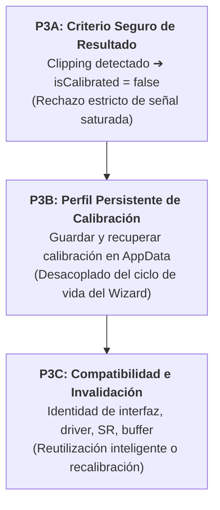

# Auditoría y Registro de Evolución: Wizard de Inicio y Calibración de Interfaz (R4)

**Fecha de Actualización:** 4 de Octubre de 2026  
**Rama:** `main`  
**Documento de Gobernanza:** `docs/audits/AUDIT_CALIBRATION_LAB_AND_STARTUP_WIZARD.md`  
**Estado:** 🟢 **PRIORIDAD 1 Y PRIORIDAD 2 CERRADAS — PREPARACIÓN DE PRIORIDAD 3**

---

## 1. Registro Canónico de Baselines de Pruebas

Para garantizar la estricta trazabilidad de no-regresión y justificar la variación en el cómputo de aserciones de la suite Catch2, se certifican los siguientes puntos de control:

| Baseline / Hito | Commit SHA | Tests Totales | PASS | SKIPPED (Legítimos) | FAIL | Assertions PASS | Delta Aserciones |
| :--- | :---: | :---: | :---: | :---: | :---: | :---: | :---: |
| **Release Histórica Inmutable v2.1.0** | `0b76616` | 945 | 918 | 27 | 0 | **211.036** | Baseline de partida |
| **Post-Prioridad 1 (Startup Sync)** | `855991f` | 946 | 919 | 27 | 0 | **211.042** | +6 (+1 test case ST-69) |
| **Post-Prioridad 2 (Claridad UX/Copy)** | `ab30e62` | 946 | 919 | 27 | 0 | **211.044** | +2 (Aserciones de copy del Stepper) |

> [!NOTE]
> Las 27 pruebas en estado `SKIPPED` corresponden exclusivamente a la ausencia de plugins VST3 externos de prueba (Dexed / VES) en el entorno de desarrollo local, de acuerdo con la clasificación normativa `KI-01`.

---

## 2. Estado de Cierre de Microhitos

### Prioridad 1: Sincronización de Arranque del Wizard (`855991f`)
- **Problema resuelto:** Incoherencia visual al abrir la aplicación (la barra lateral indicaba Tarea 0 pero el panel central presentaba Tarea 1).
- **Solución implementada:** Se fijó `Step::HardwareRouting` (Tarea 1 — Target & Routing) como único estado inicial sincronizado tanto en `SoundIdSidebarStepper` como en `WorkflowNavigationController`, garantizando la invocación canónica de `resetToNewSession()`.
- **Integridad:** Se preservaron intactos los valores ordinales del enum class `Step`. Se añadió el test de contrato `ST-69` en `test_StepperCoherence_ST47_ST68.cpp`.

### Prioridad 2: Claridad Operativa de Calibración de Interfaz (`ab30e62`)
- **Problema resuelto:** Ambigüedad en la Tarea 2 respecto a qué se calibra (el usuario creía calibrar su sintetizador en lugar de la tarjeta), instrucción incorrecta de ajuste manual a -3 dBFS, detalles técnicos irrelevantes en modo digital y códigos de error crípticos.
- **Solución implementada:**
  1. Título canónico: `2. Calibración de Interfaz de Audio` (subtítulo: `Latencia y Nivel de Tarjeta`).
  2. Aclaración explícita: La prueba mide la ruta de audio de la interfaz (DAC/ADC), no el instrumento bajo prueba.
  3. Desacoplamiento de ganancia: Se eliminó el requerimiento manual de -3 dBFS; la UI explica que el cómputo de compensación es automático (Auto-Trim).
  4. Mensajes accionables ante fallos: Instrucción específica de comprobar cables y retornos o reducir ganancia ante saturación, bajo el badge `✕ REVISAR RETORNO`.
  5. Modo digital depurado: Se eliminó la promesa de *“32/64-bit float”*, explicando con claridad que la calibración analógica no aplica a plugins/sintetizadores virtuales y se asumen 0 ms y nivel nominal.
  6. Presentación explícita de canales: Se exhibe visualmente la ruta activa `Output 1 ➔ Input 1`.

#### Salvedad Técnica Registrada (Gobernanza)
En `NativeCalibrationPanel`, los métodos `setCalibrationChannels()`, `getCalibrationOutputChannel()` y `getCalibrationInputChannel()` constituyen únicamente preparación técnica privada e inactiva.  
**Norma para Prioridad 3:** La Prioridad 3 **no debe asumir** que existe routing configurable de usuario por la mera presencia de estos métodos. Su uso real requerirá auditoría y diseño específico si se decide exponerlo como funcionalidad de usuario.

---

## 3. Plan de Trabajo Segmentado: Prioridad 3 (Robustez Técnica y Persistencia)

La Prioridad 3 aborda cambios de comportamiento matemático, criterios de aceptación estricta y persistencia en disco. Para mitigar riesgos y facilitar la validación granular, el trabajo se divide en **tres microhitos secuenciales independientes**:

### Secuencia de Ejecución

1. **P3A — Criterio Seguro de Resultado (Fallo Estricto por Clipping)**:
   - **Objetivo:** Garantizar que ninguna calibración con clipping sea aceptada como válida (`isCalibrated = false`).
   - **Alcance:** Modificación en la regla de decisión de `LoopbackCalibrator::analyzeLoopback()` y ajuste de los tests unitarios correspondientes.
   - **Estado:** ✅ **Completado y Certificado**.
     - Implementación: `result.isCalibrated = (!result.clippingDetected && result.peakInDbfs > -40.0f && result.frequencyFlatnessDb < 6.0f);` en [`src/math/LoopbackCalibrator.cpp`](file:///d:/desarrollos/ABDSynths/ABDAudioLab/src/math/LoopbackCalibrator.cpp#L155).
     - Test unitario: Caso dual en [`src/tests/test_LoopbackDiagnostics.cpp`](file:///d:/desarrollos/ABDSynths/ABDAudioLab/src/tests/test_LoopbackDiagnostics.cpp) (barrido Farina sin saturar ➔ `isCalibrated = true`; con saturación inyectada ➔ `isCalibrated = false`).
     - Verificación: `ABDAudioLab_Tests.exe "[diagnostics]"` (17 assertions en 3 test cases PASS) y `ABDAudioLab_Tests.exe "[hygiene]"` (152 assertions en 22 test cases PASS).

2. **P3B — Perfil Persistente de Calibración**:
   - **Objetivo:** Almacenar de forma desacoplada la calibración exitosa en un archivo JSON en `AppData` (directorio del usuario) para evitar obligar a recalibrar en cada sesión.
   - **Alcance:** Creación del servicio o gestor de almacenamiento del perfil de calibración, persistencia de métricas (latencia, trim, curva H(f), SNR, polaridad), y eliminación de la pérdida de estado causada por llamadas ciegas a `resetToInitialState()`.
   - **Validación:** Tests de serialización/deserialización, persistencia hermética y preservación de estado.

3. **P3C — Reglas de Compatibilidad e Invalidación Inteligente**:
   - **Objetivo:** Determinar cuándo un perfil guardado sigue siendo válido y cuándo debe invalidarse automáticamente.
   - **Alcance:** Comprobación de identidad de hardware (nombre de interfaz, driver, sample rate, buffer size y canales). Si el entorno cambia, marcar como inválido/desactualizado y solicitar nueva calibración o bypass explícito.
   - **Validación:** Tests de matrices de compatibilidad hardware y transiciones de estado en la UI.

