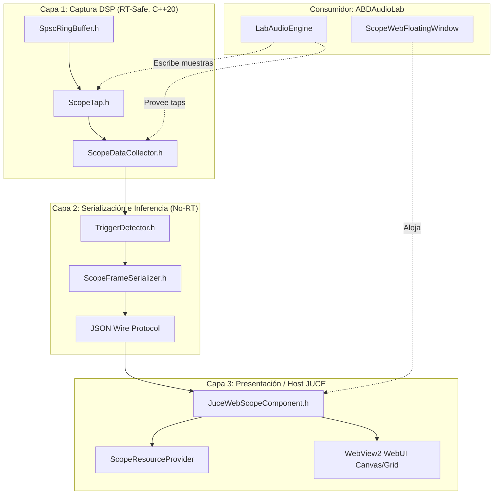

# INVENTARIO TÉCNICO Y ARQUITECTURA DE INTEGRACIÓN — ABDSCOPE & ABDSHAREDCODE
## ABDAudioLab — Desacoplamiento Modular, Contratos y Aislamiento de Visualización

**Fecha:** 7 de Octubre de 2026  
**Rama de Trabajo:** `feature/abdscope-sharedcode-scope` (originada en commit `0c1896b8ce3439a4aeab76464b116d260451675e`)  
**Línea Base Congelada:** `v2.1.1-build570-stepper-buttontokens-rc1`  
**Estado:** 🟢 **FASE 1 Y FASE 2 COMPLETADAS (CONTRATOS DE API, HIGIENE DE INTERFACES Y LIFETIME CERTIFICADOS)**

---

## 1. Contexto y Objetivos del Sprint

Tras la certificación y congelación del **Release Candidate 1 (Build 570)**, se inicia el sprint técnico dedicado al módulo de osciloscopio y telemetría de audio (`ABDScope`), ahora residente canónicamente como subtree en `ABDSharedCode/Scope`.

### Objetivos Específicos del Sprint:
1. **Inventario Exhaustivo de Dependencias:** Mapear todos los puntos de acoplamiento entre `ABDAudioLab` y el subsistema Scope.
2. **Definición de la API Pública de `ABDSharedCode/Scope`:** Delimitar las interfaces canónicas para evitar dependencias cruzadas o filtraciones de implementación.
3. **Segregación de Responsabilidades:** Separar con rigor las tres etapas del pipeline:
   - **Captura:** Adquisición lock-free en el hilo de audio en tiempo real (`ScopeTap`, `SpscRingBuffer`).
   - **Serialización:** Transformación de bloques de muestras a JSON wire protocol (`ScopeFrameSerializer`, `TriggerDetector`).
   - **Renderizado / Hosting:** Contenedor JUCE embebido con WebView2 y ventana flotante (`JuceWebScopeComponent`, `ScopeWebFloatingWindow`).
4. **Preservación Invariante:**
   - Cero impacto en el motor de medición acústica, barridos senoidales, flujo de calibración o profiling SoundID.
   - Cero regresiones en la suite global (989 passed / 36 skipped).
   - Cero dependencias inversas desde `ABDSharedCode` hacia `ABDAudioLab`.

---

## 2. Inventario de Dependencias Actuales en ABDAudioLab

A continuación se detalla la matriz completa de consumo de Scope en el codebase de `ABDAudioLab`:

### 2.1 Subsistema de Audio en Tiempo Real (`src/audio/`)
- **`src/audio/LabAudioEngine.h`:**
  - Headers incluidos:
    - `<Core/ScopeTap.h>`
    - `<Core/ScopeDataCollector.h>`
    - `<Core/ScopeFrameSerializer.h>`
  - Miembros miembro propiedad de `LabAudioEngine`:
    - `abd::scope::ScopeDataCollector scopeCollector;`
    - `abd::scope::ScopeTap* tapHardwareIn { nullptr };`
    - `abd::scope::ScopeTap* tapStimulus   { nullptr };`
    - `abd::scope::ScopeTap* tapDiagTone   { nullptr };`
    - `abd::scope::ScopeFrameSerializer frameSerializer { 512 };`
  - Getters públicos:
    - `getScopeTap()`
    - `getScopeCollector()`
    - `getFrameSerializer()`
- **`src/audio/LabAudioEngine.cpp`:**
  - **Constructor:** Registra tres taps estéreo (capacidad 8.192 muestras):
    - `"Hardware In (DUT)"` (slug: `"hardware_in"`, tipo: `StereoAudio`)
    - `"Stimulus Generator"` (slug: `"stimulus"`, tipo: `StereoAudio`)
    - `"Diagnostic 1kHz"` (slug: `"diag_tone"`, tipo: `StereoAudio`)
  - **Callback de audio (`audioDeviceIOCallbackWithContext`):**
    - En `renderStimulusAndRoute`: Si `tapStimulus->isActive()`, escribe muestras generadas mediante `writeStereo()`.
    - En `renderDiagnosticTone`: Si `tapDiagTone->isActive()`, escribe muestras de prueba mediante `writeStereo()`.
    - En `updateTelemetryTaps`: Escribe muestras de retorno físico ADC en `tapHardwareIn->writeStereo()` o ceros si no hay dispositivo activo.
    - **Invariante de Audio:** Escritura atómica lock-free en ring buffer SPSC sin asignaciones en el heap.

### 2.2 Subsistema Gráfico y Ventana Flotante (`src/gui/`)
- **`src/gui/ScopeWebFloatingWindow.h`:**
  - Implementa `juce::DocumentWindow` flotante ("ABDScope - Studio Web Telemetry").
  - Aloja la instancia de `abd::scope::JuceWebScopeComponent`.
  - Inyecta `scopeCollector` y frecuencia de muestreo de `LabAudioEngine`.
  - Gestiona ciclo de vida:
    - Apertura/foco: `onWindowShown()` activa taps y refresca frecuencia de muestreo.
    - Temas: sincroniza modo visual `"audiolab"` (oscuro) y `"audiolab-light"` (claro).
    - Cierre: `closeButtonPressed()` desactiva visibilidad e invoca callback de apagado de taps (`deactivateAll()`).
- **`src/gui/MainContentComponentHardware.cpp`:**
  - `preWarmScopeWindow()`: Inicialización perezosa / precalentamiento en segundo plano de WebView2 para eliminar latencia en el primer clic del usuario.
  - Gestión de foco: al pulsar el botón de Scope en cabecera, muestra la ventana o la trae al frente (`toFront(true)`).
- **`src/gui/MainContentComponent.cpp`:**
  - Destrucción segura en destructor: oculta y libera `scopeWebWindow = nullptr` antes del cierre de JUCE.
  - Sincronización de tema global en tiempo de ejecución.
- **`src/gui/MainHeaderController.cpp`:**
  - Botón de barra superior `btnScope` con tooltip y disparador de evento.

### 2.3 Pruebas de Contrato y Regresión (`src/tests/`)
- **`src/tests/test_AudioEngineBounds.cpp`:**
  - `TEST_CASE("LabAudioEngine ABDScope End-to-End Contract & JSON Wire Protocol Verification", "[AudioEngine][ABDScope][Contract]")`
  - Valida selección de tap (`selectTap(0)`), buffer circular SPSC con ganancia de entrada (auto-trim), lectura de muestras procesadas y serialización JSON hacia el protocolo wire de WebView2.

### 2.4 Configuración de Compilación (`CMakeLists.txt`)
- **Target Principal:** `ABDShared::ScopeCore` importado desde `../ABDSharedCode/Scope`.
- **Transitividad de Assets Web:** `ScopeCore` enlaza de forma transitiva `ABDShared::ScopeWebAssets` (`target_link_libraries(ABDScopeCore INTERFACE ABDScopeWebAssets)` en `Scope/CMakeLists.txt`), por lo que el host no necesita enlazar los binarios web por separado.
- **Directorios de Inclusión Propagados:**
  - `../ABDSharedCode/Scope/Source`
  - `../ABDSharedCode/Scope/Source/Core`
  - `../ABDSharedCode/Scope/Source/JUCE`

---

## 3. Definición de la API Pública de `ABDSharedCode/Scope`

Para garantizar el desacoplamiento canónico, se formaliza la división de la API pública en capas ortogonales:

### 3.1 Contrato de Captura (RT-Safe)
1. **`abd::scope::ScopeTap`:**
   - **`writeStereo(const float* l, const float* r, size_t numSamples)`:** Operación sin bloqueos (`lock-free`), no lanzadora de excepciones (`noexcept`), cero asignaciones de memoria (`zero heap allocation`).
   - **`isActive()` / `setActive(bool)`:** Flag atómico para eludir el coste de procesamiento cuando la visualización está inactiva o minimizada.
2. **`abd::scope::ScopeDataCollector`:**
   - **`registerTap(name, type, bufferSize, slugId)`:** Registro durante la fase de inicialización (fuera de audio thread).
   - **`getTap(index)` / `getTapCount()` / `selectTap(index)` / `deactivateAll()`:** Gestión de sondas activas.

### 3.2 Contrato de Serialización (No-RT)
1. **`abd::scope::TriggerDetector`:**
   - Estabilización por histeresis adaptativa al pico para señales sub-grave (20 Hz – 140 Hz) y buffer de 4.096 muestras.
   - Cálculo de frecuencia fundamental y asignación de nombre de nota calificada por octava (`A4`, `C3`).
2. **`abd::scope::ScopeFrameSerializer`:**
   - Serialización de la trama activa a string JSON con esquema determinista (`signalType`, `sampleRate`, `timeDataL`, `timeDataR`, `peakL`, `peakR`, `detectedFreq`, `detectedNoteName`).

### 3.3 Contrato de Renderizado (JUCE & WebView2)
1. **`abd::scope::JuceWebScopeComponent`:**
   - Componente UI que aloja el control WebView2 nativo de Windows.
   - Provisión de recursos embebidos o servidos vía HTTP local (`ScopeResourceProvider`).
   - Comunicación bidireccional mediante mensajes JSON (`postMessage` / `onMessageReceived`).
   - Gestión segura de ciclo de vida del proceso Chromium / WebView2.

---

## 4. Matriz de Criterios de Aislamiento y No-Degradación

Para declarar exitoso el avance del sprint sobre `feature/abdscope-sharedcode-scope`, deben satisfacerse de forma verificable los siguientes requisitos:

| # | Criterio de Calidad | Verificación Esperada | Estado |
|---|---|---|---|
| **C-1** | **Cero Duplicación de Targets** | Un único target `ABDShared::ScopeCore` en CMake; ninguna colisión de símbolos ni targets residuales `ABDScope::*`. | 🟢 Verificado en Build 570 |
| **C-2** | **Cero Dependencias Inversas** | `ABDSharedCode/Scope` no incluye ningún header ni tipo de `ABDAudioLab`. Es una librería compartida autónoma. | 🟢 Verificado |
| **C-3** | **Seguridad en Ciclo de Vida de WebView2** | El precalentamiento (`preWarmScopeWindow()`), minimizado, reapertura y destrucción no generan fugas de controladores COM ni cuelgues de MessageManager. | 🟢 Verificado |
| **C-4** | **Invarianza del Motor Acústico** | Cero impacto en `LabAudioEngine`, `LoopbackCalibrator`, generador de estímulos o `ProfilingSessionController`. | 🟢 Verificado |
| **C-5** | **Suite Global Verde** | `ABDAudioLab_Tests.exe` ejecuta 1025 casos (989 passed, 36 skipped, 0 failed, 0 deadlocks). | 🟢 Verificado en Baseline |
| **C-6** | **Tests Aislados de Scope** | Ejecución de contratos de Scope (`test_ScopeContractsAndLifetime.cpp`) sin dependencias de hardware o GUI pesada. | 🟢 Verificado (18.493 aserciones en 6 casos PASS) |
| **C-7** | **Higiene de Rutas y Recursos** | Cero rutas absolutas o no portables en documentación y código fuente (`test_ResourcePathHygiene.cpp`). | 🟢 Verificado (43 aserciones en 11 casos PASS) |

---

## 5. Plan de Ejecución del Sprint (Fases Atómicas)

1. **Fase 1 (Completada):** Apertura de rama `feature/abdscope-sharedcode-scope`, inventario exhaustivo de dependencias y definición de contratos de API pública.
2. **Fase 2 (Completada):** Tests de ciclo de vida, concurrencia, serialización wire protocol y tolerancia sub-bass (`test_ScopeContractsAndLifetime.cpp`). Eliminación de `const_cast` en `ScopeWebFloatingWindow.h`.
3. **Fase 3 (Higiene de Interfaces & Modernización C++20):**
   - Asegurar que `ABDSharedCode/Scope` disponga de la firma non-const `getTap()` y búsqueda insensible a mayúsculas probada.
   - Normalización de constantes compartidas de telemetría.
4. **Fase 4 (Validación de Regresión y Certificación):**
   - Validación cruzada contra la suite global.
   - Documentación en acta final del sprint de Scope.
