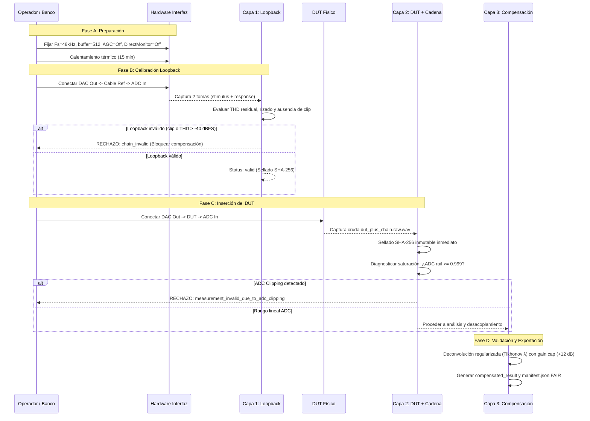

# Protocolo Metrológico de Validación Física con Hardware Real (Fase 20.12 T20.12-3)

## Propósito y Alcance

Este documento establece el protocolo formal y auditable para la caracterización analógica de hardware real (interfaces de audio, preamplificadores, procesadores y sintetizadores analógicos) en **ABDAudioLab**, garantizando:
1. Desacoplamiento riguroso de la tarjeta de sonido mediante calibración previa por loopback.
2. Preservación estricta de capturas crudas inmutables (`.raw.wav`) selladas con SHA-256.
3. Compensación reversible regularizada sin amplificación excesiva de ruido ni singularidades.
4. Segregación inequívoca entre saturación digital del convertidor ADC y compresión analógica del DUT.

---

## 1. Registro de Hardware y Entorno

Toda sesión de caracterización física debe registrar en los metadatos de conexión (`HardwareConnectionMetadata`):

| Campo | Descripción | Ejemplo / Valores Válidos |
| :--- | :--- | :--- |
| `interfaceModel` | Marca, modelo y revisión del hardware de audio | `"RME Babyface Pro FS"` |
| `firmwareVersion` | Versión del firmware del dispositivo | `"v1.24"` |
| `sampleRateHz` | Frecuencia de muestreo fijada | `48000.0`, `96000.0` |
| `blockSize` | Tamaño de buffer ASIO / CoreAudio | `128`, `256`, `512` |
| `dutOutputImpedance` | Impedancia de salida del DUT y fuente del dato | `{"valueOhms": 100.0, "source": "datasheet"}` |
| `interfaceInputImpedance`| Impedancia de entrada del canal ADC | `{"valueOhms": 10000.0, "source": "datasheet"}` |
| `cableDescription` | Longitud, apantallamiento y tipo de conector | `"Mogami 2534, 1.5m, Neutrik Gold TRS"` |
| `wiringTopology` | Configuración eléctrica de conexión | `"Balanced"`, `"Unbalanced"`, `"PseudoBalanced"` |
| `padGainDb` | Atenuador o ganancia analógica de previo fijada | `0.0 dB` (o valor nominal calibrado) |
| `phantomPowerActive` | Alimentación phantom +48V | `false` (OBLIGATORIO desactivar para entradas de línea/DUT) |
| `ambientTemperatureCelsius`| Temperatura ambiente del banco de prueba | `22.5` (si está disponible) |

---

## 2. Fases Operativas del Protocolo

### Fase A: Preparación del Banco
1. **Configuración de Interfaz**: Fijar frecuencia de muestreo (48 kHz o 96 kHz) y buffer constante (512 muestras). Desactivar cualquier limitador de hardware, DSP interno, monitorización directa o ecualización del mezclador del fabricante.
2. **Estabilidad Térmica**: Permitir un periodo de encendido previo de al menos 15 minutos para estabilizar la deriva térmica de los osciladores y componentes analógicos.
3. **Verificación de Protecciones**: Comprobar visualmente que la alimentación phantom (+48V) esté apagada en todos los canales de medición.

### Fase B: Calibración de Cadena (Capa 1 — Loopback de Referencia)
1. **Conexión Directa**: Conectar la salida del DAC directamente a la entrada del ADC con un cable corto balanceado de referencia.
2. **Emisión de Estímulo**: Emitir log-sweep canónico a nivel nominal $-6.0\text{ dBFS}$.
3. **Criterios de Aceptación/Rechazo**:
   - $\text{SNR} \ge 18\text{ dB}$ (nominal $\ge 80\text{ dB}$ en interfaces profesionales).
   - $\text{Rizado de Frecuencia} \le 1.0\text{ dB}$ (estado `valid`) o $\le 3.0\text{ dB}$ (estado `degraded`).
   - $\text{THD Residual} \le -60\text{ dBFS}$.
   - **Cero Muestras en Rail**: Si existe alguna muestra $\ge 0.999$, la calibración se marca como `chain_invalid`.
4. **Bloqueo Preventivo**: Si la calibración es `chain_invalid`, queda estrictamente prohibido utilizarla para compensar mediciones de DUT.

### Fase C: Caracterización del DUT (Capa 2 — DUT + Cadena)
1. **Inserción**: Interpolar el dispositivo bajo prueba (DUT) entre el DAC y el ADC.
2. **Ajuste de Niveles**: Configurar el nivel de entrada al ADC para asegurar que los picos máximos no superen $-1.0\text{ dBFS}$, dejando al menos $1.0\text{ dB}$ de margen dinámico.
3. **Captura y Sellado Inmediato**: Grabar la señal cruda y computar inmediatamente su hash criptográfico SHA-256. El archivo queda marcado como solo lectura y jamás se modifica.
4. **Diagnóstico Físico de Saturación**:
   - Si se detecta saturación en el ADC ($\ge 3$ muestras en rail): la medición queda invalidada para THD/IMD (`measurement_invalid_due_to_adc_clipping`).
   - Si el DUT comprime a niveles donde el ADC está en rango lineal: registrar `dut_saturating` con la compresión observada en dB.

### Fase D: Compensación Reversible y Validación (Capa 3)
1. **Deconvolución Regularizada de Tikhonov**:
   $$H_{\text{comp}}(f) = \frac{H_{\text{dut+chain}}(f) \cdot H_{\text{chain}}^*(f)}{|H_{\text{chain}}(f)|^2 + \lambda}$$
2. **Cota de Ganancia Inversa**: Aplicar la política configurada (`maxInverseGainDb = +12 dB` por defecto) para prevenir que notches o caídas de banda de la tarjeta disparen el ruido térmico.
3. **Contrato de Reversibilidad**: La compensación solo se marca como `isReversible = true` si conserva la cadena completa de hashes: `rawCaptureSha256`, `chainReferenceSha256`, `compensationModelSha256`, $\lambda$ y la máscara de validez.
4. **Empaquetado FAIR / LNL**: Generar el contenedor reproducible con los audios crudos, los resultados analizados, el informe HTML/SVG y el archivo `manifest.json`.
