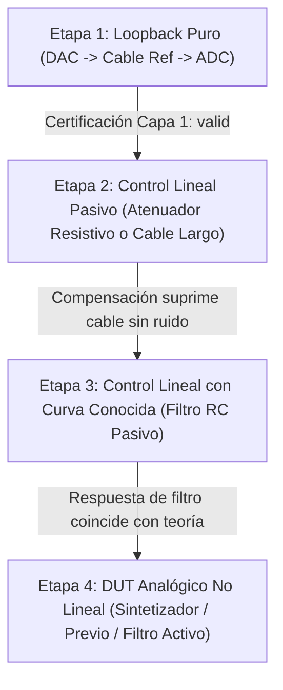

# Protocolo Metrológico de Validación Física con Hardware Real (Fase 20.12 T20.12-3)

## Propósito y Alcance

Este documento establece el protocolo formal y auditable para la caracterización analógica de hardware real en **ABDAudioLab**. Regula la ejecución de ensayos de laboratorio mediante la segregación en tres capas físicas:
1. **Capa 1: Referencia de Cadena (`loopback_reference`)**: Calibración previa del trayecto directo DAC $\to$ cable $\to$ ADC.
2. **Capa 2: DUT + Cadena (`dut_plus_chain`)**: Preservación de capturas crudas inmutables selladas con SHA-256 sin alteración.
3. **Capa 3: Compensación Reversible (`compensated_result`)**: Desacoplamiento matemático regularizado con máscara de validez y cota de ganancia inversa.

---

## 1. Registro de Hardware y Entorno (Parametrización Obligatoria)

El protocolo es agnóstico respecto a marcas o modelos de convertidores. Toda sesión debe registrar obligatoriamente los datos reales del banco antes de procesar o interpretar resultados (`HardwareConnectionMetadata`):

| Parámetro | Tipo | Descripción | Estado Inicial |
| :--- | :--- | :--- | :--- |
| `interfaceModel` | String | Marca, modelo y revisión del hardware de audio | `[Pendiente de declarar]` |
| `firmwareVersion` | String | Versión del firmware del dispositivo | `[Pendiente de declarar]` |
| `driverBackend` | String | Controlador o backend de audio (ASIO, WASAPI Exclusive, CoreAudio) | `[Pendiente de declarar]` |
| `sampleRateHz` | Float | Frecuencia de muestreo fijada (48000.0, 96000.0) | `[Pendiente de fijar]` |
| `blockSize` | Integer | Tamaño de buffer fijado (128, 256, 512) | `[Pendiente de fijar]` |
| `inputMode` / `outputMode` | String | Modo de entrada/salida (Line In / Line Out, +4 dBu / -10 dBV) | `[Pendiente de fijar]` |
| `dutOutputImpedance` | Object | Impedancia de salida del DUT con fuente: `datasheet`, `measured`, `user_supplied` | `{"valueOhms": null, "source": "unknown"}` |
| `interfaceInputImpedance` | Object | Impedancia de entrada ADC con fuente: `datasheet`, `measured`, `user_supplied` | `{"valueOhms": null, "source": "unknown"}` |
| `cableDescription` | String | Longitud, apantallamiento y tipo de conector | `[Pendiente de declarar]` |
| `wiringTopology` | Enum | Topología eléctrica (`Balanced`, `Unbalanced`, `PseudoBalanced`) | `[Pendiente de declarar]` |
| `padGainDb` | Float | Atenuador o ganancia analógica de previo fijada (nominal 0.0 dB) | `0.0` |
| `phantomPowerActive` | Boolean | Estado de alimentación phantom +48V | `false` (OBLIGATORIO) |
| `ambientTemperatureCelsius`| Float | Temperatura ambiente del banco de prueba | `[Opcional / Medida]` |

> [!CAUTION]
> **Alimentación Phantom (+48V)**:
> Debe verificarse físicamente que la alimentación phantom esté desactivada antes de conectar el loopback o cualquier DUT de línea. Ciertas interfaces aplican +48V de forma global a varios canales; la presencia de DC residual puede dañar las etapas de salida y falsear severamente las mediciones.

---

## 2. Progresión Gradual de Ensayos

Para aislar variables y garantizar que la compensación no introduce artefactos, la campaña de validación física debe seguir una progresión estricta en 4 etapas:



1. **Etapa 1 (Loopback Puro)**: Caracteriza el suelo de ruido, rizado de la tarjeta, latencia $\tau_0$ y deriva de reloj. Si no se certifica como `valid`, la campaña se detiene.
2. **Etapa 2 (Control Lineal Pasivo)**: Conectar un atenuador resistivo puro o un tramo de cable conocido. Verifica que la compensación regularizada suprime la atenuación o pérdidas sin alterar la fase ni amplificar ruido.
3. **Etapa 3 (Control Lineal con Curva Conocida)**: Conectar un filtro pasivo $RC$ de frecuencia de corte conocida. Verifica que la máscara de validez y la deconvolución recuperan la curva teórica del filtro sin singularidades.
4. **Etapa 4 (DUT Analógico No Lineal)**: Solo tras superar los tres controles lineales previos, se conecta el sintetizador analógico o previo para medir THD, IMD y umbrales de compresión.

---

## 3. Criterios Metrológicos de Aceptación y Rechazo

### A. Diagnóstico Segregado de Clipping
Se distinguen dos niveles de evidencia de saturación:
- `railEvidenceDetected`: Una o más muestras en el riel del convertidor ($|s| \ge 0.999$).
- `hardClipConfirmed`: Patrón temporal sostenido ($\ge 3$ muestras consecutivas en riel).

**Regla de Decisión**:
- **Capa 1 (Loopback)**: Rechazo incondicional ante cualquier `railEvidenceDetected` $\to$ estado `chain_invalid`.
- **Capa 2 (DUT + Cadena)**: Si `railEvidenceDetected == true`, se marca `status = "measurement_invalid_due_to_adc_clipping"` y se **bloquea el cálculo de THD, IMD y métricas de distorsión compensadas**, para evitar atribuir al DUT los armónicos espurios del ADC.

### B. Umbrales de SNR Específicos por Medición
No existe un umbral único de SNR. Se registran `snrRequiredForMeasurement`, `snrMeasured` y `snrMargin`:
- **Respuesta en Frecuencia (Sweep)**: $\text{SNR}_{\text{req}} \ge 18.0\text{ dB}$.
- **Distorsión Armónica (THD hasta 0.1%)**: $\text{SNR}_{\text{req}} \ge 40.0\text{ dB}$.
- **Intermodulación (IMD CCIF/SMPTE de alto orden)**: $\text{SNR}_{\text{req}} \ge 50.0\text{ dB}$.
- **Rizado de Frecuencia en Loopback**: $\le 1.0\text{ dB}$ para `valid`, $\le 3.0\text{ dB}$ para `degraded`.

### C. Criterios de Abortar Sesión Inmediatamente
La sesión se suspende e invalida automáticamente si ocurre cualquiera de los siguientes eventos:
1. Detección o sospecha de alimentación phantom activa.
2. Cualquier muestra en rail de ADC en la calibración de loopback.
3. Dropout o discontinuidad temporal detectada por `FineLatencyAnalyzer` (`jumpSamples != 0`).
4. Conmutación inesperada de frecuencia de muestreo o tamaño de buffer del driver.
5. Detección de monitorización directa analógica o AGC/DSP activo en el panel de control de la tarjeta.
6. Calibración degradada cuando la sesión exige `allowDegraded = false`.
7. Temperatura ambiente fuera del rango declarado ($> \pm 5^\circ\text{C}$ de variación durante la sesión).

---

## 4. Protocolo de Repetición y Estadística ($N \ge 3$)

Toda medición física (tanto loopback como DUT) debe ejecutarse con un mínimo de **$N = 3$ tomas independientes**.

> [!IMPORTANT]
> **Prohibición Estricta de Pre-Promediado**:
> Queda estrictamente prohibido promediar las ondas WAV crudas antes de sellarlas. Cada toma cruda se graba, se almacena de forma independiente y se sella con su propio hash SHA-256 inmutable.

Por cada toma individual $k \in \{1..N\}$ se registra:
- `captureId`, `rawSha256`, `latencySamples`, `driftPpm`, `noiseFloorDbfs`, `residualThdDbfs`, `responseRippleDb`, `clipSampleCount`.

Posteriormente, el motor calcula las estadísticas consolidadas:
- $\text{Media } (\mu)$ y $\text{Desviación Estándar } (\sigma)$ de latencia, THD y respuesta.
- $\text{Rango } (\max - \min)$ y $\text{Máxima Diferencia Inter-Toma}$.
- Incertidumbre combinada de la medición $u_c$.

---

## 5. Artefactos Obligatorios por Sesión Experimental

Toda sesión completada en el laboratorio debe generar un directorio autocontenido con los siguientes 8 artefactos canónicos:

```
session_<id>_<timestamp>/
├── session_manifest.json          # Manifiesto canónico RFC 8785 con inventario y SHA-256
├── loopback_reference.raw.wav     # Audio crudo inmutable de la calibración DAC->ADC
├── dut_plus_chain.raw.wav         # Audio crudo inmutable con el DUT insertado
├── calibration_record.json        # Capa 1: Registro formal de loopback (SNR, rizado, estado)
├── dut_measurement.json           # Capa 2: Métricas directas del crudo + diagnóstico saturación
├── compensated_result.json        # Capa 3: Respuesta regularizada desacoplada + máscara
├── hardware_metadata.json         # Interfaz, firmware, impedancias, cables y conexiones
├── environment.json               # Driver, OS, temperatura y fecha/hora UTC
└── diagnostics.json               # Conteo de clips, residuos de latencia y evaluación de aborto
```

El archivo `session_manifest.json` debe clasificar explícitamente cada artefacto según su estatus:
- `"raw"`: Captura original inmutable garantizada por SHA-256.
- `"derived"`: Resultado computado reproduciblemente a partir de los raws.
- `"rejected"`: Medición descartada por clipping, SNR insuficiente o violación de protocolo.
- `"not_available"`: Metadato o toma no provista por el operador.
